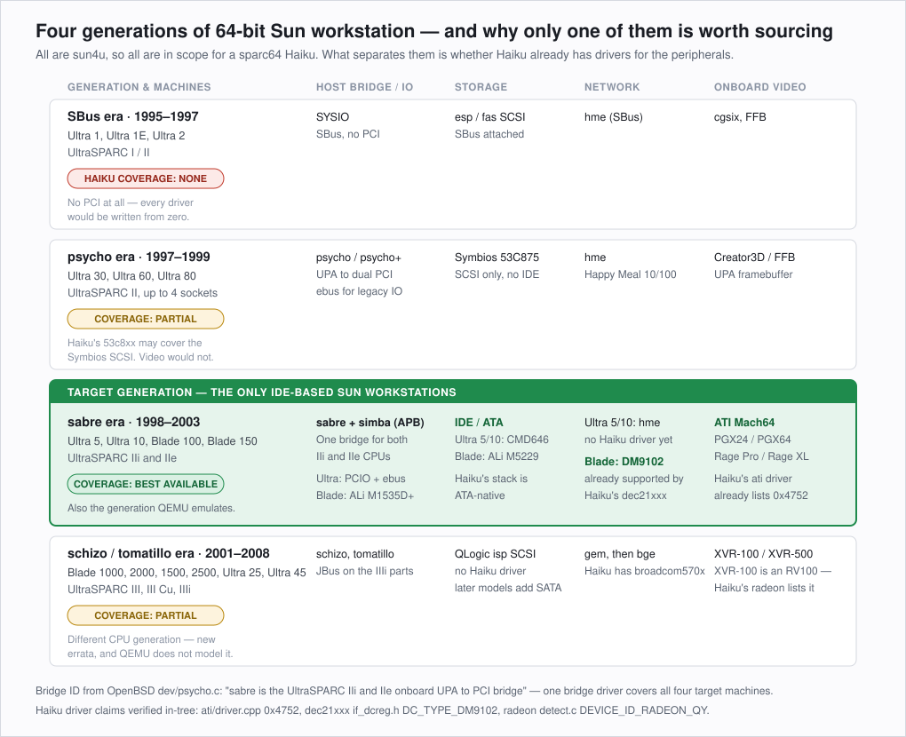

# SPARC Workstation Hardware Support Matrix

**Purpose:** decide which physical machines are worth sourcing for the Haiku/SPARC port, by
mapping every 64-bit Sun *workstation* onto the silicon it actually contains and asking a
single question of each part — **does Haiku already have a driver for this?**

Servers (Enterprise, Netra, Fire, T-series) are deliberately excluded. They add SCSI, LOM,
and multi-board topologies without adding anything the port needs, and none of them have a
usable console-plus-display story for desktop bring-up.

**Companion documents:** [Porting plan](PORTING_PLAN.md) · [Reference index](#7-documentation-coverage)

---

## 1. How to read this

Every claim carries a confidence marker, because a matrix that hides its uncertainty is worse
than no matrix at all when you are about to spend money on eBay hardware.

| Marker | Meaning |
| :---: | --- |
| ✅ | Verified this session against source or vendor documentation on disk. The check is cited. |
| 📘 | From vendor spec sheets or well-established community documentation. High confidence, not independently verified. |
| ❓ | Plausible but unconfirmed. **Treat as a task, not a fact** — see [§9](#9-open-verification-items). |

Scope note: Haiku's SPARC target is `sparc64-unknown-haiku` and **32-bit SPARC is explicitly
not planned**. Every machine in the main tables is therefore `sun4u` or later. The 32-bit
`sun4c`/`sun4m` workstations are listed in [§5](#5-the-32-bit-machines-out-of-scope) only so
nobody buys one by mistake.

---

## 2. Machine identity

| Machine | Year | CPU | Sockets | Bus architecture |
| --- | :---: | --- | :---: | --- |
| Ultra 1 / 1E | 1995 | UltraSPARC I, 143–200 MHz | 1 | SBus + UPA 📘 |
| Ultra 2 | 1996 | UltraSPARC I / II, 168–300 MHz | 2 | SBus + UPA 📘 |
| Ultra 30 | 1997 | UltraSPARC II, 250–300 MHz | 1 | PCI + UPA 📘 |
| Ultra 60 | 1998 | UltraSPARC II, 300–450 MHz | 2 | PCI + UPA 📘 |
| Ultra 80 | 1999 | UltraSPARC II, 450 MHz | 4 | PCI + UPA 📘 |
| **Ultra 5** | 1998 | **UltraSPARC IIi**, 270–400 MHz | 1 | **PCI only** ✅ |
| **Ultra 10** | 1998 | **UltraSPARC IIi**, 300–440 MHz | 1 | **PCI + UPA slot** 📘 |
| **Blade 100** | 2001 | **UltraSPARC IIe**, 500 MHz | 1 | **PCI only** ✅ |
| **Blade 150** | 2002 | **UltraSPARC IIe** ("IIi+"), 550–650 MHz | 1 | **PCI only** ✅ |
| Blade 1000 | 2000 | UltraSPARC III, 750–900 MHz | 2 | PCI + UPA 📘 |
| Blade 2000 | 2002 | UltraSPARC III Cu, 900–1200 MHz | 2 | PCI + UPA 📘 |
| Blade 1500 | 2003 | UltraSPARC IIIi, 1.0–1.5 GHz | 1 | JBus + PCI 📘 |
| Blade 2500 | 2003 | UltraSPARC IIIi, 1.28–1.6 GHz | 2 | JBus + PCI 📘 |
| Ultra 25 | 2006 | UltraSPARC IIIi, 1.34 GHz | 1 | JBus + PCI 📘 |
| Ultra 45 | 2006 | UltraSPARC IIIi, 1.6 GHz | 2 | JBus + PCI 📘 |
| Ultra 3 Mobile | 2003 | UltraSPARC IIIi (Tadpole laptop) | 1 | JBus + PCI 📘 |

**Bold rows are the recommended target family.** The reasoning is in [§8](#8-sourcing-recommendation).

> The Blade 150's CPU is marketed inconsistently. Sun's own system handbook describes it as
> "UltraSPARC IIi" while also stating it is "based on the 500MHz UltraSPARC IIe (Hummingbird)"
> and labelling it "UltraSPARC IIi+" 📘. For porting purposes the distinction does not matter:
> OpenBSD's bridge driver treats IIi and IIe identically (see below), and the IIe manual is
> published as a *supplement to* the IIi manual ✅ — one document set covers both.

---

## 3. Chipset and I/O topology

| Machine | Host bridge | PCI bridge | Southbridge / legacy I/O |
| --- | --- | --- | --- |
| Ultra 1, Ultra 2 | SYSIO ✅ | — (SBus, no PCI) | SBus-attached 📘 |
| Ultra 30, 60, 80 | psycho / psycho+ ✅ | — | ebus ✅ |
| **Ultra 5, Ultra 10** | **sabre** ✅ | **simba (APB), ×2** ✅ | **PCIO** — ebus + hme in one part 📘 |
| **Blade 100, Blade 150** | **sabre** ✅ | **simba (APB)** ✅ | **ALi M1535D+** — M5229 IDE ✅, M5451 audio 📘, USB, FireWire |
| Blade 1000, 2000 | schizo ✅ | — | ebus 📘 |
| Blade 1500, 2500, Ultra 25, 45 | tomatillo ✅ | — | ebus 📘 |

The single most useful fact in this table is from OpenBSD's own source, and it is what makes
all four target machines one porting problem instead of two:

> `sabre` is the UltraSPARC IIi onboard UPA to PCI bridge. It manages a single PCI bus […]
> appears as two `simba`'s underneath the sabre.
> — `OpenBSD/sys/arch/sparc64/dev/psycho.c:155`, whose header line reads
> *"Support for `psycho' and `psycho+' UPA to PCI bridge and UltraSPARC IIi and IIe `sabre' PCI controllers"* ✅

One bridge driver covers Ultra 5, Ultra 10, Blade 100 and Blade 150 — **and the QEMU machine
we will develop against**.

### How a device interrupt is identified

Verified against the machine rather than only read, so it belongs here. A device interrupt on
sun4u is named by an **Interrupt Number Register** value: eleven bits, a five-bit Interrupt Group
Number and a six-bit Interrupt Number Offset. On UltraSPARC-IIi the IGN is **fixed at 0x1f** and
not programmable, which the firmware confirms — sabre's own node publishes `0x7f0 0x7ee 0x7ef
0x7e5`, being PCI bus error, DMA UE, DMA CE and power fail with `0x7c0` already OR'd in.

The INO is what identifies the source, and its *value* decides which of the bridge's two register
files programs it:

| INO | Source | Register file |
| --- | --- | --- |
| `0b0bssnn` (`0x00`–`0x1f`) | PCI bus `b`, slot `ss`, pin `nn` = INTA–INTD | PCI |
| `0x20` | SCSI — **and the onboard IDE, which occupies that slot on an Ultra 5/10** | OBIO |
| `0x21` | Ethernet | OBIO |
| `0x22` | Parallel port | OBIO |
| `0x23`, `0x24` | Audio record, audio playback | OBIO |
| `0x25` | Power fail | OBIO |
| `0x26` | Keyboard / mouse / serial | OBIO |
| `0x27` | Floppy | OBIO |
| `0x29` | Keyboard | OBIO |
| `0x2b` | Serial (observed on the ebus `su` at `0x3f8`) | OBIO |
| `0x2e`, `0x2f`, `0x30` | DMA UE, DMA CE, PCI bus error | OBIO |

That table is TABLE 19-28 of the `UltraSPARC IIi User's Manual (805-0087)`, and the entries for
`0x20`, `0x21`, `0x29` and `0x2b` were confirmed by reading the firmware's own `interrupt-map`
properties on the QEMU machine.

**The `0x20` row is the trap.** The IDE controller is a PCI device whose interrupt is an *on-board*
number, so it is programmed through the OBIO registers and not the PCI ones — because the onboard
storage occupies the SCSI slot on this generation. Deciding which register file to use from what
kind of device it is, rather than from the INO's value, programs a register belonging to nothing.

What connects a device to its INO is the **`interrupt-map` property on the device's parent**, and
on these machines that parent is the *simba*, not sabre: the wiring a map describes is the parent's
wiring. Its mask keeps the bus and device numbers and drops the function, which is how a
multifunction device shares a line — the ebus and the Ethernet controller are functions 0 and 1 of
one device and both resolve to `0x21`.

---

## 4. Peripherals — the part that decides the work

| Machine | Storage | Network | Onboard video | Console input |
| --- | --- | --- | --- | --- |
| Ultra 1, Ultra 2 | esp / fas SCSI (SBus) 📘 | hme (SBus) 📘 | cgsix, FFB 📘 | Sun serial keyboard 📘 |
| Ultra 30, 60, 80 | Symbios 53C875 SCSI 📘 | hme 📘 | Creator3D / FFB (UPA) 📘 | ebus PS/2-class 📘 |
| **Ultra 5, Ultra 10** | **CMD646 PCI IDE** 📘 | **hme** 📘 | **ATI Mach64 — PGX / PGX24** 📘 | ebus PS/2-class 📘 |
| **Blade 100, Blade 150** | **ALi M5229 UDMA IDE** ✅ | **Davicom DM9102** ✅ | **ATI Rage XL — PGX64** ✅ | **USB 1.1** ✅ |
| Blade 1000, 2000 | QLogic isp SCSI 📘 | gem 📘 | XVR-500 / Expert3D 📘 | USB 📘 |
| Blade 1500, 2500, Ultra 25, 45 | isp SCSI, later SATA 📘 | bge (Broadcom) 📘 | XVR-100 / XVR-600 📘 | USB 📘 |

Evidence for the two ✅ rows that matter most:

- **ALi M5229 IDE** — OpenBSD carries `{ PCI_PRODUCT_ALI_M5229, /* Acer Labs M5229 UDMA IDE */ }`
  in `sys/dev/pci/pciide.c:877`, and a published Blade 100 dmesg shows the M5229 and its
  companion M7101 power-management function present on the machine.
- **Davicom DM9102 on Sun boards** — the Linux tulip/dmfe split exists *specifically* to handle
  this. `drivers/net/ethernet/dec/tulip/dmfe.c:362` reads *"SPARC on-board DM910x chips should
  be handled by the main tulip driver, except for early DM9100s"*, and the guard beneath it
  detects exactly this case: a DM9102 whose **Open Firmware node carries a `local-mac-address`
  property** — i.e. a Sun on-board part rather than an add-in card. ✅
- **PGX64 = ATI Rage XL** — confirmed by both the Blade 100 restoration writeup ("Sun PGX64 8MB
  integrated graphics card (ATI Rage XL)") and OpenBSD's `GENERIC`, which comments its Mach64
  driver as `machfb* at pci? # PGX/PGX64 framebuffers` ✅.

---

## 5. The 32-bit machines (out of scope)

Listed only to prevent a mistaken purchase. Haiku will not run on any of these, now or later:
SPARCstation 1/1+/2/IPC/IPX/ELC/SLC (`sun4c`), SPARCstation 4/5/10/20, SPARCclassic,
SPARCstation Voyager, JavaStation (`sun4m`), and the earlier Tadpole SPARCbooks.

Haiku's own architecture documentation is unambiguous: *"Support for 32-bit versions of SPARC
is currently not planned."* ✅ The RefDocs library has excellent `sun4m` coverage
(microSPARC-II, SuperSPARC, MBus, SLAVIO, Sun4M system architecture) — that material is
useful background on Sun's design lineage and nothing more.

---

## 6. Where Haiku already has a driver

This is the table that should drive the purchase decision. Every "yes" is a verified device-ID
match in the current Haiku tree, not an assumption that a family name implies support.

| Device class | Part | Found in | Haiku driver | Verified how |
| --- | --- | --- | --- | --- |
| Video | ATI Rage XL (PGX64) | Blade 100/150 | **`ati` + Mach64 accelerant** ✅ | `drivers/graphics/ati/driver.cpp:83` lists `0x4752 "3D RAGE XL, PCI"` |
| Video | ATI Rage Pro (PGX/PGX24) | Ultra 5/10 | **`ati`** 📘 | Same table carries `0x4750`/`0x4751` Rage Pro PCI; exact Sun subdevice unconfirmed |
| Video | Radeon RV100 (XVR-100) | Blade 1500/2500 | **`radeon`** ✅ | `drivers/graphics/radeon/detect.c:260` — `DEVICE_ID_RADEON_QY, "Radeon 7000 / Radeon VE"` |
| Video | Creator3D / FFB, cgsix, XVR-500 | Ultra 1–80, Blade 1000/2000 | **none** ✅ | No UPA or SBus framebuffer driver exists in Haiku |
| Network | Davicom DM9102 | Blade 100/150 | **`dec21xxx`** ✅ | `ether/dec21xxx/dev/dc/if_dcreg.h:76` — `DC_TYPE_DM9102` |
| Network | Broadcom BCM570x | Blade 1500/2500, Ultra 25/45 | **`broadcom570x`** ✅ | Driver present in `drivers/network/ether/` |
| Network | Sun hme (Happy Meal) | Ultra 1–80, Ultra 5/10 | **none — must be written** ✅ | Absent from the full `ether/` listing |
| Network | Sun gem, Cassini | Blade 1000/2000 | **none** ✅ | Absent from the same listing |
| Storage | PCI IDE — CMD646, ALi M5229 | Ultra 5/10, Blade 100/150 | **ATA stack + `generic_ide_pci`** 📘 | `busses/ata/generic_ide_pci` exists; neither device ID is enumerated in it |
| Storage | Symbios 53C875 SCSI | Ultra 30/60/80 | **`53c8xx`** 📘 | `busses/scsi/53c8xx` present; exact part-number coverage unverified |
| Storage | esp/fas SCSI, QLogic isp | Ultra 1/2, all Blade *000 | **none** ✅ | `busses/scsi/` holds only 53c8xx, ahci, buslogic, hyperv, usb, virtio |
| Input | USB 1.1 HID | Blade 100/150 | **Haiku USB stack** 📘 | Generic; endianness on a big-endian host is untested |
| Input | ebus PS/2-class keyboard | Ultra 5/10/30/60 | **none for ebus** 📘 | Haiku's PS/2 driver assumes x86 I/O ports |

Three conclusions fall straight out of this table:

1. **Only the sabre generation is IDE.** Every other 64-bit Sun workstation is SCSI, and Haiku
   has no `esp`, `fas`, or `isp` driver. Haiku's storage stack is ATA-native, so choosing an
   IDE machine deletes an entire driver from the plan.
2. **The same Mach64 driver covers all four sabre machines.** Onboard video on Ultra 5, Ultra
   10, Blade 100 and Blade 150 is the same ATI family, and Haiku already drives it on x86.
3. **Networking is the one place the two sub-families differ**, and the Blade wins: its DM9102
   is already supported by `dec21xxx`, whereas `hme` does not exist in Haiku at all.

---

## 7. Documentation coverage

RefDocs coverage for this hardware is unusually good — 100 files under `SPARC/`, all
text-extractable and searchable (the corpus has exactly one extraction failure, an unrelated
Intel NIC document) ✅.

| Need | Document | Status |
| --- | --- | --- |
| CPU: traps, MMU, windows, %TICK | `SPARC/UltraSPARC-IIi/manual.pdf` (dup: `UltraSPARC-IIi-manual-805-0087.pdf`) | ✅ searchable — MMU overview p.23, demap pp.85–86, TICK_CMPR p.96 |
| CPU: IIe deltas (Blade 100/150) | `SPARC/USIIe_ext_1.1.pdf` | ✅ explicitly a supplement to the IIi manual |
| CPU: IIi deltas | `SPARC/USIIi_ext_v1.1.pdf`, `ultrasparc-IIi_add.pdf` | ✅ |
| Architecture: V9 trap model, windows | `SPARC/architecture-v9.pdf`, `UA2005-*-EXT.pdf` | ✅ CANSAVE p.87, spill/fill trap types p.212 |
| Open Firmware client interface | `SPARC/OpenFirmware/IEEE-1275-1994-*.pdf` + SPARC and PCI bindings | ✅ complete |
| PCI-PCI bridge (simba) | `SPARC/APB-manual-805-1251.pdf`, `APB-datasheet-805-0088.pdf` | ✅ |
| Host bridge (sabre) | **`SPARC/UltraSPARC-IIi/manual.pdf`** — sabre is *on-die*, so its host PCI bridge and IOMMU are chapters of the CPU manual, not a separate document. Chapter 10 covers the IOMMU including its own software-managed TSB and TTE format. | ✅ — **an earlier revision of this table wrongly listed this as a gap** |
| Ultra 5 chassis, connectors, part numbers | `SPARC/Systems/Ultra5_Service_Manual_805-7763-12.pdf` | ✅ added 2026-08-18 |
| Blade 150 setup, ports, jumpers | `SPARC/Systems/SunBlade150_Getting_Started_816-1161-10.pdf` | ✅ added 2026-08-18 |
| Ultra 5/10 system architecture | `SPARC/Systems/Sun Ultra 5 and Ultra 10 Workstation Architecture Technical White Paper (May 2001).pdf` | ✅ — architecture-level. Confirms PCI EIDE (up to three internal devices) and built-in PGX24 graphics, but **names no chips**: no sabre, simba, PCIO or CMD646. Our chip identifications remain sourced from OpenBSD's drivers. |
| **Sourcing and repair reference** | `SPARC/Systems/Sun Field Engineer Handbook Volume 1 (800-4006-19, Sep 2000).pdf` and `Volume 2` | ✅ — per-machine part numbers, CPU module speeds, memory configurations and graphics options. **The most useful of the new additions for buying hardware.** Predates the Blade 150, so covers the Ultra 10 but not the Blade. |
| Ultra 5/10 south bridge | `SPARC/PCIO-manual-802-7837.pdf` + `PCIO-datasheet-802-7836.pdf` | ✅ |
| hme ethernet core | `SPARC/FEPS.pdf`, `FEPS_STP2002QFP_datasheet.pdf`, `STP2002QFP-FEPs_UG.pdf` | ✅ excellent |
| Blade 100/150 south bridge | **nothing** — no ALi M1535D+ or M5229 documentation | ⚠️ **gap** |
| Ultra 5/10 IDE (CMD646) | **nothing** | ⚠️ **gap** |
| VIS instructions | `SPARC/VIS-manual-805-1394.pdf` | ✅ (not needed early) |

**Coverage for the kernel work is complete.** Everything the MMU, trap table, register windows,
context switch and timer need is on disk and searchable: the IIi manual (including its own
Appendix K errata, 9 entries), the IIe supplement, SPARC V9, UA2005, and the Open Firmware
bindings. Nothing in Phase 2 through Phase 6 is waiting on a document.

**The two remaining gaps are both Phase 7 device work**, and both are ordinary PCI IDE parts:

| Part | Needed for | Status |
| --- | --- | --- |
| CMD646 | Ultra 5/10 IDE | ✅ **`Storage/IDE/CMD_PCI0646_PCI-IDE_Spec_Rev1.2.pdf`** — the real chip specification, MAN-000646-000 Rev 1.2, Dec 1995. Pin definitions, base address registers, PCI config, and IDE timing registers. Added 2026-08-18. |
| ALi M1535D+ / M5229 | Blade 100/150 IDE, USB, audio | ⚠️ **product brief only** — `Chipset/ALi/ALi_M1535D+_ProductBrief.pdf`. Four marketing pages, no register map. |

The ALi brief is not a datasheet, but it is not worthless either: it confirms the Blade 150's
peripheral set in the vendor's own words — *"2-channel dedicated UDMA/ATA-100 IDE Master
controller, 2 USB controllers, SMBus controller, PS/2 Keyboard/Mouse controller, the Super I/O
(Floppy Disk Controller, 2 serial port/1 parallel port)"*, plus an AC'97 audio controller. That
upgrades several 📘 entries in §4 to vendor-confirmed, and settles that the M5229 IDE seen by
OpenBSD is a PCI function of the M1535D+ rather than a separate part.

Also in the library and **not relevant to this port**, filed for completeness only:
`ALi_M1535_ProductBrief.pdf` (the predecessor southbridge) and the M1644, M1646 and M1651T
briefs, which are x86 northbridges for Pentium II/III and Athlon with Trident graphics.

**Still wanted:** a real ALi M5229 or M1535D+ *datasheet* with register-level detail. It is a
Phase 7 item and unlikely to block — the M5229 is a conventional PCI IDE controller, covered by
the ATA specification, and OpenBSD's `pciide.c` documents its quirks in code.

---

## 8. Sourcing recommendation

**Buy a Sun Blade 150 first, and an Ultra 10 second.** They are complementary rather than
redundant, and the pair covers the whole target family.

**Sun Blade 150 — the primary machine.** It has the best existing-driver coverage of any 64-bit
Sun workstation: onboard video that Haiku's `ati` driver already claims by device ID, and
onboard networking that `dec21xxx` already claims by device ID. Both are verified in-tree, not
hoped for. Its ALi southbridge is a conventional PC-style part, so IDE, USB and audio all look
like hardware Haiku has met before. It is also the fastest of the four (550–650 MHz), takes up
to 2 GB of ordinary PC133 ECC, and is the newest and therefore the most commonly available in
working condition.

**Sun Ultra 10 — the second machine, and the one that matches the emulator.** QEMU's `sun4u`
machine is modelled on the Ultra 5/10, so it is the box that tells us whether "works in QEMU"
means anything. It also carries `hme`, the NIC shared by *seven* of the sun4u workstations,
which makes an `hme` driver the single highest-leverage network driver in the whole lineup even
though it does not exist yet. Its ebus keyboard path differs from the Blade's USB path, so
between the two machines both console input designs get exercised.

**What not to buy.** Ultra 1/2 (SBus — every driver from scratch, no PCI). Ultra 30/60/80 (SCSI
plus UPA framebuffers, neither supported). Anything Blade 1000 and up (a different CPU
generation with its own errata, no QEMU model, SCSI, and unsupported graphics). None of these
are impossible; all of them cost more work for strictly less benefit than the sabre machines.

**Buy accessories with the machines.** A null-modem DE-9 serial cable and USB-serial adapter are
mandatory — serial console is the only debugging channel that exists for the entire first half
of this project. For the Blade 150 also budget for a **13W3-to-VGA adapter** ❓ or confirm the
onboard port is already VGA, and note that the NVRAM battery in these machines is soldered and
almost certainly dead, which causes lost MAC address and IDPROM checksum errors at boot.

---

## 9. Open verification items

These are the ❓ and thin 📘 entries above, restated as tasks. Most resolve in minutes once
hardware is on the bench and `banner` / `.properties` / `show-devs` can be run at the `ok`
prompt.

1. **Confirm the Ultra 10's exact Mach64 device ID** against Haiku's `ati` table. PGX/PGX24 is
   Rage Pro-family, but the Sun subdevice ID has not been checked and the driver matches on
   device ID.
2. **Confirm the Blade 150's NIC part and PCI ID.** The Linux tulip/dmfe evidence is strong and
   specific to Sun on-board parts, but it has not been confirmed on a Blade 150 specifically.
3. **Confirm the CMD646 and M5229 are enumerated by `generic_ide_pci`,** or determine what has
   to be added. Neither device ID appeared in that driver.
4. **Confirm the Blade 150 video connector type** before ordering cables.
5. **Check `53c8xx` against the Ultra 30/60 Symbios part** — only matters if a psycho machine
   ever enters scope.
6. **Record `show-devs` output from both machines** into `TestHardware/` the day they arrive,
   the same way every other test machine in this lab is documented.

---

## 10. Sources

- OpenBSD source tree, `/home/kevin/Code/OpenBSD` — `sys/arch/sparc64/dev/psycho.c`,
  `sys/arch/sparc64/conf/GENERIC`, `sys/dev/pci/pciide.c`, `sys/dev/pci/pcidevs`
- Linux source tree, `/home/kevin/Code/Linux/linux` — `drivers/net/ethernet/dec/tulip/dmfe.c`,
  `arch/sparc/configs/sparc64_defconfig` *(reference only — GPL, see the plan's licensing section)*
- Haiku source tree, `/home/kevin/Code/Haiku/haiku` — driver device-ID tables as cited
- RefDocs library, `/home/kevin/Code/RefDocs/SPARC/` — as itemised in §7
- [Sun Blade 150 hardware specifications](https://dogemicrosystems.ca/pub/Sun/System_Handbook/Sun_syshbk_V3.4/Systems/SunBlade150/spec.html) · [Sun Blade 150 system board](https://shrubbery.net/~heas/sun-feh-2_1/Devices/System_Board/SYSBD_SunBlade_150.html)
- [Sun Blade 100 restoration notes](https://www.finnie.org/text/computers/sunblade100/) — PGX64/Rage XL and ALi audio identification
- [QEMU sparc64 system emulation](https://www.qemu.org/docs/master/system/target-sparc64.html)
- [Haiku port status](https://www.haiku-os.org/guides/building/port_status/) · [The SPARC port](https://www.haiku-os.org/docs/develop/kernel/arch/sparc/overview.html)
