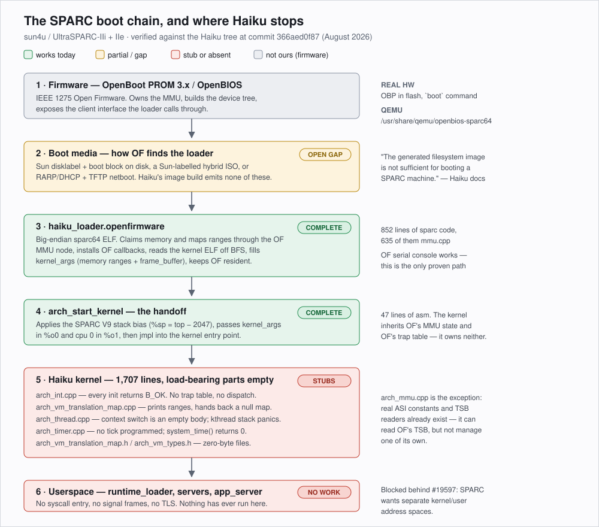
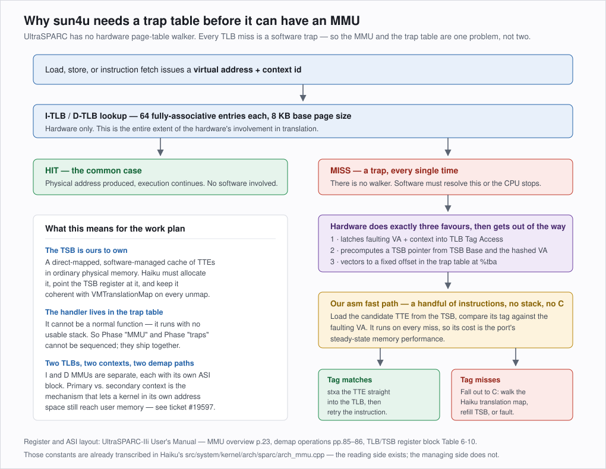
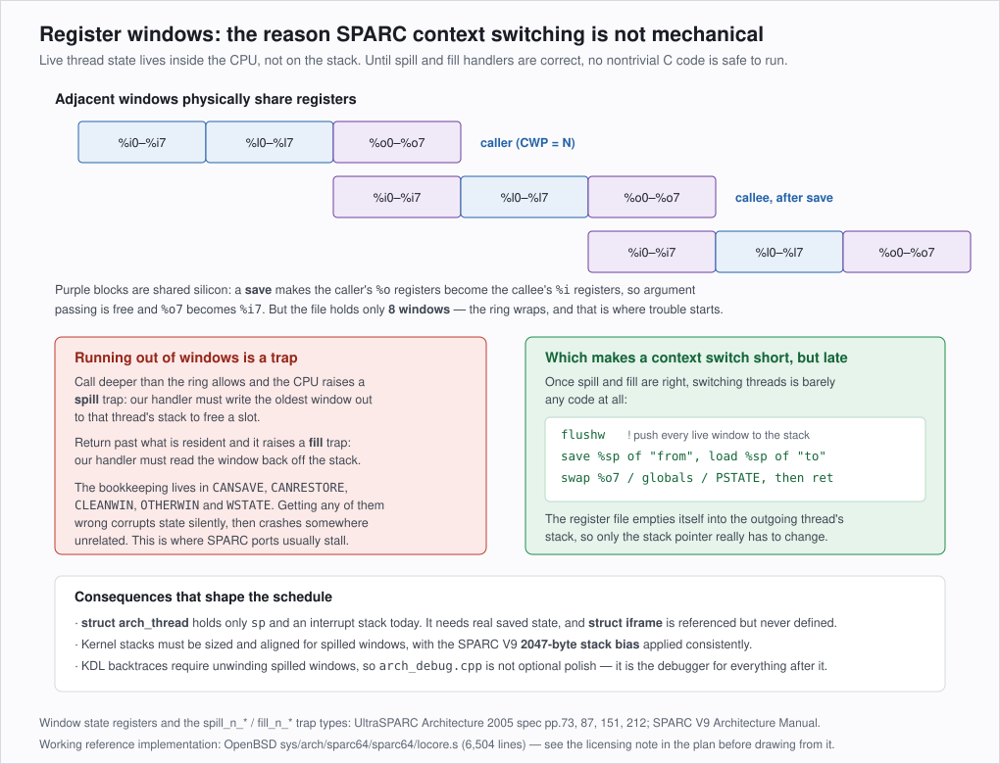
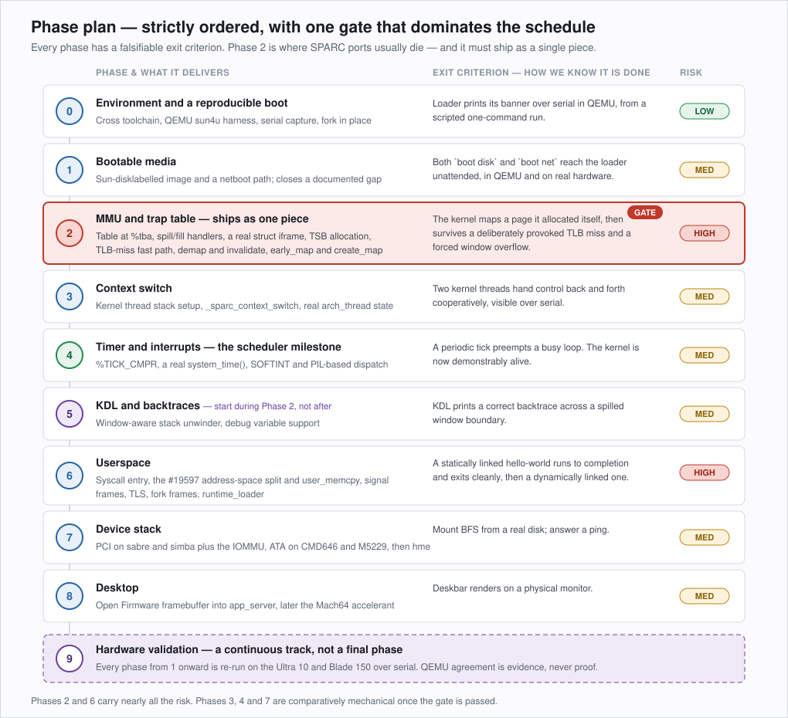
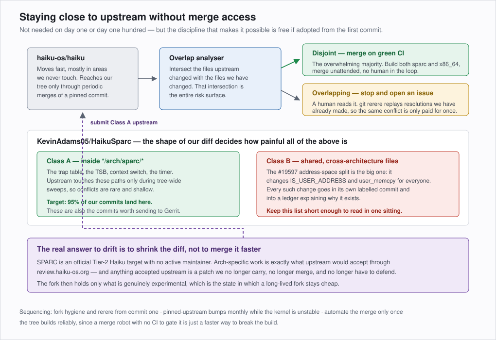

# Haiku on SPARC — Porting Plan

**Repository:** [KevinAdams05/HaikuSparc](https://github.com/KevinAdams05/HaikuSparc)
**Targets:** Sun Blade 150 and Sun Ultra 10 (`sun4u`, UltraSPARC IIe / IIi), developed against QEMU `sun4u`
**Status of this document:** the plan. Revised as findings change it; the running state of the
work is in [PROGRESS.md](PROGRESS.md), not here. Supersedes the scratch notes in the parent
directory.

**Companion documents:** [Hardware support matrix](HARDWARE_MATRIX.md) ·
[Phase 2 MMU design](PHASE2_MMU_DESIGN.md) · [Progress log](PROGRESS.md)

---

## 1. What this project is

Haiku already lists SPARC as an official Tier-2 architecture. The bootloader works. The kernel
does not. The gap between those two sentences is the whole project.

This plan takes the port from *"an ELF loader prints a banner over a serial cable"* to
*"Deskbar renders on a Sun Blade 150."* It is organised around the observation that SPARC
bring-up is ordinary OS work everywhere except two places — and that those two places are so
interlocked they have to be built as a single unit.

The plan is deliberately explicit about what is verified and what is assumed. Every claim about
the current state of the tree below was checked against the Haiku source at commit `366aed0f87`
during the writing of this document, and the check is cited so it can be re-run when it goes
stale.

---

## 2. Where the port stood at the start

**This section is the baseline, not the current state** — it describes the tree as inherited, so
that later progress has something to be measured against. For where things stand now see
[PROGRESS.md](PROGRESS.md).



### What works

The **OpenFirmware bootloader is genuinely complete**, and it is not a trivial amount of code:
852 lines of SPARC-specific loader, 635 of them in `mmu.cpp` alone. It claims memory through the
Open Firmware MMU node, installs OF callbacks, reads the kernel ELF off BFS, populates
`kernel_args` with both the physical memory ranges and the framebuffer geometry, and hands
control to `arch_start_kernel`, which applies the SPARC V9 2047-byte stack bias and jumps.

The OF serial console works. `arch_mmu.cpp` already carries a transcription of the UltraSPARC MMU
ASI and register map, and can read the TSB that Open Firmware set up — though not correctly: it
masked `TSB_Size` with 3 where the field is four bits wide, which we later fixed.

### What does not

The kernel architecture layer is 1,707 lines across 16 files, and the load-bearing parts are
empty bodies:

| File | State |
| --- | --- |
| `arch_int.cpp` | Every init returns `B_OK`. No trap table, no dispatch, IRQ enable/disable are empty. |
| `arch_vm_translation_map.cpp` | Prints the memory ranges, returns a null map. `early_map` is a no-op. *(`early_map` now implemented — PROGRESS.md §18.)* |
| `arch_thread.cpp` | `arch_thread_context_switch()` is an empty body. `arch_thread_init_kthread_stack()` calls `panic()`, and the commented-out body beneath it is stale m68k/PPC copy-paste. |
| `arch_timer.cpp` | Nothing programmed; `system_time()` returns 0. |
| `arch_asm.S` | 34 lines. User memcpy/memset/strlcpy are `retl; nop`. No context switch. |
| `arch_debug.cpp` | Backtrace returns 0 entries; debug variables unimplemented. |
| `arch_smp.cpp` | IPIs `panic()`. |
| `arch_vm_translation_map.h`, `arch_vm_types.h` | **Zero-byte files.** |
| `arch_thread_types.h` | `struct arch_thread` holds only `sp` and an interrupt stack. `struct iframe` is referenced but never defined. |

### Momentum

There is none, and this is the reason the project is viable rather than a reason it is not.
Filtering the git history for SPARC paths shows the last decade of commits are almost entirely
tree-wide sweeps that happen to include `arch/sparc` — the VM protection overhaul, the
`arch_cpu_invalidate*` signature change, the interrupt-function renames. The last commit written
*for* SPARC is `sparc: move kernel to a lower address`, authored 2020-12-30. Authorship before
that traces to François Revol and Adrien Destugues (PulkoMandy).

Community effort is entirely on ARM64 and secondarily RISC-V. Nobody is going to collide with
this work, and nobody is going to fix it for us.

### One documented gap that is easy to miss

Haiku's own build guide states plainly: *"The generated filesystem image is not sufficient for
booting a SPARC machine."* Producing bootable media is an open problem, not a solved step — it
gets its own phase below rather than being assumed away.

---

## 3. Strategy

### 3.1 Haiku first

The port is written to Haiku's abstractions, not around them. `VMTranslationMap`, the device
manager, the ATA stack, the PCI bus manager and the existing accelerant interface are the
targets; SPARC-specific code exists to satisfy them, not to replace them.

Concretely, that means we **port algorithms and register sequences, never subsystems**. The
sun4u TLB-miss path, the window spill/fill state machine and the sabre IOMMU programming
sequence all get lifted from prior art. The surrounding structure — how a translation map is
created, how a bus manager publishes devices, how an interrupt is routed — stays Haiku's.

A port that reads like Haiku is one that upstream might eventually take. A port that reads like
BSD wearing a Haiku hat is one we maintain alone forever.

### 3.2 Donor code and licensing

Copying open-source code is fine where the licence permits it, and on this project the licence
situation is unusually favourable — but it is not uniform, and the difference matters.

| Source | Licence | Verdict |
| --- | --- | --- |
| **OpenBSD `sparc64/pmap.c`** | 1996–1999 Eduardo Horvath, **BSD 2-clause, no advertising clause** ✅ | **Cleanest donor available.** The sun4u pmap — TSB management, TLB demap, context allocation. Port freely with attribution. |
| **OpenBSD `sparc64/locore.s`, `trap.c`, `clock.c`** | **BSD 4-clause** — advertising clause from Kranenburg, Horvath, Ross, Glass; the UCB Regents' clause was rescinded in 1999 but the others were not ✅ | **Usable.** Haiku already ships **125 files** carrying this exact clause (FireWire stack, msdosfs, and more), so precedent is settled. Preserve the notices verbatim. |
| **NetBSD `sparc64`** | Same BSD family, generally a superset of OpenBSD's code and ~40% larger | Usable on the same terms. Prefer OpenBSD: leaner and better-licensed for the same logic. |
| **FreeBSD** | BSD 2-clause | Usable. Haiku already has a FreeBSD network-driver compat layer, which matters for `hme`. |
| **Linux `arch/sparc`** | **GPL-2.0** | **Reference for behaviour only. Never copy, never paraphrase closely.** GPL is incompatible with Haiku's MIT kernel. Used above purely to *confirm a hardware fact* about Sun on-board NICs. |
| **OpenBIOS** | GPL-2.0 | Irrelevant — separate firmware, no linkage. |

The practical rule: **OpenBSD is the donor, Linux is the second opinion.** When the two disagree
about hardware behaviour, the vendor datasheet decides.

Every file containing ported code carries the original copyright block intact, plus our own
header in Haiku's two-line MIT form under `Kevin Adams <kevinadams05@gmail.com>`. A
[`THIRD_PARTY.md`](THIRD_PARTY.md) ledger records what came from where — written as we go, because
reconstructing provenance later is miserable.

### 3.3 Target hardware

Established in detail in the [hardware support matrix](HARDWARE_MATRIX.md). The short version:

The sabre generation — Ultra 5, Ultra 10, Blade 100, Blade 150 — is the only 64-bit Sun
workstation family that is **IDE rather than SCSI**, and Haiku's storage stack is ATA-native.
The same family shares one PCI host bridge across both CPU variants, uses ATI Mach64 onboard
graphics that Haiku's `ati` driver already claims by device ID, and is the generation QEMU
emulates. Buy a **Blade 150** first (best existing driver coverage, including a DM9102 NIC that
`dec21xxx` already supports) and an **Ultra 10** second (it is what QEMU models, and it carries
`hme` — the NIC shared by seven of the sun4u workstations).

---

## 4. The four hard problems

Everything else in this plan is ordinary work. These four are not, and they are what the
schedule should be built around.

### 4.1 Software-managed TLB



UltraSPARC has **no hardware page-table walker**. Every TLB miss is a trap. Hardware does three
things — latches the faulting address, precomputes a TSB pointer, and vectors into the trap
table — and then software does the rest.

The consequence for scheduling is the important part: **the TLB-miss handler is assembly living
inside the trap table, and it runs with no usable stack.** So "implement the MMU" and "install a
trap table" cannot be sequenced. They ship together or neither works.

There is a second, easily-missed translation structure. Chapter 10 of the IIi manual describes
the **IOMMU's own software-managed TSB** for DVMA — a completely separate table with a
different TTE format from the CPU MMU's in Chapter 15. That one is not needed until PCI DMA in
Phase 7, but it should not come as a surprise when it arrives.

#### The failure mode that ends the machine

This is worth stating in full, because it is the specific hazard that makes §4.1 and §4.2
*compose* into something worse than either alone. PulkoMandy, the port's last active developer,
named exactly this as the reason he stopped:

> I stopped when I found out how bad the MMU architecture for SPARC is (no hardware page table
> walk, so everything needs to be done in software, which itself can trigger various other type
> of exceptions such as register spills and so on)

The mechanism, from the UltraSPARC-IIi User's Manual §14.1.3 (printed p.224):

> UltraSPARC-IIi supports five trap levels; that is, MAXTL=5. […] Traps at MAXTL−1 cause the CPU
> to enter RED_state. **If a trap is generated while the CPU is operating at TL = MAXTL, the CPU
> will enter error_state and generate a Watchdog Reset (WDR).**

So the trap budget is finite and shallow. A TLB miss takes us to TL1. If that handler makes a
call deep enough to spill a register window, that is a second trap at TL2 — and the spill writes
to a stack that **may itself miss the TLB**, taking a third. Run out of levels and the machine
does not report an error; it resets.

Three design constraints follow, and they are not negotiable:

- The TLB-miss fast path must be **assembly that cannot fault**: no stack, no calls, only the
  alternate global registers the hardware swaps in on the way to the handler, touching only
  memory that is guaranteed mapped. It must also handle the **TL>0 half of the trap table**,
  which the hardware vectors to separately (`FIGURE 12-4` in the UA2005 spec — a full privileged
  trap table is 32 KB precisely because TL=0 and TL>0 each get 512 entries).
- Kernel stacks and the TSB must be mapped by **locked or large-page translations** that cannot
  themselves miss, or the recursion above is reachable from ordinary code.
- **Debugging this requires the backtrace to work first.** A window-state bug corrupts silently
  and kills the machine somewhere unrelated with no diagnostic. That is why Phase 5 starts during
  Phase 2 rather than after it, and why the QEMU gdb stub (§5.2) is the most valuable tool we
  have — on real hardware a watchdog reset tells you nothing at all.

None of this is unsolved: OpenBSD's `sparc64/locore.s` and `pmap.c` are a working, battle-tested
implementation of exactly this, under a licence we can port from (§3.2). But it explains why
Phase 2 carries the schedule risk, and why it must not be reported as nearly-done until a
deliberately provoked nested fault has been survived.

### 4.2 Register windows



Live thread state lives inside the CPU register file, not on the stack. Overflow raises a spill
trap; underflow raises a fill trap; the bookkeeping spans `CANSAVE`, `CANRESTORE`, `CLEANWIN`,
`OTHERWIN` and `WSTATE`. Get any of it wrong and state corrupts silently, then crashes somewhere
unrelated.

Once spill and fill are correct, the context switch itself is nearly trivial — `flushw` empties
the register file onto the outgoing thread's stack, and little more than `%sp` has to change.
All the difficulty is front-loaded, which is exactly why this is the gate.

### 4.3 Kernel and user address spaces — ticket #19597

Haiku ticket [#19597](https://dev.haiku-os.org/ticket/19597) records the concern, filed by
PulkoMandy out of a Gerrit review:

> In sparc […] the kernel runs in its own address space and use these instructions to access
> userspace memory. […] The consequence for Haiku is that `IS_USER_ADDRESS` cannot be used, and
> `user_memcpy` needs a different implementation.

That is true of the *idiomatic* SPARC design, and it would be a large, invasive, cross-cutting
change to Haiku's shared kernel code — precisely the class of change that makes a fork expensive
to maintain.

**We should not do it, at least not first.** The UltraSPARC-IIi manual's TTE definition
(FIGURE 15-1, printed p.205) provides a cleaner way out:

> **G: Global.** If the Global bit is set, the Context field of the TTE is ignored during hit
> detection. This allows any page to be shared among all (user or supervisor) contexts running
> in the same processor.

So the recommended design for the first working system is the same split-address-space model
Haiku's other 64-bit ports already use: **kernel mappings high and marked Global, user mappings
low and tagged with a per-team 13-bit context id, all in one address space.** `IS_USER_ADDRESS`
keeps working, `user_memcpy` stays ordinary, and Haiku's shared code needs no changes at all.
The existing `arch_kernel.h` already declares `KERNEL_BASE` at `0xffffff0000000000`, so the tree
is halfway to this model already.

The costs are honest and small: the 13-bit context field gives 8192 contexts, so a context
recycling scheme is needed; and we give up the theoretical syscall-time benefit of a separate
kernel space — which is a benefit we would not measure for years. The 4 MB page size available
in the TTE size field is worth using for the kernel image and the physical map to keep TLB
pressure low.

This decision should be recorded and revisited only if profiling ever justifies it. It converts
the single largest cross-architecture change in the project into no change at all.

### 4.4 Bootable media

Open Firmware does not boot arbitrary disk images. It wants a Sun disklabel with a boot block at
a known offset, a Sun-labelled hybrid ISO, or a netboot over RARP/DHCP and TFTP. Haiku's image
build emits none of these, which is why the official guide says the filesystem image is not
sufficient to boot a SPARC machine.

This is unglamorous, entirely tractable, and blocks literally every test that follows — so it
goes early rather than late.

---

## 5. Development environment and test loop

### 5.1 The emulator is the primary target, with a caveat

QEMU's `sun4u` machine is *"most similar to the Sun Ultra 5 and Ultra 10 workstations"* and is
described as mostly complete, running Linux, NetBSD and OpenBSD headless. It defaults to the
`sunhme` NIC — the same Happy Meal as a real Ultra 10 — which means an `hme` driver written
against QEMU transfers to real hardware rather than being throwaway.

The caveat is documented and specific: **graphics work during firmware and early boot but fail
when an OS switches into graphics mode.** That is survivable, because our graphics plan is to
use the framebuffer Open Firmware already set up rather than to program a mode — but it means
the desktop phase gets validated on real hardware, not in the emulator.

**The build host is already equipped — nothing needs installing.** Verified on Linux Mint 22.3
(noble base): `qemu-system-sparc` 8.2.2 is installed, providing `/usr/bin/qemu-system-sparc64`,
with the OpenBIOS firmware at `/usr/share/qemu/openbios-sparc64` from `qemu-system-data`.
OpenBIOS v1.1 boots the `sun4u` machine to the `ok` prompt and reports
`CPUs: 1 x SUNW,UltraSPARC-IIi`.

Better still, QEMU models **both** our target CPUs by name — `TI UltraSparc IIi` (Ultra 10) and
`TI UltraSparc IIe` (Blade 150) — each with the expected 8 register windows. Every phase can be
exercised against both target identities rather than against a single generic sun4u.

### 5.2 The single largest tooling advantage

QEMU's gdb stub, driven by the `sparc64-unknown-haiku-gdb` from our own cross toolchain, lets us
**single-step the trap table and inspect `%tba`, `CANSAVE` and TSB state directly.** On real
hardware, none of that is observable — the debugging channel is a serial cable and whatever the
kernel manages to print before it dies.

Given that Phase 2 is the gate and Phase 2 is nothing but trap-table and MMU assembly, this
capability is worth more than everything else in the toolchain combined. Set it up in Phase 0
and prove it works before it is needed.

QEMU's `-d int,mmu` execution tracing is the complementary tool for the same phase.

### 5.3 Build

Toolchain, per Haiku's SPARC guide:

```sh
mkdir generated.sparc && cd generated.sparc
../configure --use-gcc-pipe -j$(nproc) \
    --cross-tools-source ../../buildtools --build-cross-tools sparc
jam -q haiku_loader.openfirmware
jam -j$(nproc) -q @minimum-raw
```

Buildtools are already on disk with GCC 13.3.0. `configure` accepts `sparc` and maps it to
`sparc64-unknown-haiku`.

Two architecture facts that have already bitten this port historically and are worth keeping in
mind: SPARC uses **8 KB pages** where Haiku's other ports use 4 KB — the `PAGESIZE` versus
`B_PAGE_SIZE` distinction is real and was a source of bugs in 2021 — and SPARC is **big-endian**,
which is untested territory for most of Haiku's driver stack.

### 5.4 Test loop

A single script should take a source tree to a serial log with no interaction, because this loop
runs hundreds of times:

```
build → assemble bootable image → launch QEMU headless → capture serial → assert on output
```

Serial capture is the test harness. Golden-output comparison on the boot log is a cheap and
surprisingly effective regression test for a kernel at this stage.

Real hardware runs the same images over netboot, with the serial console captured from the build
host through a USB-serial adapter. The lab already has a Serial-over-LAN capture workflow for
`shredder` that the same tooling can follow.

### 5.5 Is hardware needed to start? No — Phases 0–6 run entirely in QEMU

**Nothing in the first two thirds of this plan is blocked on sourcing a machine.** Phases 0
through 6 — the whole kernel bring-up, up to and including userspace — are QEMU-viable.

QEMU's `sun4u` implements precisely what the hard phases exercise: *"UltraSPARC Translation
Storage Buffer (TSB) support with software-managed TLB, multiple page sizes, and context tags
for fast context switching."* Those context tags are exactly the mechanism the §4.3 Global-bit
design depends on. The stronger evidence is empirical: Linux, NetBSD and OpenBSD all boot on
this machine headless, and they hit the software TLB, the trap table and window spill/fill
constantly.

For **Phase 2, QEMU is better than real hardware.** The gdb stub makes `%tba`, `CANSAVE` and TSB
state directly inspectable and the trap table single-steppable. On an Ultra 10 the entire
debugging channel is whatever the kernel prints over serial before it dies. Doing the gate phase
blind when an instrumented alternative exists would be a poor trade.

Phase 7 splits along machine lines, and more favourably than expected: QEMU emulates the Ultra
10's **exact** IDE controller (`cmd646-ide`) and its **exact** NIC (`sunhme`), so the whole Ultra
10 device path is developable in emulation. The Blade 150's ALi M5229 is not emulated at all and
needs hardware. **Phase 8** needs hardware regardless, per the documented graphics-mode
limitation.

**Buy early regardless, for a specific reason.** There is a standing category of bugs that QEMU
cannot surface, and it is already visible in the tree: `arch_cpu_sync_icache()`,
`arch_cpu_memory_read_barrier()` and `arch_cpu_memory_write_barrier()` are **empty bodies**.
QEMU will never punish that; real UltraSPARC will. Installing a trap table is self-modifying
code that requires a `flush`, and absent `MEMBAR`s produce intermittent faults that present as
random corruption. Add OpenBIOS-versus-OpenBoot device-tree differences and these accumulate
invisibly.

Discover them a few at a time from Phase 1 onward rather than as one pile at Phase 7. Sourcing
also takes time and luck, and these machines routinely arrive with dead NVRAM batteries and
IDPROM checksum errors that are better found early.

**Sequencing:** begin Phase 0 immediately on QEMU, put a Blade 150 on watch in parallel, and run
a hardware smoke test as soon as Phase 1 produces bootable media. Nothing waits on shipping.

---

## 6. Phased plan



Each phase below states what it delivers, which files it touches, and a **falsifiable exit
criterion**. A phase is not done because the code is written; it is done because the criterion
is demonstrated over a serial log.

### Phase 0 — Environment and a building toolchain  **[DONE]**

Fork Haiku. Build the cross toolchain and the loader. Write the launch-and-capture script. Prove
the gdb stub attaches.

**Files:** tooling under `sparc-port/tools/`, plus whatever it takes to make the loader compile.
**Exit:** `haiku_loader.openfirmware` builds clean, and QEMU boots OpenBIOS to the `ok` prompt
under script control.
**Risk: low** — and it held.

Done so far: fork with `master`/`sparc/main` split and `rerere`; GCC 13.3.0 cross toolchain for
`sparc64-unknown-haiku`; `jam` built from buildtools; `qemu-sun4u.sh` verified booting OpenBIOS
v1.1 as both target CPUs.

> **Correction to this plan's original sequencing.** Phase 0's exit criterion was first written
> as *"the loader prints its banner over serial."* That was wrong: it depends on Phase 1. Open
> Firmware will not execute the loader until it is packaged as boot media, because the loader is
> an Open Firmware *client program* — its `_start` takes the OF entry point as its fifth
> argument, which only a real `boot` sets up. QEMU's `-kernel` bypasses that and jumps to a bad
> entry. Building the loader and running it are two different milestones.

**The loader did not build from upstream master.** Four `-Werror` failures had to be fixed
first — see [UPSTREAM_DELTA.md](UPSTREAM_DELTA.md). Three are architecture-neutral, so the
Open Firmware loader is bit-rotted for PowerPC too, not merely for us. Worth knowing before
trusting any other "this part already works" claim about this port.

gdb works too, with caveats worth knowing before relying on it — breakpoints on kernel
addresses never fire, and `-d int,mmu` tracing is the instrument that does. See PROGRESS.md §14.

### Phase 1 — Bootable media  **[DONE]**

Generate a Sun-disklabelled disk image containing the loader and kernel, and stand up a netboot
path. Netboot is worth doing even though it seems like the harder option: it is the fastest
iteration loop on real hardware, and the OF bootloader already has a `network.cpp`.

**Files:** `build/jam/` image rules, plus a standalone image-assembly tool under `tools/`.
**Exit:** both `boot disk` and `boot net` reach the loader unattended, in QEMU and on hardware —
and the loader prints its banner, which is the milestone Phase 0 was originally mis-credited with.
**Risk: medium** — the disklabel geometry and boot-block offsets are fiddly and poorly documented.

**What the first attempts already established.** The build emits an **a.out** image, not ELF
(magic `0x009c0107`, OMAGIC, `a_entry` 0x00202000) — consistent with `sparcbootblock.h` in the
tree, and a format OpenBIOS does accept. Two paths were tried and both failed informatively:

- `qemu -kernel` loads it and reports `[sparc64] Kernel already loaded`, then traps at PC 0.
  Expected: it does not establish the OF client calling convention.
- `boot net` over QEMU's built-in TFTP reaches `Trying net...` and then
  `No valid state has been set by load or init-program` — OpenBIOS fetched nothing it would run.

So the open question for this phase is narrow and concrete: what exactly does OpenBoot, and
OpenBIOS, require of this a.out image and of the media around it. That is a far better starting
position than "produce bootable media somehow."

### Phase 2 — MMU and trap table ★ THE GATE  **[DONE]**

The one phase that ships as a single unit. Install a `%tba`-aligned trap table. Write window
spill and fill handlers and set the window state registers. Define a real `struct iframe`.
Allocate and manage a TSB. Write the TLB-miss fast path. Implement demap and invalidate,
`early_map` and `create_map`. Fill in the two zero-byte headers.

Adopt the shared-address-space model from §4.3: kernel mappings Global, user mappings
context-tagged, 4 MB pages for the kernel image and physical map.

**Files:** new `arch_traps.S`; `arch_vm_translation_map.cpp`, `arch_mmu.cpp`, `arch_cpu.cpp`,
`arch_int.cpp`, `arch_thread_types.h`, and the empty `arch_vm_translation_map.h` /
`arch_vm_types.h`.
**Primary references:** UltraSPARC-IIi manual ch.15 (MMU internals, TTE at p.205, demap
pp.85–86); UA2005 spec pp.73/87/151/212 (window state, spill/fill trap types); OpenBSD
`pmap.c` and `locore.s`.
**Exit:** the kernel maps a page it allocated itself, survives a deliberately provoked TLB miss,
and survives a forced window overflow.
**Risk: high.** This is where SPARC ports stall. Budget accordingly and do not let it be
optimistically reported as nearly-done.

### Phase 3 — Context switch  **[DONE]**

Replace the `panic()` in `arch_thread_init_kthread_stack` — delete the stale m68k body — with
real SPARC frame setup. Write `_sparc_context_switch`. Extend `struct arch_thread` with genuine
saved state.

**Files:** `arch_thread.cpp`, `arch_asm.S`, `arch_thread_types.h`.
**Exit:** two kernel threads hand control back and forth cooperatively, visible over serial.
**Risk: medium** — small once Phase 2 is right, and near-impossible before.

### Phase 4 — Timer and interrupts (the scheduler milestone)  **[DONE]**

Program `%TICK_CMPR` for a periodic tick. Implement `system_time()` from `%TICK` divided by the
`clock-frequency` property read from Open Firmware. Route interrupts through PIL-based dispatch
and `SOFTINT` into Haiku's timer, which drives the scheduler. Single CPU only — SMP stays
stubbed deliberately.

**Files:** `arch_timer.cpp`, `arch_int.cpp`, `arch_smp.cpp` (single-CPU only).
**References:** IIi manual — `TICK_CMPR` p.96, `SOFTINT` p.166, interrupt vectors ch.11.
**Exit:** a periodic tick preempts a busy loop. **The kernel is now demonstrably alive.**
**Risk: medium.**

**Status: done.** `system_time()` from `%TICK`, the level-14 entry path, `%TICK_CMPR` arming, and
preemption — a spinner that never yields is taken off the CPU. See [PROGRESS §24](PROGRESS.md).

### Phase 5 — KDL and backtraces (starts during Phase 2, not after)  **[DONE]**

Window-aware stack unwinding and debug-variable support. This is listed fifth but should be
started as soon as Phase 2 is underway: `arch_debug.cpp` currently returns zero stack frames,
which means every bug in the hardest phase of the project is diagnosed without a backtrace.
Fixing it early pays for itself immediately.

**Files:** `arch_debug.cpp`, `arch_debug_console.cpp`.
**Exit:** KDL prints a correct backtrace across a spilled window boundary.
**Risk: medium.**

**Status: done**, four phases later than this said to do it, and KDL is fully usable: `sc` prints a
symbolised sixteen-frame backtrace and every other command works. Getting there took two fixes
beyond the stack walker — the debugger had never accepted a keypress (`int` versus `intptr_t`, as in
Phase 1), and `setjmp`/`longjmp` were a bare `ret`, which is why any command faulted. See
[PROGRESS §25 and §26](PROGRESS.md).

**The advice above was not taken, and the cost is now measurable.** Phases 2 and 3 were done without
backtraces. What replaced them was a trap handler that returns to TL=0 and reports the trapped
window's `%o7` and `%i7`, which turned out to identify a call site well enough to find every bug
that came up — see [PROGRESS §22 and §23](PROGRESS.md). That is one frame, not a backtrace, and
several of those bugs took a bracket-and-bisect hunt that a real stack walk would have shortened.
The recommendation stands for anyone reading this before starting: do it earlier than we did.

### Phase 6 — Userspace  **[IN PROGRESS]**

Syscall entry and return. `arch_thread_enter_userspace`. Signal frames. TLS. Fork frames. The
real `user_memcpy`/`memset`/`strlcpy` in place of the `retl; nop` stubs. `runtime_loader`.

Per §4.3 this phase should require **no changes to shared Haiku code** — that is the main thing
to verify early, because if the shared-address-space model turns out not to hold, the scope of
this phase changes completely.

**Files:** `arch_thread.cpp`, `arch_asm.S`, `arch_user_debugger.cpp`, `arch_commpage.cpp`,
`src/system/runtime_loader/arch/sparc/`, `src/system/libroot/os/arch/sparc/`.
**Exit:** a statically linked hello-world runs to completion and exits cleanly; then a
dynamically linked one.
**Risk: high** — the largest surface area in the plan, and the phase most likely to surface
big-endian assumptions elsewhere in Haiku.

**Status: the foundation is done and the model is verified.** Page faults reach `vm_page_fault()`,
`user_memcpy()` fails safely on a bad user address, and the shared address space of §4.3 holds with
no shared-code changes — which is what this phase said to check first. What remains is everything
gated on running a binary: syscall entry, `arch_thread_enter_userspace`, signal frames, TLS, and
`runtime_loader`. Note those are also gated on the image build, which cannot yet produce SPARC media
(§5.4) — so the exit criterion needs that gap closed too. See [PROGRESS §27](PROGRESS.md).

### Phase 7 — Device stack  **[IN PROGRESS]**

PCI bus manager over sabre and simba, with Open Firmware providing config-space access and the
device tree. The sabre IOMMU for DVMA — the second software-managed TSB from §4.1. ATA on
CMD646 (Ultra 10) and ALi M5229 (Blade 150). Then `hme`, written from the FEPS and PCIO
datasheets, which RefDocs covers well.

**Exit:** mount BFS from a real disk; answer a ping.
**Risk: medium.** The IOMMU is the interesting part; the rest is conventional.

**Status: the stack is assembled and reaches the disks.** A `busses/pci/sabre` driver publishes the
host bridge to the device manager, so Haiku's own PCI bus manager attaches beneath it and enumerates
sabre, both simba bridges, sunhme, the framebuffer and the CMD646. `generic_ide_pci` binds the CMD646
through `ata_adapter`, and both QEMU disks identify by model, serial and geometry over PIO.

Two pieces of this phase are deliberately not done yet, and both are named in the code:

- **The IOMMU.** Bus-master DMA needs a DVMA address from a mapping nothing makes yet, so
  `ata_adapter` reports the controller as unable to DMA on sparc. PIO is slow and correct.
- **Interrupt routing.** `SabrePCIController::ReadIrq()` returns `B_UNSUPPORTED` rather than a
  plausible wrong number, because a wrong interrupt is a driver that waits forever. It needs the
  `interrupt-map` walk that `ECAMPCIControllerFDT::Finalize()` does for the flattened-device-tree
  platforms.

`scsi_disk` binds to both disks and publishes `disk/ata/0/master/raw` and
`disk/ata/0/slave/raw`; the CD-ROM identifies through the ATAPI path. The boot then grinds, polling a
device that is not there — which is what the missing interrupt routing costs, and puts that piece of
this phase on the critical path rather than in the "later" pile.

See [PROGRESS §29](PROGRESS.md) for the eight bugs between the device manager and a published disk —
including the TSB that was sitting on top of every thread stack, which is the one that had been
corrupting register windows.

### Phase 8 — Desktop

Feed the Open Firmware framebuffer that the loader already records in `kernel_args` into
Haiku's existing generic `framebuffer` driver and accelerant — both of which are architecture-
neutral and need no SPARC work. That gets app_server on screen without programming a single
video register. The Mach64 accelerant comes afterwards as an optimisation.

USB HID for the Blade 150's keyboard and mouse; the ebus path for the Ultra 10.

**Exit:** Deskbar renders on a physical monitor.
**Risk: medium**, and mostly on the input side rather than display.

### Phase 9 — Hardware validation (continuous, not final)

From Phase 1 onward, every phase is re-run on the Ultra 10 and Blade 150 over serial. QEMU
agreement is evidence, never proof — emulators are wrong in exactly the places that matter for
MMU and trap work, and OpenBIOS is not OpenBoot.

Record `show-devs`, `banner` and `.properties` output from both machines into `TestHardware/`
the day they arrive.

---

## 7. Staying in sync with upstream



Not needed on day one, or day one hundred. But the discipline that makes it cheap later is free
if adopted from the first commit, and expensive to retrofit.

### 7.1 Fork, not overlay

The repository should be a **full fork of Haiku**, not a patch set or a loose collection of
files. A port is in-tree kernel work by nature; nothing else can be merged, built, or bisected.

### 7.2 The discipline that does the real work

**Keep changes inside `*/arch/sparc/*`.** This is the single highest-leverage habit available.
Upstream touches those paths only during tree-wide sweeps, so a diff confined to them merges
almost cleanly forever. The git history confirms this empirically: every SPARC-path commit in the
last five years is a cross-architecture refactor, and every one of them was mechanical.

Changes to shared files are the entire risk surface. They go in **their own labelled commits**
and into a `docs/UPSTREAM_DELTA.md` ledger recording what was changed, why, and whether it is
upstreamable. Keeping that list short enough to read in one sitting is the actual goal — the
tooling below is only there to protect it.

The §4.3 decision matters here more than anywhere: choosing the shared-address-space model
instead of implementing #19597 removes what would otherwise have been the single largest entry
in that ledger.

### 7.3 Mechanics, in order of when they earn their keep

**From commit one — free.** Track `upstream/master` as a remote. Enable `git rerere` so a
conflict resolved once is replayed automatically forever. Merge rather than rebase, so repeated
merges get cheaper instead of re-litigating history.

**Early — cheap.** Pin to a known-good upstream commit and bump deliberately on a monthly
cadence rather than chasing tip-of-tree. While the kernel is unstable, tracking a moving target
means never knowing whether a break is ours or theirs.

**Once the tree builds reliably — worth automating.** A nightly job that attempts the merge on a
scratch branch, builds **both sparc and x86_64** (the x86_64 build is what catches accidental
cross-architecture breakage), and merges unattended when the upstream change set is disjoint
from our own. When it overlaps, it stops and opens an issue.

The overlap test is the whole trick and it is one command:

```sh
git diff --name-only upstream/master...HEAD          # files we have changed
git diff --name-only upstream/master@{1}..upstream/master   # files they changed
# the intersection is the only thing a human needs to look at
```

**Cherry-picking individual Gerrit changes is the wrong shape** and worth ruling out explicitly.
It is tempting — the Gerrit REST API will happily list merged changes with their file sets — but
individual patches assume the commits before them. Picking a disjoint subset produces a tree
that is a state upstream was never in and never tested. Merge-based sync at the branch level is
strictly safer for the same effort.

### 7.4 The real answer

**Shrink the diff.** SPARC is an official Tier-2 target with no active maintainer, and
arch-specific work is exactly what `review.haiku-os.org` exists to accept. Anything landed
upstream is a patch we no longer carry, no longer merge, and no longer have to defend.

That leaves the fork holding only what is genuinely experimental — which is the condition under
which a long-lived fork stays cheap indefinitely.

---

## 8. Repository layout and conventions

```
/home/kevin/Code/Haiku/SPARC/
├── NOTES.md, roadmap.svg     ← superseded scratch notes, not pushed
├── (scratch, logs, images, hardware dumps — not pushed)
└── src/                      ← the HaikuSparc repo: a full Haiku fork
    ├── README.md             ← ours; Haiku's own ReadMe.md is left untouched
    ├── sparc-port/           ← EVERYTHING of ours lives here
    │   ├── PORTING_PLAN.md
    │   ├── HARDWARE_MATRIX.md
    │   ├── THIRD_PARTY.md      ← provenance ledger, written as we go
    │   ├── UPSTREAM_DELTA.md   ← shared-file changes and why
    │   ├── diagrams/*.svg
    │   └── tools/              ← build, image assembly, QEMU harness
    └── (the rest of the Haiku tree, unmodified)
```

**Why `sparc-port/` and not `docs/`.** Haiku already has a `docs/` tree, and dropping our
documents into it would mean our files and upstream's share directories — turning routine
upstream activity into merge noise for no benefit. A uniquely-named top-level directory can
never collide with anything upstream does, which is the same §7.2 discipline applied to
documentation. `README.md` at the root is the one deliberate exception: Haiku's own file is
`ReadMe.md`, a different path, so both coexist and GitHub shows ours as the landing page.

Everything that should not be published — QEMU disk images, serial logs, hardware dumps,
scratch experiments — stays in the parent directory, outside the repo.

### Branch layout

| Branch | Role |
| --- | --- |
| `master` | Pristine upstream tracking. Tracks `upstream/master`. **Never commit here.** |
| `sparc/main` | Our trunk. All port work lands here. |

Keeping `master` pristine is what makes `git diff master...sparc/main` mean exactly "our entire
delta" — the input the §7.3 overlap analyser needs, available for free at any moment.

Remotes: `origin` and `fork` both point at `KevinAdams05/HaikuSparc` so either habit works;
`upstream` is `haiku/haiku` with its push URL deliberately set to an invalid value, so an
absent-minded `git push upstream` fails loudly instead of doing something embarrassing.

**Conventions**, consistent with the rest of this lab's Haiku work: Haiku coding style
throughout, enforced by a `style-check.py` linter with a baseline, ported from the RadeonHD
project. Copyright headers in Haiku's two-line MIT form under
`Kevin Adams <kevinadams05@gmail.com>`. Descriptive names over abbreviations. Diagrams as SVG,
never ASCII art. Ported donor code keeps its original formatting and copyright block so it stays
diff-comparable against the upstream it came from — the same policy already in force for
NimblePDF's poppler interop layer.

Branching follows the existing convention: never push to `main` directly; releases as tags on a
`release/*` line; `git push fork`.

---

## 9. Risks

| Risk | Likelihood | Impact | Mitigation |
| --- | --- | --- | --- |
| Phase 2 stalls — window spill/fill or TSB subtly wrong | **High** | Project-ending | The gdb stub on QEMU is the countermeasure. Build Phase 5's backtrace early. Port OpenBSD's `pmap.c` closely rather than inventing. |
| Big-endian assumptions surface across Haiku's driver stack | High | Weeks of scattered work | Expect it in Phase 6/7, not before. Every Haiku driver we reuse was written for little-endian hosts. |
| OpenBIOS diverges from real OpenBoot | Medium | Chases phantom bugs | Get hardware early. Never let QEMU-only results gate a phase. |
| QEMU sun4u graphics limitation blocks Phase 8 | Medium | Desktop unverifiable in emulation | Already mitigated by design: use the OF framebuffer, program no modes. Validate on hardware. |
| Sourced hardware is dead or incomplete | Medium | Schedule slip | Buy two machines, not one. Expect dead NVRAM batteries and IDPROM checksum errors — these are normal and recoverable. |
| Upstream drift outpaces us | Low early, rising | Merge cost compounds | §7. The `arch/sparc` confinement discipline is the mitigation; the automation is only insurance. |
| Missing sabre, CMD646, and ALi M5229 documentation | Low | Slower Phase 7 | Psycho manual plus OpenBSD's driver covers sabre; the IDE parts are conventional PCI IDE. |
| Scope creep into SMP, T-series, or 32-bit SPARC | Medium | Dilutes a hard project | Explicitly out of scope. Single CPU, `sun4u`, sabre generation. |

---

## 10. Immediate next actions

1. **Fork Haiku into `SPARC/src`**, add `upstream` as a remote, enable `git rerere`, and commit
   this plan and the matrix.
2. ~~Install `qemu-system-sparc`~~ — **already present and verified booting to `ok`.** ✅
3. **Build the cross toolchain and `haiku_loader.openfirmware`**, and get it to print its banner
   over serial in QEMU. This is Phase 0's exit criterion and validates the entire toolchain in
   one shot.
4. **Prove the gdb stub** attaches and breaks on `arch_start_kernel`.
5. **Source a Sun Blade 150** — *in parallel, blocking nothing* (see §5.5). An Ultra 10 when one
   appears at a sensible price. Order a null-modem serial cable and USB-serial adapter alongside.
6. **Resolve the open verification items** in the matrix's §9 as soon as hardware is on the bench.

Phase 1 begins once items 1–4 are green. Items 5–6 run alongside and gate nothing before
Phase 7.

---

## 11. References

**Vendor documentation** (local, `/home/kevin/Code/RefDocs/SPARC/`) — UltraSPARC-IIi User's
Manual; UltraSPARC IIe supplement; SPARC V9 Architecture Manual; UltraSPARC Architecture 2005;
IEEE 1275 Open Firmware core plus SPARC and PCI bindings; APB (simba) manual; PCIO manual; FEPS
datasheets. Itemised with coverage assessment in the [matrix §7](HARDWARE_MATRIX.md#7-documentation-coverage).

**Donor source trees** (local) — `/home/kevin/Code/OpenBSD/sys/arch/sparc64/`,
`/home/kevin/Code/NetBSD/sys/arch/sparc64/`, `/home/kevin/Code/FreeBSD`,
`/home/kevin/Code/Linux/linux` *(reference only — GPL)*.

**Haiku** — [Port status](https://www.haiku-os.org/guides/building/port_status/) ·
[The SPARC port](https://www.haiku-os.org/docs/develop/kernel/arch/sparc/overview.html) ·
[Compiling for SPARC](https://www.haiku-os.org/guides/building/compiling-sparc/) ·
[Boot process specification](https://www.haiku-os.org/docs/develop/kernel/boot/boot_process_specs.html) ·
[Network booting](https://www.haiku-os.org/guides/network_booting/) ·
[Ticket #19597](https://dev.haiku-os.org/ticket/19597)

**Emulation** — [QEMU sparc64 system emulation](https://www.qemu.org/docs/master/system/target-sparc64.html)
