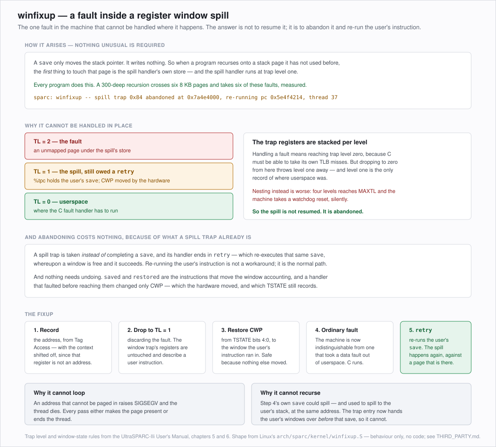

# Progress notes

Running log of what has been done, what was learned, and what to pick up next. Deliberately
separate from [PORTING_PLAN.md](PORTING_PLAN.md): the plan describes the shape of the work and
should stay stable; this file changes constantly. Findings get promoted into the plan only when
they change the plan.

**State: Phases 0–5 complete with a working kernel debugger. Phase 6's foundation is in and
verified; Phase 7 has started.**

The loader boots from Sun-disklabelled media, mounts a BFS volume and enters the kernel. The kernel
takes the MMU and trap table over from Open Firmware, builds its own three-level page table, runs
the VM and slab allocator, initialises the ELF loader, the commpage and the scheduler, switches
between and preempts kernel threads, keeps time from `%TICK`, **handles page faults**, drops into a
usable KDL, and **reads the firmware's device tree**. It stops at
`KDiskDeviceManager::InitialDeviceScan()` — no disk drivers yet, which is Phase 7's job.

Exit criteria met, each by a deliberate test rather than by inference:

| Phase | | |
| --- | --- | --- |
| 2 | Maps a page it allocated itself | after the cutover `early_map` writes only the page table and TSB (§21) |
| 2 | Survives a provoked TLB miss | translation demapped, read back correctly (§21) |
| 2 | Survives a forced window overflow | 24 frames against 8 windows, sum exact (§21) |
| 3 | Two threads hand control back and forth | `counter 128 of 128 after 124 yields` (§23) |
| 4 | `system_time()` is right | monotonic, and agreeing with the raw `%TICK` delta (§24) |
| 4 | A tick preempts a busy loop | `spinner reached 402130 ... without either thread yielding` (§24) |
| 5 | KDL prints a correct backtrace across a spilled window | sixteen symbolised frames from `sc` (§25, §26) |
| 3 | `wait_for_thread()` waits and reports | `returned 0x0, thread exited 0x1234` (§23, §26) |
| 6 | *the model holds, and no shared code changed* | ranges disjoint; `user_memcpy` faults caught (§27) |
| 6 | A static hello-world runs | **not met** — needs syscalls and an image build that can make SPARC media |
| 7 | Mount BFS from a real disk; answer a ping | **not met** — config space reads and the stack builds; no driver bound yet (§28) |

What exists:

| | |
| --- | --- |
| Page table | three levels, physical interior pointers, TTE leaves (§22) |
| TLB miss fast path | 10 instructions; slow path walks the page table, and an unresolved miss becomes a page fault (§22, §27) |
| Trap table | 32 KB, geometry asserted at build time and re-checked every boot (§20) |
| `VMTranslationMap` | `SPARCVMTranslationMap`, wired into `create_map` (§22) |
| Context switch | twelve instructions, built on the window spill and fill handlers (§23) |
| Clock and timer | `system_time()` from `%TICK`, level-14 interrupt, preemption (§24) |
| Backtraces and KDL | window-aware stack walk; every command works (§25, §26) |
| `setjmp` / `longjmp` | implemented — they were a bare `ret` (§26) |
| Page faults | access exceptions, the protection trap, and unresolved misses, all to `vm_page_fault()` (§27) |
| Device tree | read from Open Firmware, matching the hardware matrix (§27) |
| PCI configuration space | sabre, verified against the device tree (§28) |

**Next, in the order that pays** (§28 has the detail): register the sabre controller with the device
manager, get the add-ons into the BFS image so the loader preloads them, then ATA on the CMD646.
Configuration space already works and the whole stack already builds; what is left is plumbing and
packaging rather than hardware.

Userspace needs the image build to produce SPARC media before its exit criterion can even be
attempted, which is the same packaging gap from the other direction.

**Nothing is open.** The one item that was — `wait_for_thread()` tripping `could acquire exit_sem
for thread 5` — was retested and is fixed: it was the `setjmp` bug (§26), which makes semaphore
bookkeeping the third thing that bare `ret` broke.

Read [PHASE2_MMU_DESIGN.md](PHASE2_MMU_DESIGN.md) before touching any of it: the mechanism, the
sizing, the table layout and the QEMU-fidelity verification are all there.

---

## 1. Environment — exact, reproducible

Everything runs on the Mint 22.3 desktop (24 cores, 31 GB, 1.5 TB free), *not* the usual Haiku
build server at 192.168.74.122, because QEMU lives here and the build/test loop wants one machine.

| Thing | Where |
| --- | --- |
| Fork | `/home/kevin/Code/Haiku/SPARC/src` — branches `master` (pristine upstream) and `sparc/main` |
| Buildtools | `/home/kevin/Code/Haiku/SPARC/buildtools` — a **clean clone**; the shared one at `~/Code/Haiku/build/buildtools` is dirty from an old in-tree build, do not use it |
| Cross toolchain | `SPARC/src/generated.sparc/cross-tools-sparc/bin/sparc64-unknown-haiku-*`, GCC 13.3.0 |
| jam | `SPARC/buildtools/jam/bin.linuxx86/jam` — built with plain `make`; there is no system jam |
| QEMU | `/usr/bin/qemu-system-sparc64` 8.2.2, already installed |
| Firmware | `/usr/share/qemu/openbios-sparc64`, OpenBIOS v1.1 |
| Scratch | `/home/kevin/Code/Haiku/SPARC/` (parent) — never pushed |

Host packages installed: `flex bison gawk gdb-multiarch`. QEMU did **not** need installing.
Stock gdb rejects `set architecture sparc:v9`; `gdb-multiarch` accepts it.

```sh
# toolchain, once
cd SPARC/src && mkdir -p generated.sparc && cd generated.sparc
../configure --use-gcc-pipe -j24 \
    --cross-tools-source /home/kevin/Code/Haiku/SPARC/buildtools --build-cross-tools sparc

# loader, each iteration
JAM=/home/kevin/Code/Haiku/SPARC/buildtools/jam/bin.linuxx86/jam
cd SPARC/src/generated.sparc && $JAM -q -j24 haiku_loader.openfirmware
```

---

## 2. Fixes made so far

Everything below is committed and pushed. The bugs found so far, in the order they were hit:

| # | Where | What |
| :-: | --- | --- |
| 1–4 | `openfirmware/{devices,network,video}.cpp`, `loader/menu.cpp` | Four `-Werror` failures that stopped the loader compiling at all |
| 5 | `openfirmware/arch/sparc/mmu.cpp` | **PowerPC page-protection constants passed to a sun4u MMU** — §3 |
| 6 | `openfirmware/devices.cpp` | Boot device opened by a path naming a *file*, not the device — §6 |
| 7 | `openfirmware/devices.cpp` | **A 64-bit Open Firmware handle truncated to `int`** — §7a |
| 8 | `openfirmware/arch/sparc/start.cpp` | The FPU was never enabled — §7a |
| 9 | `kernel/arch/sparc/arch_elf.cpp` | `R_SPARC_WDISP30` fell through into `HI22`, corrupting 196 call sites — §13 |
| 10 | `kernel/arch/sparc/arch_elf.cpp` | **`R_SPARC_RELATIVE` written 32 bits wide**, so every GOT entry held its address shifted left by 32 — §15 |
| 11 | `openfirmware/arch/sparc/arch_start_kernel.S` | The kernel was entered with interrupts enabled, failing its first assertion — §16 |
| 12 | `openfirmware/console.cpp` | Three-byte console reads the firmware rejects, 570k warnings and unreliable input per boot — §16 |
| 13 | `kernel/arch/sparc/arch_platform.cpp` | **Kernel debug output silently discarded** whenever a frame buffer existed — §17 |
| 14 | `kernel/arch/sparc/arch_elf.cpp` | `WDISP22`/`WDISP19` unimplemented, so a kernel containing either would not load — §19 |

Several are architecture-neutral, so the Open Firmware loader is bit-rotted for PowerPC too.
Haiku's own guide claims the loader runs. Discount similar claims about this port.

`-Wstack-usage=1023` applies to the `openfirmware` boot target and **no other**
(`build/jam/ArchitectureRules:554`), because this loader runs on the firmware's small stack. So
the stack consumers wanted fixing, not the limit — even though SPARC's mandatory 176-byte
register-window save area makes every frame larger.

---

## 3. The MMU protection bug — the one that unblocked everything

`mmu.cpp` carried:

```c
#define PAGE_READ_ONLY   0x0002
#define PAGE_READ_WRITE  0x0001
```

Those are **PowerPC PTE `PP` protection bits**, inherited from the PowerPC loader this file was
copied from. They mean nothing to a sun4u MMU, where the mode argument to Open Firmware's `map`
method is a **TTE data value** and **bit 1 is Writable** (UltraSPARC-IIi User's Manual,
FIGURE 15-1, printed p.205).

So a request for writable memory passed `0x1` — which sets `G` (Global), not `W` — producing a
**read-only** mapping. The loader allocated its heap, printed `heap base = …`, wrote to it, and
took trap `0x6c` = `fast_data_access_protection`.

Two details confirm the diagnosis rather than merely fitting it:

- The same file's `Mode()` helper decodes an existing OF translation with `if (data & 2)` — the
  author knew the sun4u W bit is `0x2`, and the constants were simply never corrected.
- NetBSD passes `-1` for this argument everywhere, commented `-1/* sunos does this */`
  (`sys/arch/sparc64/sparc64/pmap.c`). `-1` asks the firmware for its default mode: cacheable,
  privileged, writable.

The fix passes `-1`, widening the parameter to `int64` so it sign-extends into a full OF cell
rather than becoming `0xFFFF`. **Effect: the loader immediately got from a heap fault all the
way to `Welcome to the Haiku boot loader!`**

---

## 4. Booting from real media — it works

```
0 > boot /pci@1fe,0/pci@1,1/ide@3/ide@0/disk@0:a,\loader.elf
Not a Linux kernel image
init_real_time_clock(): Found no RTC device!
heap base = 0x000000000080c000
Welcome to the Haiku boot loader!
Haiku revision:
boot path = "/pci@1fe,0/pci@1,1/ide@3/ide@0/disk@0:a,\loader.elf"
boot type = block
add_partitions_for(0x000000000080c258, mountFS = no)
0x000000000080c2b8 Partition::Scan()
check for partitioning_system: Intel Partition Map
Unhandled Exception 0x0000000000000030      <- inside OpenBIOS, see section 7
```

**The working recipe**, reproducible end to end:

```sh
L=generated.sparc/objects/haiku/sparc/release/system/boot/openfirmware/boot_loader_openfirmware

dd if=/dev/zero of=fs.ext2 bs=1M count=16
mkfs.ext2 -q -F -r 0 -b 1024 fs.ext2          # -r 0 is REQUIRED, see below
debugfs -w -R "write $L loader.elf" fs.ext2   # no mount, no root needed

python3 sparc-port/tools/make-sun-image.py \
    --payload fs.ext2 --output disk.img --start-cylinder 1 --size-mb 64

qemu-system-sparc64 -M sun4u -cpu "TI UltraSparc IIi" -m 512 -nographic \
    -bios /usr/share/qemu/openbios-sparc64 \
    -drive file=disk.img,format=raw,if=ide,media=disk
# then at the ok prompt:
#   boot /pci@1fe,0/pci@1,1/ide@3/ide@0/disk@0:a,\loader.elf
```

Three requirements, each learned by having it fail:

1. **The ELF, not the a.out.** `boot_loader_openfirmware` (ELF64 MSB SPARC V9, entry 0x202000)
   is the real loader; `haiku_loader.openfirmware` is an a.out wrapper. OpenBIOS carries a
   `/packages/elf-loader`, and the Tabby PowerPC port likewise boots `haikuloader.elf`.
2. **ext2 revision 0.** `mkfs.ext2` without `-r 0` produces a filesystem OpenBIOS's `grubfs`
   cannot read — the boot fails with a bare `File not found`. This cost a confusing rebuild
   cycle when a "no-op" change to the recipe silently broke it.
3. **Partition a must not start at cylinder 0**, or the payload overwrites the disk label.

---

## 5. Boot media — everything that was tried

Each of these is a data point, not a dead end.

| Attempt | Result |
| --- | --- |
| `-kernel` with the **a.out** | `[sparc64] Kernel already loaded`, then traps at PC 0 |
| `-kernel` with the **ELF** | Loader runs, but at the wrong address — see below |
| `-boot n`, TFTP, both formats | `Trying net...` then `No valid state has been set by load or init-program` |
| `boot cdrom:,\loader.elf` | `File not found`; `cdrom` is not a valid alias, `devalias` is empty here |
| `dir <full-ide-path>:,\` | **Crashes OpenBIOS**: trap 0x34 (`mem_address_not_aligned`) at PC `0xffd1c184` |
| Raw ELF at device offset 0 | `Not a bootable ELF image` (plus Linux / a.out / FCode) |
| Sun label, ELF at partition offset 0 | Same four rejections |
| **Sun label + ext2 rev 0 + `:a,\loader.elf`** | **Boots.** |

**`-kernel` is a dead end and the reason matters.** QEMU reports `kernel phys 202000 virt
40004000`, and the loader then faults at `0x40010888` — it executes at an address it was not
linked for. It also cannot establish the Open Firmware client calling convention: `_start` takes
the OF entry point as its *fifth* argument (`%o4`), which only a real `boot` supplies. Useful as
a smoke test, nothing more.

**A control experiment worth remembering.** When the raw-ELF-on-disk attempts failed, a
sixteen-instruction hand-written SPARC ELF was put on the same image and failed *identically* —
proving the problem was media layout, not our binary. Bisecting with a trivial payload took two
minutes and saved a long hunt through the loader.

---

## 6. The boot-device path fix

`platform_add_boot_device()` did:

```c
int handle = of_open(sBootPath);
```

`sBootPath` is the **whole** boot path including the file: `…/disk@0:a,\loader.elf`. `of_open`
honours the file argument, so the handle is an instance of the *file inside ext2*; the partition
scan that follows then issues block reads against a filesystem instance.

`of_finddevice()` hides this, because it ignores everything after the `:` — which is why
`boot type = block` prints correctly and the problem only shows up later.

The fix keeps the `:partition` suffix and drops the `,file` argument. **The comma must be looked
for after the last colon**: Open Firmware device paths contain commas of their own, as in
`pci@1fe,0`. A naive `strchr(path, ',')` would truncate the path at the *bus address*.

This did not change the observed failure — see §7 — but it is correct, and it removes a real
class of misbehaviour.

---

## 7a. RESOLVED — it was never a firmware `seek` bug

**§7 below is retained as a record of a wrong diagnosis, because the way it was wrong is
instructive.** The conclusion "OpenBIOS's `seek` is broken" was well-evidenced and still wrong.

Two further bugs were found, both ours:

**The handle was being truncated.** `platform_add_boot_device()` had
`int handle = of_open(devicePath)`. `of_open` returns `intptr_t`; on sparc64 storing it in an
`int` drops the high half, and the value then sign-extends back into something that is not a
valid instance handle. The firmware dereferenced it and took a data access exception *inside
itself* — which is exactly why the trap PC was in OpenBIOS and why it looked like a firmware
bug. On 32-bit PowerPC `int` and `intptr_t` coincide, so this was invisible there.

*What broke the false diagnosis:* skipping `seek` entirely still crashed at the **same PC**. An
operation-specific bug cannot survive removing the operation. Once both `seek` and `read` failed
identically, the only shared input left was the handle.

*What made the false diagnosis so convincing:* the debug `printf` after `of_seek` never appeared,
so the trap looked like it happened inside `of_seek`. Console output can be lost when the machine
traps immediately afterwards — **never infer where a fault happened from the last line printed.**

**The FPU was never enabled.** With the handle fixed, the trap moved out of OpenBIOS and into our
own code at a `ld [%g1], %f0` — trap `0x20`, `fp_disabled`. SPARC V9 gates floating point behind
**PSTATE.PEF (bit 4)** and **FPRS.FEF (bit 2)**, and an FP instruction with either clear traps
(UltraSPARC-IIi User's Manual §A.4). Open Firmware does not set them for a client program.

The loader genuinely needs FP: the menu formats partition sizes with `%f`, and GCC also emits FP
register loads to move small structures — which is what actually faulted first. `_start` now
enables both bits before the constructors run. Note the VIS graphics instructions share the FP
register file and the same two enables.

### Where that leaves us: the boot menu renders

```
	no boot path found, scan for all partitions...
	/pci@1fe,0/pci@1,1/ebus@1/fdthree@0        (could open device, handle = 0xfef86860)
	/pci@1fe,0/pci@1,1/ide@3/ide@0/disk@0      (could open device, handle = 0xfef86c10)
	/pci@1fe,0/pci@1,1/ide@3/ide@1/cdrom@0     (could open device, handle = 0xfef86fc0)
	check for partitioning_system: Intel Partition Map
	check for partitioning_system: Intel Extended Partition
	check for file_system: BFS Filesystem / FAT32 Filesystem / TAR Filesystem
	Could not locate any supported boot devices!

	Welcome to the Haiku Boot Loader
	Copyright 2004-2026 Haiku, Inc.
	  Select boot volume/state (Current: None)
	  Select safe mode options
	  Select debug options
	  Exit to OpenFirmware
```

Full device enumeration, partition scanning on every device, filesystem probes, and an
interactive menu. Handles now print as plausible values (`0xfef86860`) instead of a truncated
negative. "Could not locate any supported boot devices" is **correct**: the test disk carries
ext2, which Haiku's loader does not read. It needs a BFS volume with a kernel — that is the next
step, not a bug.

### Two emulator quirks that are genuinely OpenBIOS's fault

Both are about *empty* removable drives, and both are worked around by attaching media:

- **Opening an empty CD-ROM traps** `0x34` (`mem_address_not_aligned`) at PC `0xffd1c184` — the
  same PC as the earlier `dir` crash. Attach any ISO and it opens fine. QEMU's sun4u always
  instantiates a CD-ROM on the secondary IDE channel, so pass
  `-drive file=<any>.iso,format=raw,if=ide,index=2,media=cdrom`.
- **Scanning an empty floppy hangs** the partition scan indefinitely. Pass `-fda <any image>`.

With both attached, the loader runs to the menu. Also note the console emits a continuous stream
of `pc_serial_read: bad len, addr … len 3` once the menu starts polling for keys — harmless
QEMU noise, but it buries the log, so filter it with `grep -v pc_serial_read`.

---

## 7. Superseded: the "OpenBIOS seek is broken" diagnosis

Instrumenting `Handle::ReadAt` was decisive:

```
Handle::ReadAt handle=… pos=0 buffer=0x00000000ffe8df48 size=512
Unhandled Exception 0x0000000000000030   PC = 0x00000000ffd0f1f4
```

The follow-up `"seek ok, reading"` never printed, so **the trap happens inside `of_seek`**, with
the most benign arguments possible: position zero, on a freshly opened handle.

Things that were checked and ruled out:

- **Argument order is correct.** IEEE 1275-1994 §6.3.2.3 defines the client-interface service as
  `seek IN: ihandle, pos.hi, pos.lo`, which is exactly what `openfirmware.cpp` passes. (The
  `( pos.lo pos.hi -- status )` seen elsewhere in the spec is the *package method* signature, in
  Forth stack order — a genuinely easy way to talk yourself into "fixing" working code.)
- **No handle truncation.** `Handle::fHandle` and every `of_*` prototype use `intptr_t`, 64-bit
  here. The `-17275608` in the trace above was a `%d` in the debug printf, not a real value.
- **Not specific to the partition instance.** Opening the whole disk instead of `:a` traps at
  the identical PC.
- **OpenBIOS can read this disk perfectly well** — it just parsed the Sun label, walked ext2 and
  loaded a 455 KB ELF from it. It is the *client-interface* `seek` service that is broken, not
  the block layer beneath it.

The earlier floppy-probe crash was at `0xffd0f25c`, 0x68 bytes away — the same OpenBIOS routine.
This is consistent with the known QEMU bug *"OpenBIOS seek fails on NetBSD CD image"*
(launchpad #1169856).

**This was recorded as a firmware bug. It was not** — see §7a. Every bullet above is sound
evidence and the conclusion drawn from it was still wrong, which is the point of keeping this
section. The planned next step at the time was "build a newer OpenBIOS and see if it fixes seek";
that would have consumed an afternoon and fixed nothing.

The lesson worth carrying: *"the fault PC is in their code"* localises the **dereference**, not
the **cause**. A caller can hand a callee a bad pointer, and then the callee is where it dies.

---

## 8. What the sun4u machine looks like

From `show-devs`. A genuine Ultra 5/10 topology — sabre, then simba, then ebus — which is why
this emulator is the right development target.

```
/pci@1fe,0                                  sabre host bridge
/pci@1fe,0/pci@1,1                          simba PCI bridge
/pci@1fe,0/pci@1,1/ebus@1                   ebus
        ├── eeprom@0, power@0
        ├── fdthree@0 (block)               floppy
        ├── su@0 (serial)                   the console we use
        └── 8042@0/kb_ps2@0                 PS/2 keyboard
/pci@1fe,0/pci@1,1/network@1,1              sunhme
/pci@1fe,0/pci@1,1/QEMU,VGA@2 (display)
/pci@1fe,0/pci@1,1/ide@3                    cmd646 IDE
        ├── ide@0/disk@0 (block)
        └── ide@1/cdrom@0 (block)
/SUNW,UltraSPARC-IIi (cpu)

/packages/elf-loader   /packages/sun-parts   /packages/disk-label
/packages/deblocker    /packages/grubfs-files
```

Default `boot-device` is `disk:a`; `load-base` is `4000`; **`devalias` is empty**, so every
device must be named by full path.

---

## 9. Reference: the Tabby PowerPC port

Thread: <https://discuss.haiku-os.org/t/i-have-made-some-progress-on-the-powerpc-port/19578>
(113 posts, read in full). Different firmware and architecture, so not to be followed blindly,
but they have hit several of our problems first.

- They boot **`haikuloader.elf` by name** (`boot hd:,\haikuloader.elf`), which corroborated the
  ELF-not-a.out decision in §4.
- `leo75` describes the Pegasos II multi-architecture work as *"a few big-endian fixes (BFS, ATI
  driver)"* plus *"PS/2 support lacked PowerPC support which was added"*. **All three are things
  we will need**: BFS big-endian to read our own filesystem, the ATI driver for Mach64 on both
  target machines, and PS/2 for the Ultra 10's ebus keyboard. Find those patches before writing
  our own.
- `guidol` hit **`CLAIM failed`** and `LOAD-SIZE is too small` on real OpenBoot — Open Firmware
  memory-claim failures, exactly what our loader's `mmu.cpp` claim path does. Re-read when
  hardware arrives.

**Not yet done:** the thread's repository links live in the posts' HTML anchors, which the text
extraction dropped. Re-fetch preserving hrefs to locate `leo75`'s and `omgmonsters`' trees.

---

## 10. Tooling built

- **`tools/qemu-sun4u.sh`** — the harness. CPU selection (`iii` / `iie`), disk, cdrom, kernel,
  TFTP, gdb stub, timeout-safe logging.
- **`tools/make-sun-image.py`** — builds and inspects Sun-disklabelled disk images. The label is
  a fixed 512-byte big-endian VTOC with magic `0xDABE` at offset 508 and a checksum making the
  XOR of all 256 words zero. `--inspect` decodes and validates an existing image.
- **`tools/style-check.py`** — Haiku style checker, scoped to our delta. See §11.

### QEMU gotchas, learned the hard way

- `-nographic` serial produces **no output at all** if stdout is a pipe that closes early
  (`| head`, `| sed`). Redirect to a file, then grep. This wasted two runs.
- The sun4u machine already instantiates an onboard sunhme. Use `-nic user,model=sunhme`;
  `-device sunhme` fails with `PCI: no slot/function available`.
- The `ok` prompt is scriptable by feeding stdin on a delay — how every experiment above ran:
  ```sh
  ( sleep 9; printf 'show-devs\n'; sleep 6 ) | timeout 40 qemu-system-sparc64 ... > log 2>&1
  ```

---

## 11. The style checker, and why it is scoped the way it is

`python3 sparc-port/tools/style-check.py` — checks **our delta only**:

- a file we **created** is checked in full;
- a file we **modified** is checked only on **the lines we changed**;
- a file we have not touched is not checked at all;
- **cosmetic** rules apply only to files we created.

That last point was added after the checker flagged `void *virtualAddress` on a line in
`mmu.cpp` that we had touched for an unrelated reason. Acting on it would have meant restyling
upstream code — the exact churn §7 of the plan exists to avoid. Rules indicating a real defect
still apply to every line we touch; only the cosmetic ones (`pointer-style`, `cast-space`,
`func-blank-lines`, indentation) are limited to code we wrote.

Rules come from **Haiku's own `src/tools/checkstyle/checkstyle.py`**, including its real
**100-column** limit, plus a few from the published guidelines a script can judge without false
positives. Naming conventions, const correctness and "explain why not what" are deliberately
absent: a checker that cries wolf gets ignored, and then it is worse than nothing.

Ported BSD code is exempt via a `style-check: donor` comment marker, per
[THIRD_PARTY.md](THIRD_PARTY.md).

`--self-test` runs 25 cases against the checker itself, and caught two bugs in its own first
draft:

1. It **exempted itself** as donor code, because its own docstring contained the marker string.
   The marker is now a regex requiring a comment line of its own, built from concatenated parts
   so the source never contains the literal.
2. It applied Haiku's tab-indentation rule to **Python and shell**, where spaces are correct.
   Scope is now four-level (`text` / `code` / `native` / `source`).

Current state: **clean across 15 files.**

---

## 13. The kernel runs — Phase 1 complete

```
	Select boot volume/state (Current: Haiku (1024 GiB))
	load kernel kernel_sparc...
	video mode: 1024x768x8
	Unhandled Exception 0x0000000000000030
	PC = 0x00000000800f36c0
```

`0x800f36c0` is inside the kernel (`KERNEL_LOAD_BASE_64_BIT` is `0x80000000`), in
`create_debug_alloc_pool`, on a plain `ld [%g3], %g2`. Trap `0x30` is
`data_access_exception`. **This is the expected wall**: the kernel has no trap table and no
TLB-miss handler, so the first access outside Open Firmware's existing translations faults with
nothing to service it. Phase 2 is exactly the work of fixing this.

### What it took to get here

**The kernel would not compile.** `musl/arch/sparc/atomic_arch.h` did not exist, so anything
including `atomic.h` failed — `ffs`, `ffsl`, `ffsll`. Added, using SPARC V9's native
compare-and-swap:

- `cas` / `casx`: `casa [rs1] asi, rs2, rd` compares `rs2` against memory and exchanges `rd` on a
  match, or loads memory into `rd` on a mismatch — so `rd` always ends up with the previous value,
  which is exactly musl's `a_cas` contract. Verified against the SPARC V9 Architecture Manual A.9
  and cross-checked against OpenBSD's `sys/arch/sparc64/include/atomic.h`, which uses the
  identical constraint form.
- `a_barrier` uses `membar #StoreLoad` — under TSO that is the only ordering a barrier must add —
  placed in the delay slot of an always-taken branch to work around **erratum 51**, which the IIi
  manual's Appendix K explicitly lists as affecting *"US-I, II, and IIi"*: a membar issued late in
  the delay slot of a mispredicted control transfer can stop instruction issue entirely. Linux
  carries the same workaround as `membar_safe()`.

**Haiku's loader has no Sun disklabel support.** It only probes Intel partition maps, so a BFS
partition inside a Sun-labelled disk is invisible to it. Rather than write a partitioning-system
add-on now, the BFS volume goes on its own disk, which the device scan finds directly. Teaching
the loader about Sun labels is real future work — it is what an installed single-disk system will
eventually need.

**BFS endianness is fine, and that is worth knowing.** The host tool runs little-endian and
writes a little-endian volume; Haiku's BFS defaults to `BFS_LITTLE_ENDIAN_ONLY`, so the
big-endian SPARC loader byte-swaps on read and mounts it correctly. Every field the loader
validates was decoded and checked by hand before the first boot attempt. Note
`BFS_BIG_ENDIAN_ONLY` applies only to the separate `bfs_big` add-on, so loader and kernel agree.

**A bare kernel is enough.** `BootVolume::_SetTo` treats a missing `system/packages` as
"apparently not packaged" and returns `B_OK`, so `PackageVolumeInfo::SetTo(): failed to open
packages directory` is benign, not an error to chase.

**The boot menu is interactive and reachable over serial.** Volume selection needs three
keypresses: `\r` to open "Select boot volume/state", `\r` to take the listed volume, then
navigate to the boot entry. Cursor keys are `ESC [ A/B/C/D`; the OF console reads three bytes at
a time. QEMU grumbles `pc_serial_read: bad len ... len 3` continuously once the menu polls for
keys — noisy but harmless, and `grep -v pc_serial_read` is essential to read the log at all.

### Reproducing it

```sh
JAM=/home/kevin/Code/Haiku/SPARC/buildtools/jam/bin.linuxx86/jam
cd generated.sparc && $JAM -q -j24 haiku_loader.openfirmware kernel \
    '<build>bfs_shell' '<build>fs_shell_command'
cd ..
./sparc-port/tools/make-boot-disk.sh --output /tmp/loader.img   # loader on ext2 + Sun label
./sparc-port/tools/make-bfs-image.sh  --output /tmp/bfs.img     # BFS + system/kernel_sparc

qemu-system-sparc64 -M sun4u -cpu "TI UltraSparc IIi" -m 512 -nographic \
    -bios /usr/share/qemu/openbios-sparc64 \
    -drive file=/tmp/loader.img,format=raw,if=ide,index=0,media=disk \
    -drive file=/tmp/bfs.img,format=raw,if=ide,index=1,media=disk \
    -drive file=/tmp/any.iso,format=raw,if=ide,index=2,media=cdrom \
    -fda /tmp/any.fd
# ok prompt:  boot /pci@1fe,0/pci@1,1/ide@3/ide@0/disk@0:a,\loader.elf
# then \r, \r, and navigate to boot
```

The cdrom and floppy media are the empty-drive workarounds from §7a, not optional.

---

## 14. Debugging the kernel: what works, and what does not

`tools/gdb-kernel.sh` boots the kernel with gdb attached and serial driven
automatically by `tools/serial-driver.py`. Four things about this were learned the hard way and
every one of them will waste an afternoon if forgotten.

### `set endian big` is mandatory

`set architecture sparc:v9` alone is not enough. Without the explicit endian setting **every
register reads byte-swapped**: the reset PC appears as `0x200000f0ff010000` instead of
`0x1fff0000020`, which is the sun4u reset vector. Reversing those bytes by hand is how the
problem was spotted, and nothing about the symptom says "endianness".

### `symbol-file`, never `add-symbol-file kernel 0x80000000`

The kernel is an ELF `DYN`, which invites the assumption that it needs relocating for gdb. It
does not: it is *linked* at `KERNEL_LOAD_BASE` and `nm` shows absolute `0x8000xxxx` addresses.
Passing `0x80000000` to `add-symbol-file` relocates on top of that, and gdb then reports **wrong
symbols silently** — `0x800f36c0` resolved to `inet_ntop` rather than `create_debug_alloc_pool`.
Cross-checking one address against `addr2line` is what caught it.

### QEMU halts on an unhandled trap but does not tell gdb

The console prints `Stopping execution`, the CPU stops, and gdb sits in `continue` forever. Hence
`--interrupt-on PATTERN`: a watcher greps the serial log and sends gdb `SIGINT` once the pattern
appears, which interrupts the target and, in batch mode, carries on with the remaining commands.

Note that by the time `Unhandled Exception` is printed the machine is already spinning in
OpenBIOS's error handler at `0x1fff000d914` (`b .` at the RED_state vector), so the faulting
context is gone from the CPU. `%g1` there holds the trap type, which is a small consolation.

### Breakpoints on kernel addresses do not work at all

Neither software (`break`) nor hardware (`hbreak`) breakpoints on kernel addresses ever fire.
gdb accepts both without complaint. The kernel is not in memory when gdb attaches at reset, so
software breakpoint insertion cannot write the trap instruction, and QEMU's sparc64 stub appears
to accept hardware breakpoint requests without implementing them. Setting them later loses a race
against the loader, which jumps into the kernel within milliseconds of printing `video mode:`.

**So do not plan Phase 2 around breakpoints.** Two things work instead:

1. **`-d int,mmu` tracing**, which is better than a breakpoint for this work anyway — see below.
2. **A deliberate spin loop** at the point of interest, then `--interrupt-on` and inspect. Ugly,
   deterministic, and reliable.

### `-d int,mmu` is the real Phase 2 instrument

`qemu-system-sparc64 -d int,mmu -D trace.log` logs every trap with the **complete** register
file, and that is exactly what trap-table and window work needs. The fault we are stuck on, in
full:

```
172300: Data Access Fault (v=0030)
pc: 00000000800f36c0  npc: 00000000800f36c4
%g0-3: 0000000000000000 00000000000003ff 0000000000000401 80217fc800000000
%g4-7: 80217fc7fffffff8 0000000000000000 0000000000000000 00000000802106d8
pstate: 00000014  asi: 00  tl: 0  pil: 0  gl: 2
tbr: 00000000ffd00000
cansave: 0 canrestore: 6 otherwin: 0 wstate: 0 cleanwin: 7 cwp: 1
fprs: 0000000000000005
```

Three things to read out of that:

- The faulting instruction is `ld [%g3], %g2`, and **`%g3` is `0x80217fc800000000`** — which is
  `0x80217fc8` shifted left by 32. `0x80217fc8` is a plausible kernel address, and `%g4` holds
  the same value minus 8. So a 64-bit address is being assembled or moved wrongly, not merely
  pointing somewhere unmapped.
- **`tbr` is still `0xffd00000`** — Open Firmware's trap table. The kernel has installed none,
  which is precisely the Phase 2 work; even a legitimate TLB miss here would have no handler.
- `fprs: 5` confirms the loader's FPU enable (§7a) survives into the kernel. `gl: 2` is worth a
  second look: the IIi has no GL register, so either QEMU is modelling it regardless or the
  kernel is running in a global-register set it did not intend, which would neatly explain a
  corrupt `%g3`.

### One real bug found and fixed along the way

`arch_elf.cpp`'s `R_SPARC_WDISP30` case had **no `break`** and fell through into
`R_SPARC_HI22`/`LM22`, OR-ing a second unrelated value into the same instruction word. The kernel
image carries **196 WDISP30 relocations**, so 196 call displacements were being corrupted. Fixed.
It did not change this particular fault, so it was not the cause here — but it was silently
corrupting call targets and would have caused something eventually.

### Leads for the fault, not yet followed

Both NetBSD and OpenBSD build their sparc64 kernels with **`-mno-fpu`**
(`conf/Makefile.sparc64`), and Haiku does not. Haiku does match NetBSD on `-mcmodel=medlow`.
Whether the kernel should use the FPU at all is worth deciding deliberately rather than by
default.

---

## 15. The `%g3` corruption: root-caused and fixed

### It was a relocation bug, and `gl: 2` was a red herring

**`gl: 2` is inert on this CPU and means nothing here.** UltraSPARC-IIi has no GL register — GL
arrives with UA2005 and the T-series. On the IIi the active global register set is selected by
**PSTATE.AG (bit 0), MG (bit 10) and IG (bit 11)** (UltraSPARC-IIi User's Manual, TABLE 14-12,
printed p.201, and the selection encoding in TABLE 14-13). Our trace shows `pstate: 00000014`,
which is PRIV (bit 2) and PEF (bit 4) only, so **AG, MG and IG are all clear and the normal
global set is active** — exactly right.

QEMU prints a `gl` field unconditionally because it models it for hyperprivileged CPUs. The
decisive argument that it is not banking anything: OpenBIOS runs correctly from power-on to the
boot menu with `gl: 2` displayed the whole time. If GL were switching register sets, the firmware
would break first.

### What it actually was

`%g3` came from `ldx [%g2], %g3` where `%g2 = %l7 + offset`, and `%l7` is the **GOT base** — the
kernel is built `-fPIE`. So the corrupt value was a **GOT entry**, not a corrupt register.

The GOT is populated by `R_SPARC_RELATIVE` relocations, and `arch_elf.cpp` had:

```c
case R_SPARC_RELATIVE:
	write_word32(P, B + A);   // Elf64_Word is uint32
```

`R_SPARC_RELATIVE` on ELF64 is a **64-bit** field. Writing 32 bits of it left the other half
untouched, and **because SPARC is big-endian the value landed in the high half** — so a slot that
should have held `0x80217fc8` held `0x80217fc800000000`, which is precisely the observed `%g3`.
The kernel carries **1153** of these relocations, so most of the GOT was wrong. Fixed to
`write_word64`.

The arithmetic matching exactly is what makes this conclusive rather than plausible: writing
`0x80217fc8` as 32 bits at a big-endian 64-bit slot gives bytes `80 21 7f c8 00 00 00 00`, which
reads back as `0x80217fc800000000`.

### What the fix bought

The kernel now runs a great deal of real code. From the trap trace:

| Trap | Count |
| --- | --- |
| Clean Windows | 51,938 |
| Window Spill | 9,959 |
| Window Fill | 9,956 |
| Data Access MMU Miss | 693 |
| Instruction Access MMU Miss | 24 |
| Instruction Access Error | 1 (fatal) |

Ten thousand spill and ten thousand fill traps, all serviced — by **Open Firmware's** trap table,
since `tbr` is still `0xffd00000`. That is a useful thing to know: OF's handlers are carrying the
kernel until we install our own, which is why the kernel gets this far with none of Phase 2 done.

Resolving the instruction-miss addresses gives the execution path:

```
_start → __sparc_get_pc_thunk.l7 → smp_set_num_cpus → cpu_preboot_init_percpu
       → arch_cpu_preboot_init_percpu → thread_preboot_init_percpu
       → panic → blue_screen_enter → kprintf → sort_debugger_commands → [wild jump]
```

**The kernel reaches early init and then panics**, and the panic path itself dies on a wild jump.
Two separate problems now, which is progress: something panics, and the debugger path cannot
report it. The latter is unsurprising — `arch_debug.cpp` is entirely stubs.

### Reading the panic message is blocked by a third bug

The panic text goes to `blue_screen_enter`, i.e. the framebuffer, where nothing can read it.
Serial output is selectable with `serial_debug_output` in
`home/config/settings/kernel/drivers/kernel`, which `make-bfs-image.sh --serial-debug` will write.

**That currently makes things worse, so it is off by default.** With the settings file present the
loader dies *before* the kernel, taking `mem_address_not_aligned` at `0x204870` — a `call %g1` in
`of_finddevice`, where `%g1` was loaded from a global. In other words **`gCallOpenFirmware` itself
is corrupt**, so merely reading driver settings damages loader state. Worth chasing: it is a
memory-corruption bug in code shared with PowerPC.

The alternative route to the panic message is the boot menu's *Debug Options → Enable serial debug
output*, which passes the flag through `kernel_args` and never touches the settings file. That
needs a few more keystrokes in `serial-driver.py` and avoids this bug entirely.

---

## 16. The panic, found and fixed — and the Phase 2 gate reached

### The panic was an assertion about interrupts

Reading it needed the spin-loop technique from §14, because breakpoints do not work here: `panic()`
was temporarily patched to spin, and gdb attached afterwards to read the call frame.

```
pc  = panic + 44                      (the spin)
i7  = 0x800afbc8                      (the caller)
o7  = panic + 16
```

Disassembling the call site gave the argument registers, and `%o2 = 0x4f7 = 1271` is a **line
number** — so this was an `ASSERT`, not a hand-written panic:

```c
smp.cpp:1271:   ASSERT(!are_interrupts_enabled());
```

**The kernel was being entered with interrupts still enabled.** Open Firmware runs with
`PSTATE.IE` set, `arch_start_kernel` did not clear it, and the kernel has no other opportunity to
before that assertion — which fires before it has any means of reporting the failure. Fixed by
clearing `PSTATE.IE` (bit 1, TABLE 14-12) in `arch_start_kernel.S` immediately before the jump.

Worth noting how indirect this was: the trap trace showed `pstate: 00000014` at the *fault*, with
IE clear, because by then `panic()` had already called `disable_interrupts()`. The offending
state was gone by the time anything reported it.

### Attaching gdb early corrupts the boot

A harness bug found on the way, now worked around with `--filler-iso` / `--filler-floppy`: if gdb
connects while Open Firmware is reading the kernel off disk, the read fails and the loader dies at
`0xffd1c184`. Attaching *after* the kernel is running is reliable. For the spin-loop technique
this costs nothing, since the machine waits forever.

### How far the kernel gets now

```
_start → smp_set_num_cpus → cpu_preboot_init_percpu → arch_cpu_preboot_init_percpu
       → thread_preboot_init_percpu → arch_platform_init → debug_init
       → debug_paranoia_init → frame_buffer_console_init → mutex_init
       → debug_output → interrupts_init
       → vm_init → vm_page_init_num_pages → slab_init → MemoryManager::Init
       → rw_lock_init → vm_allocate_early → [fault]
```

It initialises the platform, the debug output layer, the frame buffer console, locking, and the
interrupt layer, and then enters **`vm_init`**. It dies in `MemoryManager::_AllocateArea` on
`stx %g1, [%i5 + 0x20]` — a write to memory that `vm_allocate_early` has just handed back.

**That is the Phase 2 gate, and this is the expected failure.**
`arch_vm_translation_map.cpp`'s `early_map()` is a no-op and `create_map()` yields a null map, so
the address was allocated but never mapped. Trap totals for the run: 51,771 clean-window, 9,926
spill, 9,924 fill, 700 data-MMU-miss, 38 instruction-MMU-miss — all still serviced by Open
Firmware, `tbr` unchanged.

### Kernel debug output still is not on serial

`debug_output` and `vsnprintf` are in the trace, so the kernel *is* producing messages — they go
to `frame_buffer_console`, not the serial port, so we still cannot read them. Enabling
"serial debug output" through the boot menu (`--script boot-kernel-debug`) did not change this.
Worth resolving early in Phase 2: `arch_debug_serial_early_boot_message()` is an empty stub, and
that is the function specifically meant for fatal situations before the console is up.

---

## 17. Kernel debug output works — and Phase 2's job is now fully specified

### The fix

`SparcOpenFirmware::InitSerialDebug()` only fetched Open Firmware's `stdout` when the frame
buffer was **disabled**:

```c
if (!kernelArgs->frame_buffer.enabled) {
	if (of_getprop(gChosen, "stdout", &fOutput, sizeof(int)) == OF_FAILED)
		return B_ERROR;
}
```

The constructor leaves `fOutput` at `-1`, and `SerialDebugPutChar()` returns early on `-1`, so on
any machine where the loader set a video mode — which is every machine it can — **the kernel
discarded every byte of its own debug output, silently.** That is why the panic in §16 was
invisible.

The caution behind the guard was sound, though, and worth keeping: if OF's `stdout` *is* the
screen, writing through it while Haiku draws to the same frame buffer corrupts the display. So
`stdout` is now always fetched, and suppressed only when the device actually is one — decided by
asking it, via `of_instance_to_package()` and its `device_type` property, rather than inferred
from the frame buffer being present. A machine consoled over serial, which is how this port is
developed and how a headless Sun is normally run, keeps its output.

### What the kernel now tells us

```
Welcome to kernel debugger output!
Haiku revision: , debug level: 2
vm_translation_map_init: entry
physical memory ranges:
         0x0 - 0x20000000
allocated physical ranges:
         0x0 -   0xc2e000
  0x1fe80000 - 0x20000000
allocated virtual ranges:
         0x0 -   0xa0c000
  0xfef80000 - 0xff000000        <- Open Firmware
  0xffd00000 - 0xfff00000        <- Open Firmware
  0xfffce000 - 0xfffd2000
  0x80000000 - 0x80222000        <- the kernel image
early_tmap: entry pa 0xc2e000 va 0x81000000
early_tmap: entry pa 0xc30000 va 0x81002000
... about two thousand more ...
Unhandled Exception 0x30   PC = 0x80169cdc   (MemoryManager::_AllocateArea)
```

**2065 lines of kernel narration, and roughly two thousand of them are the same stub.**
`arch_vm_translation_map_early_map()` prints its arguments and returns `B_OK` without mapping
anything, so every one of those ~2000 pages is unmapped when the memory manager first writes to
one. `arch_vm_translation_map_create_map()` likewise returns `B_OK` while leaving `*_map` null.

### This specifies Phase 2 concretely

The kernel is now telling us exactly what it wants, which is a much better starting position than
the plan's abstract description:

- **~2000 early mappings**, 8 KB apart, physical `0xc2e000`+ to virtual `0x81000000`+ — a
  straightforward linear run, so `early_map` can be implemented and tested before anything else.
- **Ranges that must keep working**: Open Firmware's own mappings at `0xfef80000`–`0xff000000`
  and `0xffd00000`–`0xfff00000` are live and are currently servicing every trap we take. Whatever
  the TSB ends up holding, those must survive, or the machine loses its trap handlers mid-flight.
- **The kernel image** occupies `0x80000000`–`0x80222000`, comfortably inside a 4 MB page, which
  is an argument for mapping it with one large TTE as the plan's §4.3 suggests.
- Physical memory is a single range, `0x0`–`0x20000000` (512 MB as configured).

`early_map` is the right first target: it runs before any TSB exists, it has no locking or
teardown to get right, and there are two thousand calls to prove it against.

---

## 18. `early_map` implemented — and what it proves about Phase 2

### The approach

`arch_vm_translation_map_early_map()` now asks **Open Firmware** to create the mapping, via the
MMU node's `map` method, exactly as the boot loader does.

The reasoning is about who is servicing TLB misses at that moment. `%tba` is still Open
Firmware's — the kernel has installed no trap table — so writing a TTE straight into the TLB
would work only until that entry was evicted, at which point the miss would be handed to a
firmware handler that had never heard of it. Asking the firmware to make the mapping puts it in
the tables its own handler consults, so it survives eviction. That is also what makes these
mappings "early": they belong to the window before the kernel owns the MMU.

### It works, and moves the kernel forward

The fault moved from `MemoryManager::_AllocateArea` to **`vm_page_init`** — further into VM
initialisation, on memory that is now genuinely mapped.

### But it does not scale, and that is the useful finding

```
early_tmap calls:        2688
mappings that succeeded: ~1348
then: out of malloc memory (10010)!
      Unable to allocate memory for translations property!   (x1340)
```

**OpenBIOS rebuilds its `translations` property on every `map` call**, so the cost is quadratic
in the number of mappings and its heap runs dry after roughly 1300 — about half of what a boot
needs.

Two obvious workarounds were considered and both are unsafe:

- **Coalescing adjacent pages into one larger call.** `vm_allocate_early()` maps an entire
  allocation and only then returns the address, so a deferred flush would land *after* the memory
  had been used. Each allocation starts a fresh virtual run, so the flush could not be triggered
  by the next call either.
- **Mapping ahead.** That would create translations for virtual addresses the VM has not handed
  out, which it would later map elsewhere — a stale-mapping conflict rather than a saving.

Also worth knowing: OF's `map` **returns nothing**, so a firmware that declines a mapping does so
silently. The failures above are visible only because OpenBIOS prints to the console. Nothing in
the client interface reports them.

### What this settles about Phase 2

It removes an attractive-looking shortcut. Delegating the MMU to firmware indefinitely is not
viable — not because of anything SPARC-specific, but because the firmware's bookkeeping is not
built for thousands of mappings. **The kernel has to own a TSB.**

That reorders the phase slightly and for the better: the TSB comes first, `early_map` becomes a
few stores into it, and only then does the trap table need to be installed to service misses
against it. The present implementation stays as a stepping stone — it gets the kernel measurably
further than the no-op stub did, and real Open Firmware may have headroom OpenBIOS lacks, which
is worth checking on hardware.

---

## 19. Phase 2: the fast path, verified piece by piece

The strategy here was to prove every mechanical step from C, where a mistake costs a `printf`,
before writing any of it in assembly, where a mistake costs a silent hang with no stack and no
debugger. All four steps are now verified on the machine.

| Step | How it was proved |
| --- | --- |
| **TSB allocation** | 256 KB split pair at `0x80240000`, aligned to its own size |
| **Index arithmetic** | Programmed the TSB register, set Tag Access, read back `ASI_DMMU_TSB_8KB_PTR`, compared against our own index — **four probes, all match**, and all match values worked out by hand beforehand |
| **TTE construction and TLB load** | Mapped a fresh page at `0xa0000000`, wrote a pattern through it, read it back — **OK** — then demapped it |
| **Lookup algorithm** | `0x80000000 → pa 0xa0c000` and `0xffe00000 → pa 0x1ff00000`, both matching the firmware's own translations |

```
sparc_mmu: TSB at 0x80240000, 8192 entries per half, 256 KB total
sparc_mmu: warmed with 3963 firmware pages, 306 collisions (3657 distinct entries live)
sparc_mmu: firmware TSB registers: D 0x0000000000000000 (unused, so free to program)
sparc_mmu: index arithmetic agrees with the hardware
sparc_mmu: TLB load test: va 0xa0000000 -> pa 0xc70000, wrote 0x123456789abcdef read 0x123456789abcdef -- OK
sparc_mmu: lookup   0x80000000 -> hit  pa     0xa0c000
sparc_mmu: lookup   0xffe00000 -> hit  pa   0x1ff00000
```

### The handler

`arch_traps.S` now carries both MMU miss handlers, twelve instructions each, assembled and
disassembly-checked but **not installed** — `%tba` is untouched:

```
ldxa  [%g0] #ASI_DMMU_TSB_8KB_PTR, %g1    ! pointer the hardware formed
clr   %g2 ; ldxa [%g2] #ASI_DMMU, %g2     ! tag target
ldx   [%g1], %g4 ; ldx [%g1 + 8], %g5     ! the TSB line
xor   %g4, %g2, %g4                        ! compare
sllx  %g4, 1, %g4                          ! discard the Global bit
brnz,pn %g4, miss
stxa  %g5, [%g0] #ASI_DTLB_DATA_IN         ! atomic TLB write
membar #Sync
retry                                       ! re-run the faulting access
```

### The current fault is what the trap table will fix

The kernel still dies in `vm_page_init`, and the trap trace shows it accessing **`0x82000000`** —
an address `early_map` handed out. That is the OpenBIOS heap exhaustion from §18: the firmware
silently declined the mapping. **Our TSB has that entry**, because `early_map` records into it
regardless of what the firmware does. So the cutover is not merely the next step, it is the fix
for the fault we are looking at.

### Two bugs found while making the assembly build

**The miss branch became a branch to itself.** `FUNCTION()` makes a symbol global; a branch to a
global symbol goes through a relocation even within one section, because the linker must allow
for interposition; and the kernel is linked as a shared object, so `ld` left an
`R_SPARC_WDISP22` for load time with a displacement of zero. The miss path would have spun in
place with nothing to say why. Fixed by making the target local. **Worth remembering for every
handler added from here: keep internal branch targets local.**

**`arch_elf.cpp` handled neither `WDISP22` nor `WDISP19`**, so a kernel containing either would
have refused to load. Both are now implemented.

Also: the kernel-only parts of `arch_mmu.cpp` are now behind `!_BOOT_MODE`, because the boot
loader compiles that file too — for the TSB register readers — and is built with
`-Wstack-usage=1023`, which the 1.5 KB translation buffers failed outright.

### What remains before the cutover

1. **Window spill and fill handlers.** The big piece, and unavoidable: the traces show ~10,000
   spills and ~10,000 fills per boot, all currently serviced by the firmware. Port from OpenBSD's
   `locore.s`.
2. **The 32 KB table itself**, with entries for every trap type, both `TL = 0` and `TL > 0`
   halves.
3. **A slow path** for TSB misses, resolving from the authoritative translation map. The 306
   collisions above are exactly the cases that will need it.
4. **Lock the handler and the TSB in the TLB** before installing, per §2.6 — this is the
   requirement QEMU will forgive and hardware will not.
5. **The cutover**: `%tba` and the TSB register together. The firmware's locked entries survive,
   which keeps its own code mapped, so this can be staged rather than atomic.

---

## 20. Next steps

Phases 0 and 1 are done and the kernel is being entered. **Everything from here is Phase 2**, the
gate described in the plan's §4.1 and §4.2.

1. ~~Attach gdb~~ — **done, see §14.** `tools/gdb-kernel.sh` boots the kernel with gdb attached
   and serial automated. Read §14 before using it: breakpoints do not work, and `-d int,mmu`
   tracing is the instrument that does.
2. ~~Chase the `%g3` corruption~~ — **root-caused and fixed, see §15.** A 32-bit write to a 64-bit
   `R_SPARC_RELATIVE` GOT slot on a big-endian target. `gl: 2` was a red herring.
3. ~~Read the panic message~~ — **done, see §16.** It was `ASSERT(!are_interrupts_enabled())`;
   the kernel was entered with `PSTATE.IE` still set. Fixed, and the kernel now reaches `vm_init`.
4. ~~Get kernel debug output onto serial~~ — **done, see §17.** The kernel now narrates its own
   VM initialisation.
5. ~~Phase 2, starting with `early_map`~~ — **implemented via Open Firmware, see §18.** It works
   and moves the kernel to `vm_page_init`, but OpenBIOS's heap gives out after ~1300 mappings.
6. ~~Allocate and populate a kernel-owned TSB~~ — **done, and the whole fast path is verified
   step by step against the machine. See §19.**
7. **Window spill and fill handlers**, ported from OpenBSD's `locore.s`. The one genuinely large
   remaining piece, and unavoidable: ~10,000 spills and ~10,000 fills per boot, all currently
   serviced by the firmware.
8. **The 32 KB trap table**, both halves, and a slow path for TSB misses.
9. **Lock the handler and the TSB in the TLB**, then cut over `%tba` and the TSB register. §2.6
   of the design note is the requirement QEMU forgives and hardware does not.
6. **Chase the settings-file corruption** (§15): with a driver settings file present, the loader
   dies with `gCallOpenFirmware` corrupt. Shared with PowerPC, so likely upstreamable.
3. **Start the KDL backtrace early**, per the plan's Phase 5 note — a window-state bug corrupts
   silently and kills the machine with no diagnostic.
4. **Haiku's `arch_atomic.h` for sparc is empty stubs** — all three memory barriers are `// TODO`.
   The musl header added in §13 now has correct implementations to copy from, including the
   erratum 51 workaround.
5. **Find the Pegasos II big-endian patches** (BFS, ATI, PS/2) — §9.
6. **Later, not now:** a Sun disklabel partitioning add-on for the loader, so a single disk can
   hold both the loader and the system; and netboot, the fastest loop on real hardware.

### Open questions

- Does the kernel need its own FPU enable? The loader sets PSTATE.PEF and FPRS.FEF, but the trap
  table resets PSTATE on entry, so the kernel probably has to do it again.
- Does OpenBIOS sparc64 implement TFTP at all, or only the RARP half?
- Is the a.out wrapper meant to be written to a disklabel boot block — is `sparcbootblock.h` the
  intended first stage? Nothing in the tree exercises it.
- What exactly does the `mkfs.ext2 -r 0` requirement come from — a grubfs feature check, or
  something narrower?


## 21. The cutover — the kernel takes the MMU

The gate. From the store to `%tba` onwards every trap the machine takes goes to our handlers,
including the window spills and fills that ordinary C code generates by the thousand. It is not a
step that can be taken halfway.

### What had to be true first

**What the firmware locked, and what it did not.** `sparc_dump_tlb()` reads both TLBs through the
Tag Read and Data Access ASIs. Open Firmware locked only its own mappings — five D-entries and
two I-entries, its OBP, PCI/EBus and code regions, all 512 KB pages. Every kernel page was an
ordinary replaceable 8 KB entry, the trap table's included. And the D-TLB was already **full**:
64 valid, 0 free.

**Why the TSB had to be locked, and could not be locked cheaply.** The miss handler reads the TSB
with an atomic quad load, and TABLE 13-32 lists this CPU's atomic quad load ASIs in full: 0x24 and
0x2c, both virtual. The physical variants arrived with UltraSPARC III. Giving up atomicity instead
was not an option — a separate tag and data load can pick up a stale pairing, the one race the
quad load exists to close — so the read is virtual, can miss, and the TSB must be locked. Locking
256 KB as 8 KB pages would have taken 32 of the 64 D-TLB entries; it is locked as four 64 KB pages
instead. Full reasoning in [design note §4.4](PHASE2_MMU_DESIGN.md).

That needed physical memory both 64 KB aligned and contiguous, which `vm_allocate_early()` cannot
supply: it takes physical pages one at a time and its alignment argument constrains only the
virtual base. So the TSB takes its virtual range from that function with a `physicalSize` of zero,
which maps nothing, and `sparc_allocate_aligned_physical()` gathers the physical side — drawing
pages until one lands on the alignment, then **checking** each next page really is the last plus
one rather than assuming the early allocator stays contiguous. The locked entries are then the
TSB's only mapping, so the `memset` that zeroes it is the first write through them, done
deliberately while the firmware can still report a fault.

**Ten entries locked in total:** four for the TSB, four for the trap table, one for the handlers,
one for the trap data block. Handlers and table go in the I-TLB because a fetch that missed there
would need the very code that could not be fetched.

**That the tag comparison would match.** `sparc_tsb_insert()` stores `VA<63:22>` and nothing else,
because the hardware's tag target is `(context << 48) | VA<63:22>` and the context is zero
throughout the kernel. The fast path's single xor depends entirely on that. If it were wrong,
every access would miss and the slow path would stop the machine on the first one with nothing
said. Rather than read the context registers and reason about them,
`sparc_verify_tag_target()` writes an address into Tag Access and reads back the tag target the
hardware forms from it — the exact value a handler is handed. Both contexts read zero; all four
probes match.

### The cutover itself

TSB registers first, then `%tba`, interrupts off across both. The order is the whole of it: a trap
taken after `%tba` was set but before the TSB base was programmed would send the fast path to read
a TSB at address zero, find whatever was there, treat it as a translation, and load it into the
TLB. The reverse costs nothing, since nothing reads those registers until a handler does.

```
sparc_mmu: contexts: primary 0, secondary 0
sparc_mmu: tag target 0x80000000 -> hardware 0x000000000200, stored 0x000000000200 -- match
sparc_mmu: installing TSB register 0x0000000080241004 and %tba 0x801b8000
sparc_mmu: the kernel now services its own traps
```

That last line is itself the first evidence: it reached the console through C code, which means
window spills and fills, all handled by us.

### Then the firmware came out of the mapping path

With the kernel owning the MMU, `early_map` no longer needs to tell the firmware anything. That
turned out to be the next thing to break rather than a tidiness point: every `map` call extends the
firmware's `translations` property, and OpenBIOS's heap does not survive the thousands of pages
`vm_page_init()` maps. The first post-cutover boot died with **`out of malloc memory (10010)!`** —
an OpenBIOS message, not Haiku's — partway through that loop. Mappings made *before* the cutover
still go to the firmware, because until then the firmware is what services a miss.

### How far it gets now

Past `vm_page_init`, into `kernel malloc: using slab_heap`, through
`reserve_boot_loader_ranges()`, and into `vm_translation_map_init_post_area` — where it stops on
`ASSERT FAILED (vm.cpp:1929): wiring != B_ALREADY_WIRED`. That is not a trap and not an MMU
problem: `arch_vm_translation_map_create_map()` returns `B_OK` without ever setting `*_map`, so
the kernel address space has no translation map and the `B_ALREADY_WIRED` path's `map->Query()`
cannot work.

Worth noting from the same output: *"Current thread pointer is 0x000000008022e8d8, which is an
address we can't read from."* That value is the normal-bank `%g7` seen during the trap-globals
check, which confirms `%g7` is the thread pointer on this ABI — and that setting it in the MMU and
alternate banks left the normal one alone, as the check reported.

### The two deliberate tests

Getting this far only shows that most handler paths worked most of the time. A handler that is one
register short or one displacement off corrupts something far away, long after the evidence is
gone. So both criteria are provoked on purpose, where the answer is known in advance:

```
sparc_mmu: provoked TLB miss at 0x80280000: read 0xfeedfacecafebeef -- refilled
sparc_mmu: forced window overflow 24 deep: got 0x66408c6fe4, expected 0x66408c6fe4 -- spilled and filled
```

The miss test allocates a page, writes a pattern, demaps the translation but leaves it in the TSB,
and reads back — there is no route to a correct answer except the fast path. The window test
recurses 24 frames against 8 windows with a marker live across each recursive call, so it must
occupy a register the window owns and must therefore be spilled and filled; an exact sum also
confirms the stack bias.

### Still owed

- **A resolving slow path.** `sparc_tsb_miss_trap` records the miss into the trap data block and
  stops. It cannot resolve anything until there is an authoritative page table to resolve from,
  and collisions in a direct-mapped TSB mean this *will* be reached eventually — 288 were counted
  warming it from the firmware's translations alone.
- **A legible failure when it is reached.** The record is complete, but the machine stops with no
  output; reading it means attaching gdb and looking at the trap data block, whose address is
  printed at boot. A trampoline that returns to TL=0 and panics with the recorded address would be
  better, and the address for it can live in the still-unused MMU-global `%g3`.


## 22. The page table, and five bugs that were not the page table

Phase 2 left the TSB as the only translation structure, and it was never going to be enough on its
own: it is direct-mapped on VA<25:13>, so any two live regions more than 64 MB apart index to the
same lines and one of them silently loses. Warming it from the firmware's translations alone
produced 554 collisions. Something has to be able to answer for every address.

### What was built

**A three-level page table**, each level one page of 1024 eight-byte entries, ten bits of virtual
address each, covering VA<42:13> — which is the whole usable space, since sun4u implements a
44-bit address with a hole and VA<63:43> must be all ones or all zeroes. The geometry is
OpenBSD's, deliberately: its miss handler faces the same constraint, so matching the layout makes
the walk a known quantity.

Two properties make it work at all. Interior entries hold **physical** addresses, read through
`ASI_PHYS_USE_EC`, so no level needs a TLB entry and the walk cannot fault — which is what lets it
run from a trap handler on no stack, and lets the table itself live in ordinary unlocked memory.
Leaf entries are **TTE data halves**, so what comes out of the table is exactly what goes into the
TLB, and the slow path ends in the same three instructions as the fast path.

**`SPARCVMTranslationMap`**, wired into `arch_vm_translation_map_create_map()`, maintaining table,
then TSB, then TLB in that order. **The assembly slow path**, about twenty instructions. And
**failure reporting**: both the unresolved-miss path and the unhandled-trap handler now record
what happened, overwrite `%tnpc` and execute `done`, returning to TL=0 on the interrupted stack
where `panic()` can be called.

That last piece paid for itself immediately and repeatedly. Every previous version of these
handlers spun at a named symbol, which made a null function pointer indistinguishable from a hang.

### Five bugs, none of them in the page table

Each was silent, each surfaced far from its cause, and each is recorded because the *shape* of the
failure is the reusable part.

**The kernel address space was x86_64's.** `arch_kernel.h` had `KERNEL_BASE 0xffffff0000000000`
and a 512 GB size, copied verbatim, while the kernel is loaded at `0x80000000` and has never been
anywhere near that address. `IS_KERNEL_ADDRESS` therefore rejected every address the kernel
actually uses, `reserve_boot_loader_ranges()` skipped all of them including the kernel image's own
37 MB, and the first attempt to create an area for already-mapped memory failed with
`B_BAD_VALUE`. The correct bounds follow from `-mcmodel=medlow`, which requires the kernel inside
the low 32 bits: the upper 2 GB of the low 4 GB, the same shape as 32-bit x86.

**The loader allocated outside the kernel address space.** The block that based anonymous
allocations at `KERNEL_BASE` has been `#if 0`'d upstream, and the comment above it describes
exactly what that costs. Re-enabled — but not at `KERNEL_BASE` itself, since the heap is allocated
before the kernel is loaded and would take its address. The first attempt used a round 256 MB
above the kernel image and produced a *worse* failure than the original: 256 MB is a multiple of
the TSB's 64 MB indexing span, so those allocations aliased the kernel image line for line and
evicted it entirely as the TSB was warmed. Eight megabytes, inside the same window, keeps them
apart.

**The range arrays were never sorted.** The kernel's early allocators require ascending order and
do not check. Every other platform sorts before handing over; openfirmware was the exception, so
Open Firmware's own regions — recorded first, at the top of the address space — left the kernel
image's range last in the array, and `allocate_early_virtual()` took its "gap after the last
range" path and handed out addresses straight through the loader's heap.

**`PAGE_SHIFT` was 12 while `PAGESIZE` was 8192.** sparc64 was the only architecture where the two
disagreed, and the kernel uses them interchangeably. `vm_page.cpp` clears a freshly allocated page
with `vm_memset_physical(page->physical_page_number << PAGE_SHIFT, ...)`, so every clear landed at
half the page's real address, wiping 8 KB somewhere in the bottom half of physical memory — where
the boot loader's data lives. It surfaced as the kernel image structure reading back as zeroes.

Finding it is the part worth keeping: bracket the corruption with probes until the window is one
function wide, then guard the physical write paths and let one of them catch its own caller. The
giveaway was the address in that report, `0x9ff000` — not a multiple of 8192, so not a physical
page address that can exist.

**`preloaded_image` was 62 bytes.** It is packed so 32- and 64-bit builds agree, but the
sub-structures the derived images add are not, so the compiler emits full-width loads for
`Elf64_Ehdr`'s members. Six bytes off alignment made `verify_eheader()`'s read of `e_phoff` a
64-bit load from an address ending in 6 — absorbed by x86 and PowerPC, `mem_address_not_aligned`
on SPARC. Two bytes of padding.

### And one that was ours

**"Locked" does not mean what it sounds like.** The Lock bit exempts a TLB entry from the
*replacement* algorithm; it does nothing about an explicit demap. The trap table lives inside the
kernel image, so creating the areas for the preloaded image reached `sparc_tlb_demap()` with an
address in the middle of it and took the locked entry away. The next instruction fetch of the miss
handler then missed, and the handler needed to service that miss was the code that could not be
fetched.

QEMU reported it precisely: `Trap 0x0064 while trap level (5) >= MAXTL (5), Error state`, with the
trace showing every level vectoring to `0x801c4c80` — the table's own TL>0 entry for an
instruction miss — and immediately missing again. **This is the nested-trap death
[design note §2.8](PHASE2_MMU_DESIGN.md) describes, observed for the first time**, and it took
QEMU modelling MAXTL faithfully to be legible at all.

The fix records the ranges whose mappings are permanent as they are locked, and has both
`sparc_tlb_demap()` and `sparc_tsb_invalidate()` decline addresses inside them. Declining loses
nothing, because those mappings never change.

### A constraint worth remembering

**The kernel does not run global constructors.** There is a `.ctors` section with relocations
against it and nothing that walks it. For a plain struct that costs nothing, but a class with
virtual methods gets a null vtable pointer, and the first virtual call jumps to zero.

The physical page mapper was a static object, and `vm_page_allocate_page()` asking for a cleared
page reached `vm_memset_physical()`, which loaded the vtable, loaded the method at offset 0x40 and
called zero — reported as an illegal instruction at `pc 0x4`. This is why x86's paging code
constructs its mapper with placement new into a buffer, and why this one now does too.

### Still owed

- **Modified tracking.** Doing it properly means mapping writable pages read-only and catching the
  first write with a `fast_data_access_protection` handler, and there is no such handler yet. So W
  and MODIFIED are set up front: the VM sees every writable page as dirty, which costs writebacks
  that were not needed and never the reverse. `TTE_SOFT_REAL_WRITABLE` is already recorded, so the
  change is to stop setting two bits.
- **`GetPage()`** returns `B_NOT_SUPPORTED`. Handing back a usable virtual address for an arbitrary
  physical page needs either a physical map over all of RAM or the generic slot-pool mapper. An
  error rather than a plausible wrong address, which would corrupt memory quietly.
- **User page table teardown** panics rather than leaking, since nothing creates one yet.
- **Execute permission is recorded but not enforced.** sun4u has no per-page execute bit; a page is
  executable exactly when it has an I-TLB entry, so enforcement means deciding which TLB to refill
  from the trap type. The soft bit is there for that decision to consult.


## 23. The context switch

Twelve instructions, and short for a reason worth stating: on SPARC the registers save themselves.

### Why it is small

The ABI's callee-saved registers *are* the window registers, %l0-%l7 and %i0-%i7. So
`sparc_context_switch()` takes a window of its own, executes `flushw` to push every *other* window
out to the stack frame it belongs to, and is then the only live window in the machine. At that
point its `%i6` and `%i7` mean exactly "which stack to return onto" and "where to return to" —
overwrite them with the incoming thread's pair, and the ordinary function epilogue performs the
switch:

```
	save	%sp, -SPARC_MINIMUM_FRAME_SIZE, %sp
	flushw
	stx	%i6, [%i0 + CONTEXT_SP]
	stx	%i7, [%i0 + CONTEXT_PC]
	ldx	[%i1 + CONTEXT_SP], %i6
	ldx	[%i1 + CONTEXT_PC], %i7
	ret
	 restore
```

`ret` jumps to the new `%i7 + 8`; `restore` in its delay slot drops into a window that has to be
filled, and the fill reads from the new `%i6`. Nothing is copied anywhere: the registers are
spilled to one stack and filled from another by the same handlers that service every other window
trap. **This could not have been written before Phase 2 made those work**, and once they did, it
was nearly free.

**The floating-point registers need no saving.** Every `%f` register is caller-saved in the SPARC
V9 ABI, so the compiler has already spilled anything live across a call — and a voluntary switch
happens inside one. Preemption is a different case and arrives with the interrupt frame, which
saves what it interrupts.

### The fabricated first frame

A thread that has never run has no spilled window to fill from, so
`arch_thread_init_kthread_stack()` builds the frame a spill would have left. The entry function and
its argument go in the first two words — the positions a fill loads into `%l0` and `%l1`, which is
where `sparc_thread_entry()` looks for them, rather than being passed in the usual argument
registers.

`%i6` and `%i7` in that frame are both zero, deliberately: it terminates a stack walk at the bottom
of the thread instead of letting a backtrace wander into whatever the memory used to hold.

The **frame address** is what must be 16-byte aligned, not the stack pointer. SPARC V9 biases `%sp`
by 2047, so the two cannot both be aligned, and it is the frame the hardware cares about.

### Two things that went wrong

**The test was in the wrong place, twice over.** `arch_platform_init_post_thread()` looks like the
first point at which threads can be created — and it is — but nothing is *scheduled* before
`scheduler_start()`, which main.cpp says outright in the comment where it spawns `main2`. Threads
created there spawn successfully, resume successfully, and never run: the test reported `counter 0
of 128 after 2000001 yields`. It now runs from `arch_int_init_post_device_manager()`, inside
`main2`, which is the first thread the scheduler ever picks.

**The first version used `wait_for_thread()`** and tripped `could acquire exit_sem for thread 5` —
`acquire_sem_etc()` returning `B_OK` on a semaphore created with a count of zero. That was left open
rather than chased from here, and the test polls with `thread_yield()` instead, which depends on far
less: no semaphores, no thread-death path, no timer.

**It was `setjmp` (§26)**, retested and closed once that was fixed: `wait_for_thread returned 0x0,
thread exited 0x1234 -- waited cleanly`. Semaphore bookkeeping was the third thing a bare `ret`
broke, after the debug allocation pool and every debugger command. Worth remembering how it looked
at the time: an invariant violation deep in shared, well-exercised code, which is exactly the shape
of thing that gets blamed on the port's newest work rather than on a stub nobody had looked at.

### The barriers

All three memory barriers were empty functions with a TODO. Architecturally that is nearly
harmless on one CPU under Total Store Order, which already orders load-load, load-store and
store-store — store-load is the only ordering a barrier must add.

What an empty body does not do is tell the *compiler*, and that is the half that mattered: a read
barrier emitting nothing lets GCC hoist a load out of a loop waiting on another thread's store.
Invisible until threads exist, which they now do. They emit a `"memory"` clobber, and the full
barrier a `membar #StoreLoad` in the delay slot of an always-taken branch — erratum 51 again.


## 24. The clock, and half of the timer

### system_time()

%TICK counts elapsed CPU clock cycles, and Open Firmware publishes the rate as `clock-frequency`
on the node whose `device_type` is `cpu` — found by walking the root's children, because the path
differs between an Ultra 10 and a Blade while the device type does not. QEMU reports 100 MHz.

Bit 63 is NPT, and masking it off is not optional: it is set out of reset, so the raw register
reads as a number that looks like a plausible timestamp right up until two of them are subtracted.

The conversion is two divisions rather than one, because the obvious form overflows — %TICK reaches
2^62 and multiplying by a million does not fit. Splitting into whole seconds and a remainder keeps
every intermediate in range and the result exact.

### Open Firmware's clock is the broken one, not ours

The obvious way to check a new clock is against an existing one, and Open Firmware has
`milliseconds`. The two disagreed by a factor of eleven, and from inside the kernel there is no way
to tell which is wrong.

The host settled it. With `serial-driver.py --timestamps`, twenty samples that each claimed to have
waited **101 firmware milliseconds** arrived **17 milliseconds apart** by the host's wall clock,
while `system_time()` reported **8.9 ms** for the same interval — which matches the host once the
serial output between samples is accounted for.

So `%TICK` at the advertised frequency is right and **OpenBIOS's `milliseconds` runs about eleven
times fast**. Worth knowing before anything in this port trusts `of_milliseconds()`, and worth
re-checking on hardware, where %TICK and `clock-frequency` are related by definition rather than by
an emulator's opinion.

The self-check that remains does what can be done from inside: an absolute value at boot that is
plausible rather than the thirty million years an unmasked NPT bit produces, monotonicity across
two hundred thousand samples, and elapsed time agreeing with the raw %TICK delta — computed by
different routes, so agreement means the frequency and the arithmetic match the counter.

### The timer interrupt

`%TICK_CMPR` is bit 63 INT_DIS and bits 62:0 a compare value, and a match posts TICK_INT in
SOFTINT<0>, which arrives as a **level-14** interrupt — trap type 0x4e. The manual is explicit that
the level-14 handler must check both SOFTINT<14> and TICK_INT, since the two share a level.

**The comparison is for equality, not for "greater than".** A comparator set to a value the counter
has already passed does not fire late; it fires in about three thousand years. So the timeout has a
floor, and after arming, the comparator is checked against the counter once more and the interrupt
posted by hand if the counter got there first.

Those registers are reached by **ASR number**: the assembler rejects `%tick_cmpr`, `%softint`,
`%set_softint` and `%clear_softint` with "architecture mismatch" while accepting the same registers
addressed numerically.

The entry path takes a window of its own, reads the trap registers before they go out of scope,
saves the interrupted globals, drops to trap level zero so that a window spill or TLB miss inside C
is handled by the ordinary table, and raises the level again on the way out to make `retry`
meaningful. The interrupted window needs no saving: a trap does not rotate CWP, so `save` makes it
the previous window and `restore` brings it back.

### Two bugs, both about state that is not where it looks

**Interrupt traps use the interrupt globals.** The entry cleared `PSTATE.AG` to get back to the
normal register bank, which is what most traps need. UltraSPARC-IIi adds interrupt and MMU global
sets, selected by `PSTATE.IG` at bit 11 and `MG` at bit 10 (TABLE 14-12, printed p.201) — and
interrupts use IG. So the handler ran C with the wrong bank, `%g7` was not the thread pointer, and
the first dereference of it faulted. All three bits are cleared now.

**`%pil` has to be raised, not merely `PSTATE.IE` relied upon.** The handler runs at trap level
zero, and an interrupt arriving before it returned wrote its own trap level over this one; the two
returns then drove the level below zero and QEMU stopped with **"Trap 0x0064 while trap level (-1)
>= MAXTL (5), Error state"**. Blocking at the interrupt level does not depend on anyone else's
discipline about the enable bit. OpenBSD does this and the first version here did not.

**And `PSTATE` and `%pil` are now part of the thread context.** Both are per-CPU registers that
behave as though they were per-thread: a thread switched out from inside an interrupt handler has
interrupts off and the level raised, and the thread switched in has its own idea of both.

That last change also surfaced the rule about new threads. They must start with interrupts
**disabled**, because every context switch in Haiku happens inside `scheduler_reschedule()` holding
the scheduler lock with interrupts off, and a thread scheduled for the first time arrives in
exactly that state — `common_thread_entry()` does the matching `release_spinlock()` and
`enable_interrupts()` itself. Starting one with interrupts on trips Haiku's own check immediately.

### Preemption, and the one instruction that was wrong

Rescheduling from the handler means switching stacks with a trap frame still on this one, and with
it first enabled the kernel faulted inside ordinary code — `BOpenHashTable::Insert` in the runs
seen — with `%i7` still pointing into this handler's caller.

Read literally, that symptom is the answer: **code running in a register window that is not the one
it thinks**.

`retry` restores CWP from TSTATE, and TSTATE holds the *numeric* window index from the moment of
the trap. That identifies the right window only as long as nothing renumbers the register file in
between — and rescheduling does exactly that. The context switch flushes every window, the thread
runs somewhere else, and when it comes back its frames have been filled into whichever windows were
free. The handler is then at a different CWP than it started at, and restoring the recorded one
lands on a window holding somebody else's registers.

So the exit path patches TSTATE's CWP field to the window `restore` is about to land on, computed
before the restore because afterwards those locals are gone:

```
	rdpr	%cwp, %l6
	sub	%l6, 1, %l6
	and	%l6, 7, %l6
	andn	%l0, 0x1f, %l0
	or	%l0, %l6, %l0
```

Five instructions, and a no-op whenever no switch happened — which is exactly why everything worked
until preemption was turned on, and why the failure was intermittent rather than immediate.

### Proving it

Phase 3's test is not evidence here. Alternating two threads with `thread_yield()` shows switching
works but says nothing about preemption, because both threads *ask* to be switched away.

So: a spinner loops without ever reaching the scheduler, while the testing thread busy-waits for it
without yielding either. If nothing can take the CPU from a running thread, whichever started first
keeps it and the counter stays at zero.

```
sparc_thread: two threads alternated, counter 128 of 128 after 124 yields -- switched cleanly
sparc_int: spinner reached 402130 after 8720 us without either thread yielding -- preempted
```

Three consecutive boots, spinner counts within 2% of each other. The deadline uses `system_time()`,
so a failure of either half of this phase surfaces in the same place.


## 25. Backtraces, four phases late

The plan said to do this during Phase 2 and it was done after Phase 4. Everything in between was
diagnosed with one frame of context — the trapped window's `%o7` and `%i7` — which was enough every
time but took a bracket-and-bisect hunt more than once.

### The walk

Short, because a SPARC frame already holds what a backtrace needs. The register save area at
`%sp + 2047` has the sixteen registers a spill writes, and two of them are the whole thing: `%i6` is
the caller's stack pointer, `%i7` the call site.

And `%i7` is **the call instruction's address, not the return address** — `call` records its own
address and the return goes to `%i7 + 8`. That is better than the usual arrangement rather than
worse: the value already points inside the calling function, so it symbolises correctly even when
the call is the last instruction in it, which is exactly the case where a return address lands in
the next function and names the wrong one.

### Two things about register windows

**`flushw` first.** A frame's save area holds nothing until that window has been spilled, and the
most recent windows are usually still in the register file — that being the point of register
windows. Walking without flushing reads whatever those save areas held before, which is to say a
plausible-looking backtrace of an older call chain. A thread that is not running needs no flush; the
context switch already did one.

**`flushw` does not flush the current window.** It writes every window *except* the one executing
it. So the innermost frame's save area is still stale afterwards, and its `%i6` and `%i7` have to
come from the registers instead.

Getting that wrong is not subtle in its effect but is very subtle in its cause: **the walk finds
exactly one frame and stops**, because the stale save area's "caller stack pointer" leads nowhere.
That is exactly what the first version did, and the one-frame result is what pointed at it.

### Proving it, and two false starts

The test recurses twenty-four deep against eight windows, so most of the chain is in memory rather
than registers by the time the trace is taken. What makes it checkable without a symbol table is
that the probe calls itself from exactly one place, so **every recursive frame records the same call
site**:

```
arch_debug: backtrace found 30 frames, 24 of them the same call site 0x801c85c4, 0x40 past the probe
```

Twenty-four identical addresses in a row is not something a wrong walk produces by accident.

**Symbolising them was the obvious check and is not available.**
`elf_debug_lookup_symbol_address()` asserts the image mutex is held — true inside the debugger,
where locking is suspended, and not true of ordinary kernel code. The first version of the test
tripped that assertion, so `lookup_symbol()` now checks `debug_debugger_running()` and prints bare
addresses otherwise.

**The probe is compiled `-O0`, and that is not laziness.** At `-O2` the compiler applied the
accumulator transformation to `f(depth - 1) + 1` and turned the whole recursion into a loop — one
frame instead of twenty-four, and a test that cheerfully reported five frames and proved nothing.
`noinline` does not prevent that; only turning the optimisation off does.

### The printed trace

```
stack trace for thread 15 "main2"
 0 0000000080291421 (+  208) 00000000801c9208   arch_int_init_post_device_manager
 1 00000000802914f1 (+  176) 00000000800a4088   main2
 2 00000000802915a1 (+  224) 00000000800cc954   common_thread_entry
 3 0000000080291681 (+  176) 00000000801b005c   sparc_thread_entry
```

(Symbols resolved by hand, since this was printed outside the debugger.)

It ends at `sparc_thread_entry` — the fabricated first frame from Phase 3, whose `%i6` and `%i7`
were deliberately zeroed so that a walk would terminate at the bottom of the thread rather than
wander into whatever the memory used to hold. Two phases later, it does exactly that.

`kprintf()` had to be given a sibling for this. It is the debugger's output and goes nowhere when
the debugger is not running, which makes it exactly wrong for a backtrace printed from ordinary
kernel code: the call succeeds and nothing appears.

### The debugger now takes a keypress

Trying to run `sc` at the prompt found a separate bug, and a familiar one.
`SerialDebugGetChar()` passed `&key` to `of_interpret()` where `key` was an `int`, and
`of_interpret()` returns values by writing through the caller's pointer as a `void**` — an
eight-byte store. That writes four bytes past the variable and, on a strict-alignment architecture,
raises `mem_address_not_aligned` whenever the `int` is not eight-byte aligned.

So the debugger had never accepted a keypress on this port: typing anything faulted inside
`of_interpret()`, which panicked, which re-entered the debugger, which prompted again — a loop that
looked like the prompt ignoring input.

**Exactly the mistake as the `of_open()` handle truncation from Phase 1**, in the same interface and
for the same reason: Open Firmware deals in pointer-width values and `int` is not one. PowerPC's
copy has it too, and is harmless there only because `int` and `intptr_t` coincide.

### What still stands between this and a usable KDL

`sc` still cannot be run interactively. With input working, the command reaches the debugger's own
evaluation path and faults there: `kernel_debugger_loop` on a four-byte load through a pointer of 7,
called after `create_debug_alloc_pool`. `DebugAllocPool::Free: bad address` has appeared in every
boot since Phase 2 and was ignored as cosmetic; it is probably the same thing.

That is one bug away from this port having a real debugger, and it is not the stack walker.


## 26. setjmp was a bare `ret`, and that is why KDL never worked

Phase 5 left the stack walker working and `sc` unusable: any command typed at the prompt faulted.
Chasing that turned out to be worth more than the stack walker.

### Narrowing it

`help` faulted at the same instruction as `sc`, so it was not the new code. A bare Enter did not,
because that path never reaches the faulting instruction. The fault was
`ld [%l0]` in `kernel_debugger_loop`, reading `sCurrentLine`.

The trap report was extended to dump the trapped window — the handler runs in the same window as the
code that trapped, so `%l0` through `%l7` are simply there to be read — and that changed the
question:

```
sparc: trap 0x34 window cwp 2 cansave 4 canrestore 2 cleanwin 7 otherwin 0
sparc: trapped locals 0x7 0xfffffffffffffff8 0x801f8a30 0x3c
sparc:                0x1 0xa 0x0 0x80230470
```

`cansave + canrestore + otherwin = 6 = NWINDOWS - 2`, so the window accounting was healthy. `%l7`
held `0x80230470`, and `nm` puts `sCurrentLine` at `0x8023b484`... at `0x8023b480`, exactly
`%l7 + 0xb010`, which is what the instruction stream computes. So the relocation was right, `%l0`
had held the right value, and **one register in an otherwise intact window had been replaced by 7**.

That is a very different problem from a lost window, and the two look identical without the dump.

### The theory that was wrong

`read_line()` calls Open Firmware once per keypress, and Open Firmware's window traps are now
serviced by *our* handlers — which assume a biased 64-bit kernel frame. If OpenBIOS used a different
convention anywhere, our spill handler would write to the wrong place.

Testable, so it was tested: an assembly probe loaded six locals with values that could not occur
naturally, called into Open Firmware 256 times, and checked them after each.

```
arch_platform: 256 Open Firmware calls, corrupted local mask 0x0 -- windows preserved
```

Written in assembly because the question is about specific registers and C cannot ask it — at -O2
the compiler decides which locals live where and need not keep any live across the call, and at -O0
it puts them on the stack, where the question does not arise.

### The actual cause

`evaluate_debug_command()` reaches `debug_call_with_fault_handler()`, which calls `setjmp()`. And
`setjmp` was:

```
FUNCTION(setjmp):
	ret
```

That is worse than empty. `ret` is `jmpl %i7+8`, and `%i7` belongs to the caller's *caller* — these
are leaf functions with no `save`, so a leaf using `ret` instead of `retl` **returns two frames up
instead of one**. There was nothing in the delay slot either, so the first instruction of whatever
followed in the text section executed on the way out.

So `setjmp()` did not fail to save state. It transferred control to the wrong place while executing
a stray instruction, and whatever it landed in scrambled registers on the way past.

`__jmp_buf` was `unsigned long[1]` — not enough for even a stack pointer, with a comment saying the
size had yet to be determined.

### The implementation

SPARC needs less in a `jmp_buf` than most architectures, for the same reason the context switch is
twelve instructions: the callee-saved registers are the window registers, and `flushw` puts every one
of them in the stack frame it belongs to. What is left to record is which stack and where to resume.

`longjmp` uses the same pivot as the context switch — `save` for a window of its own, `flushw`, then
write the saved pair into this window's `%i6` and `%i7` so that `ret; restore` lands on the target
stack at the target address. Unwinding many frames costs nothing extra, because everything between
here and there is already in memory. The return value rides out on the `restore`, which computes in
the old window and writes in the new one, and so can reach `setjmp`'s caller's `%o0` — otherwise
unreachable from there.

### The result

```
kdebug> sc
stack trace for thread 15 "main2"
 0 ... invoke_command_trampoline + 0x10
 1 ... arch_debug_call_with_fault_handler + 0x18
 2 ... debug_call_with_fault_handler + 0x90
 3 ... invoke_debugger_command + 0x120
 ...
11 ... panic + 0x64
12 ... vfs_mount_boot_file_system + 0x1d4
13 ... main2 + 0xf8
14 ... common_thread_entry + 0x30
15 ... sparc_thread_entry + 0x4
kdebug>
```

`threads` prints the thread table. And **`DebugAllocPool::Free: bad address`, which had appeared in
every boot since Phase 2 and was written off as cosmetic, is gone** — it was the same corruption all
along.

The lesson worth keeping is that one: a message that appears in every single boot and is dismissed as
noise had been reporting a real fault in `setjmp` for five phases.


## 27. Page faults, and the first look at the device tree

### What Phase 6 said to check first

The plan is explicit that one thing in Phase 6 matters before any of the rest: the shared address
space chosen in §4.3 either holds or the scope of userspace support is completely different. It
holds.

```
sparc_int: address space: user 0x100000-0x7ffeffff, kernel 0x80000000-0xffffffff -- disjoint
sparc_int: user_memcpy good 0x0, unmapped 0x80001301, straddling 0x80001301 -- faults caught
```

Both ranges are simple comparisons, each recognises its own addresses, they do not overlap, and
nothing in shared Haiku code had to change to make that true.

### The machinery behind the second line

`user_memcpy` on sparc uses Haiku's **generic** `user_access()`, which is built on `setjmp`/`longjmp`
and a fault handler. Both halves were missing: `setjmp` was a bare `ret` until §26, and there was no
page fault handler at all. So `user_memcpy` has never once worked on this port.

Instruction and data access exceptions and the protection trap now reach C, which takes the address
from wherever that particular trap left it — Tag Access for the fast traps, SFAR for the slow one,
`%tpc` for an instruction fetch, which has no address register of its own — and calls
`vm_page_fault()`.

The interrupt and fault entries are now the same code with two arguments, differing only in which C
function they call and whether they raise `%pil`. **The fault path deliberately does not raise it.**
A fault handler has to be able to block, and a thread that blocks with interrupts blocked never gets
the CPU back, because the timer that would preempt whoever it is waiting for cannot fire. Whether
interrupts go back on is decided in C from the faulting context's own PSTATE — the only thing that
knows whether blocking is allowed at all.

### Two connections that were missing

**An unresolved TLB miss is a page fault.** The miss slow path treated "no page table entry" as
fatal and reported it, which was the right thing when there was nothing to escalate to. But an
unmapped address raises a *miss*, not an access exception — so `user_memcpy` on a bad pointer went
to the report-and-stop path and hung. It now branches to the fault entry, which is what the address
deserves: the page may belong to an area not yet faulted in, to a copy-on-write page, or to nothing,
and only the VM knows which.

**The exit path has to reload the trap state from the frame.** It restored `%tpc` and `%tnpc` from
the handler's own locals, so anything C wrote into the frame was discarded — and redirecting the
return is exactly how a fault the VM cannot resolve becomes a jump to the thread's fault handler.
The symptom was the same fault repeating forever, with `vm_page_fault` printing "Bad address" on
every pass. Passing a frame to a handler is pointless if the handler cannot change it.

### Phase 7's first step

On sun4u the firmware has already probed the machine and describes it in a tree, with the PCI
configuration values a bus manager would otherwise have to read itself. So the device stack starts by
reading that, not by scanning.

```
pci (pci) 108e:a000 reg 000001fe
  pci (pci) 108e:5000 reg 00000900
    ebus 108e:1000 reg 00010800
      eeprom / power / fdthree / su (serial) / 8042 -> kb_ps2
    network (network) 108e:1001 reg 00010900
    QEMU,VGA (display) 1234:1111 reg 00011000
    ide (ide) 1095:0646 reg 00011800
```

That is exactly the topology [HARDWARE_MATRIX.md](HARDWARE_MATRIX.md) describes: **sabre**
(`108e:a000`) as the on-die host bridge, **simba** (`108e:5000`) beneath it, ebus carrying the serial
port and keyboard controller, and both devices Phase 7 names for driver work — the **CMD646** IDE
controller (`1095:0646`) and the **sunhme** network adapter (`108e:1001`).

Worth noting for its own sake: that matrix was written from datasheets before any of this port ran,
and it now agrees with a machine.

### What Phase 6 still needs, and why it is not next

Syscall entry, `arch_thread_enter_userspace`, signal frames, TLS and `runtime_loader` are all gated
on being able to *run* a binary — and that is gated on something outside this phase entirely.
[§5.4 of the plan](PORTING_PLAN.md) lists it: Haiku's image build cannot yet produce SPARC-bootable
media, so there is nowhere to put a hello-world. Writing the syscall path before that exists would
mean writing it untested, which on this architecture is how the expensive bugs get made.

The device stack is the better next move regardless, because the absence of a disk driver is where
the boot actually stops.


## 28. PCI configuration space, and what is actually left before a boot

The boot stops because `KDiskDeviceManager::InitialDeviceScan()` finds nothing, so the question is
what stands between here and a disk.

### Less than expected: the stack already builds

Every add-on the path needs compiles for sparc unchanged — `ata`, `scsi`, `generic_ide_pci`,
`ata_adapter`, `scsi_disk`, `scsi_cd`, `intel` and `bfs`. Only `pci` failed, and only at the link
step, for three missing symbols: `msi_supported`, `msi_allocate_vectors`, `msi_free_vectors`. The
kernel now links `arch/generic/generic_msi.cpp`, whose implementations answer "not supported" —
which is the truth, since sabre predates MSI and routes interrupts the old way.

That is worth stating plainly because it was the open question: none of this needed porting.

### Configuration space

```
arch_platform: pci configuration space at 0x1fe01000000, 16 MB
arch_platform: pci 0:0:0 108e:a000 class 060000
arch_platform: pci 0:1:0 108e:5000 class 060400
arch_platform: pci 0:1:1 108e:5000 class 060400
arch_platform: pci 1:1:0 108e:1000 class 068000
arch_platform: pci 1:1:1 108e:1001 class 020000
arch_platform: pci 1:2:0 1234:1111 class 030000
arch_platform: pci 1:3:0 1095:0646 class 01018f
```

Three things had to be right simultaneously, and the class codes are what prove they are. An
address formation wrong by a shift and a byte order wrong both yield plausible-looking numbers;
`0604` for a PCI-to-PCI bridge and `0101` for an IDE controller do not happen by accident.

**The address.** sabre maps configuration space linearly, so a register sits at the base plus bus,
device and function packed the way the specification packs them. Sixteen megabytes is exactly eight
bits of bus.

**The access.** ASI `0x1d` — physical, non-cacheable, little endian. All three matter: configuration
space is a device register block rather than memory, so it must not be cached, and PCI is little
endian on a machine that is not.

**The base.** Read from the host bridge's `ranges` property, not hardcoded. That property is the
machine describing itself in the PCI Open Firmware binding: seven cells per entry — a three-cell PCI
address, a two-cell physical address, a two-cell size — with the top two bits of the PCI address
saying which space it is. It reports configuration at `0x1fe.01000000`, I/O at `0x1fe.02000000` and
memory at `0x1ff.00000000`, buses 0 to 2.

That agrees with sabre's documentation, and reading it from the tree anyway is deliberate: the Blade
150 is a different machine with the same bridge, and a base address is exactly the sort of constant
that turns out to differ.

Two things the scan showed that the device tree did not: simba appears as **two** PCI-to-PCI bridges
at `0:1:0` and `0:1:1`, which is what the part actually is, and the CMD646's programming interface
byte is `8f` — both channels in native mode, which the ATA driver will need to know.

### What is left

Not hardware work. Plumbing and packaging:

1. **Register the controller with the device manager.** Haiku's PCI bus manager takes a
   `pci_controller_module_info` from its *parent* device node, so something has to publish a host
   bridge node for `pci_root` to attach beneath. The ECAM controllers do this from an FDT or ACPI
   node; sparc has neither, so this needs a small driver that attaches to the device manager's root
   and hands over the accessor above.
2. **Get the add-ons into the BFS image.** The loader preloads from `system/add-ons/kernel/...` on
   the boot volume — `bus_managers`, `busses/ide`, `partitioning_systems`, `file_systems` — and
   `make-bfs-image.sh` currently writes only the kernel. Everything needed is built; it has to be
   placed.
3. **Then ATA on the CMD646**, which `generic_ide_pci` may well already handle: it is a conventional
   PCI IDE part, and the class code says both channels are in native mode.

Item 2 is the same packaging gap that blocks Phase 6's hello-world, approached from the other side.
Closing it once serves both.

---

## 29. The disk stack, and seven bugs between the device manager and a spinning disk

All three items from section 28 are done, and closing them uncovered a chain of failures that had
been latent for most of the port. The boot now reaches ATA device identification: both QEMU disks
are found, named and sized over PIO. It stops just after that, on a corrupted register window, which
is the one thing in this section still open.

Each bug below was found by the one after it being reachable. That is worth saying plainly, because
the order they appear in is the order they *had* to be fixed in, and none of them was visible until
its predecessor was gone.

### The add-ons, and where they go

`make-bfs-image.sh` now installs the twelve kernel add-ons the boot needs, at their canonical paths
under `system/add-ons/kernel/`, with symlinks in `add-ons/kernel/boot/`.

Symlinks rather than copies, and that is not tidiness. The loader skips a file whose inode it has
already loaded (`src/system/boot/loader/elf.cpp`), which is how `bfs` and `intel` avoid being loaded
twice when `load_modules()` finishes by scanning `file_systems/` and `partitioning_systems/`
unconditionally. Copies have their own inodes and would be loaded twice.

Both halves of that work: BFS stores `..` as a real b+tree entry (`Inode.cpp`), and the loader's
`Directory::Lookup` traverses links. The `boot/` directory is what has to work, because the fallback
list the loader uses when no `boot/` directory exists is stale — it still names `busses/ide`, where
the ATA controller drivers have lived under `busses/ata` for years.

`dpc` and `scsi_periph` had to be built as well; they are in Haiku's own boot module list and
nothing in the port had needed them before.

### `kernel_args_malloc` aligns to a byte

The first boot with add-ons died in the *firmware*: `mem_address_not_aligned` inside OpenBIOS's IDE
read loop, on a `sth` to an odd address. The loop reads the data register with halfword PIO and
stores halfwords into the buffer it was handed, so an odd buffer faults inside code that has nothing
to do with Haiku.

`kernel_args_malloc()` aligns to one byte unless told otherwise, and `elf.cpp` never told it. Three
allocations needed eight: the `preloaded_elf64_image` structure, the symbol table, and the string
table. The first two are structures of 64-bit fields that are also read into directly from disk; the
third needs it only for the read.

Nothing had noticed because the kernel is the only image in a boot without add-ons, and it is the
first allocation out of a fresh page-aligned block — aligned by accident. The image after it inherits
whatever offset the previous image's string table ended at, which is an arbitrary number of bytes.
The same bug in its other form put the kernel's own `elf_init()` on an odd `preloaded_image`.

### HI22 and LO10 are not what the psABI says

With the add-ons loading, the `scsi` bus manager ran and faulted on a string literal at
`0x10263e000`. Its GOT pointer was `0x102740000` for a GOT that belonged at `0x8139e1c0`.

Position-independent code finds its GOT with a three-instruction idiom:

```
	sethi	%hi(_GLOBAL_OFFSET_TABLE_-4), %l7
	call	__sparc_get_pc_thunk.l7		! %o7 = this address
	 add	%l7, %lo(_GLOBAL_OFFSET_TABLE_+4), %l7
	! thunk:  add %o7, %l7, %l7
```

The thunk adds the address of the call, so what the two immediates encode between them is the
distance from the call to the GOT — which is why the addends are the GOT minus four and the GOT plus
four rather than the GOT twice. The `sethi` sits four bytes before the call and the `add` four bytes
after it, so those offsets cancel the instructions' own positions.

The psABI defines these relocations as `(S + A) >> 10` and `(S + A) & 0x3ff`, and that is what they
mean in an object file, where the symbol is `_GLOBAL_OFFSET_TABLE_` itself. The link editor rewrites
them against the `.got` section symbol while leaving the addend as the whole object-relative
address, so adding the symbol's value counts the GOT twice. The correct computation is `(B + A) - P`.

What makes that reading certain rather than plausible is that **both halves of every pair agree under
it**. Thirteen distinct addend pairs in the kernel image, each pair four bytes apart, matching two
instructions four bytes either side of a call. All 57 of the kernel's own sites are in libsupc++ —
the demangler and the exception machinery — which is why the kernel had booted for six phases with
them wrong.

### The firmware owns %g7 while a client call is running

Next: a data alignment trap in `smp_get_current_cpu()`, reading `thread->cpu` through a `%g7` of
`0xffec73a1` — an address inside OpenBIOS's own image. The caller was `timer_interrupt()`.

SPARC V9 reserves `%g6` and `%g7` for the operating system and this kernel keeps the current thread
pointer in `%g7`. The firmware is not the operating system: it uses those registers for its own state
while a client call runs. It puts them back before returning — the check now in
`call_open_firmware()` says so in every boot log — so the call looks harmless from outside. What is
not harmless is an interrupt arriving in the middle, because the handler is ordinary kernel code that
reads `%g7` to find out which thread and which CPU it is on.

The window was every `dprintf()`, since kernel serial output goes through `of_write()`. So client
calls now run with interrupts disabled. Nothing about them needs to be interruptible, and the timer
interrupt they delay is posted in SOFTINT and delivered as soon as interrupts come back.

Two things this cost time on. The first theory — that the firmware *returned* with the registers
clobbered — was wrong, and the one-shot report written to prove it printed nothing, because
`dprintf()` reaches the serial port through the function being instrumented and its re-entrancy guard
drops anything printed from inside itself. Hence
`openfirmware_report_reserved_globals()`, which says it from somewhere that can.

The second: the report of the original fault was itself lost. `panic()` needs the current thread, so
it faulted in turn, and the cascade ran the trap level to MAXTL and printed eight window dumps of the
recursion. `sparc_report_unresolved_miss()` now puts the trap type, pc, fault address, call site,
return address and `%g7` in **one** `dprintf` before anything else, so that whatever else goes wrong,
that line has already been written.

### `map_physical_memory` failed for every caller

The sabre driver then came up and read its ranges, and the ATA driver reported four devices present,
all with the same impossible signature.

`vm_map_physical_memory()` asks for `B_UNCACHED_MEMORY` when the caller expresses no preference, and
sparc's `arch_vm_set_memory_type()` returned `B_ERROR` for every type other than zero — so the
`type == 0` case it was written for never arrived. The PCI bus manager's sixteen megabytes of I/O
ports failed to map, `pci_read_io_8()` added the port number to a null base, and the ATA driver read
the loader's low identity-mapped memory, which answered every probe with plausible-looking rubbish
rather than with an error. The bus manager now says so when the mapping fails.

sun4u has two memory types, not five: a page is cacheable, or it is uncached with side effects. The
hook accepts all of them and reports what they became.

Which raised the matching question of where that gets expressed, since sun4u carries the type in each
page's TTE rather than in a separate register file. `SPARCVMTranslationMap::Map()` had been setting
both cacheability bits unconditionally and ignoring `memoryType` — so the I/O window would have been
mapped write-back even once it mapped at all, and the first status register read would have filled a
cache line from sixty-four bytes of device registers with every read after it answered from the
cache. It now honours the type, and where the caller has no opinion the physical address decides:
above the top of RAM there is no memory on this machine, only device registers and firmware ROM.
`Protect()` preserves the bits, because losing them would turn a device page into cacheable memory
the first time anything reprotected it.

### The frame buffer's address is not a physical address

With `map_physical_memory()` working, the kernel took a bus error the first time it drew the boot
splash. The loader was passing the display node's `address` property straight into
`gKernelArgs.frame_buffer.physical_buffer.start`, under a comment that said "the memory will be
identity-mapped already" — true of Open Firmware on PowerPC Macs and not of sun4u's, where the
firmware maps the frame buffer wherever it likes.

`arch_mmu_translate()` is new: physical address behind an address the firmware uses. The sparc
implementation looks it up in the `/virtual-memory` node's `translations` property, which the loader
already parses to build the ranges it hands the kernel; the PowerPC one returns its argument and says
in a comment that this is the assumption the old code was making. If there is no translation, the
frame buffer stays disabled rather than being handed over as something the kernel cannot address.

### PCI I/O space is little endian

The disks now answered, as `EQUMH RADDSI K`. That is `QEMU HARDDISK` with every pair of bytes
swapped.

Three separate things needed saying, and they are genuinely different:

**Register access.** These ports are reached through a mapping of the host bridge's I/O window rather
than through an instruction that knows what bus it is talking to, so a multi-byte load returns the
bytes in the host's order and the value is byte-reversed. `pci_io.cpp`'s 16- and 32-bit accessors now
convert. That is what the specification already says about the bus, and it compiles away on a
little-endian host — which is every platform that took this path before.

**The data port.** A PIO transfer is the other case: the sixteen bits of each access are two
consecutive bytes of a sector, so what has to be preserved is the order they arrive in, and
converting them would swap every pair of bytes on the disk. `ata_adapter_read_pio()` converts back.

**The identify block.** Those words *are* numbers, little endian on the wire, and reading them on a
big-endian host without conversion puts the capability bits in the wrong half of each word — which is
why a perfectly ordinary disk reported itself as having no LBA support. `ata_info_block_to_host()`
converts each word, and then the three fields wider than a word, because swapping words individually
does not reorder the words themselves. The strings are deliberately left alone: ATA puts the first
character of a string in the *high* byte of its word, so swapping the word puts the pair in reading
order, which is the state `swap_words()` expects to be handed and leaves untouched on a big-endian
host.

### DMA needs the IOMMU, so DMA is off

With the identify block readable the driver chose DMA, the first transfer aborted, and the next
reschedule took a bus error on a pointer that had been written over.

PCI masters on sun4u address host memory through the host bridge's IOMMU. What goes in a PRD entry is
a DVMA address from a mapping somebody has to make, and nothing in this port makes one — so the
addresses handed to the controller were truncated physical ones, which the IOMMU translated through
whatever the firmware left behind, and the transfer landed somewhere else in memory. `ata_adapter`
reports the controller as unable to DMA on sparc until that is written. PIO is slow and correct,
which is the right order to do this in.

### Where it stops

```
ata 0: identified ATA device 0
ata 0-0: model number: QEMU HARDDISK
ata 0-0: serial number: QM00001
ata 0: identified ATA device 1
ata 0-1: serial number: QM00002
ata 0 error: command failed, error bit is set. status 0x41, error 0x04
sparc: trap 0x34 at pc 0x80117214, ... returns to 0x800000000225ee37, %g7 0x820bce40
```

`0x80117214` is the `return %i7 + 8` at the end of `device_node::InitDriver()`, and `%i7` is not an
address. So a register window came back wrong, and the trap is the alignment check on the return
target rather than anything about the window itself.

What is known:

- It is **bit-for-bit reproducible**, including `0x800000000225ee37`. So it is a fixed value, not a
  timestamp or a race.
- `%g7` is a valid thread pointer, so this is not the firmware-globals bug again.
- The frames the debugger can still walk sit between `0x80290c00` and `0x80291200`, and the trapped
  locals hold `0x80291b88` and `0x80291b84`. That is one contiguous region well inside a 32 KB
  kernel stack, so it is not a stack overflow — and a guard page would have faulted visibly anyway.
- It happens immediately after a failed ATA command with `ABRT` set, which is almost certainly the
  `SET FEATURES` in `DisableCommandQueueing()` that QEMU does not implement. The failure itself is
  survivable; something on the path out of it is not.

### What the kernel debugger says about it

The panic drops to a live `kdebug>` prompt over serial, which `tools/boot.sh`-style scripting can
drive through `serial-driver.py --expect/--send`. Four things came out of it, and together they move
the suspicion off ATA entirely.

**It is not only `%i7`.** The trapped window's save area holds `%i6 = 0x208` as well — 520, not a
stack pointer. Two adjacent registers wrong is a window that came back wrong, not a slot that was
written over.

**The same shape of value terminates a perfectly healthy stack.** Running `sc` from the debugger
prompt — a completely different call chain, KDL command dispatch, nothing to do with disks — ends at
`kernel_debugger_internal` with a return address of `0x8000000002724e37`. Compare
`0x800000000225ee37`. Bit 63 set with a small value under it is what an unmasked `%TICK` read looks
like (bit 63 is NPT), but only one place in the port reads `%TICK` and it masks; the resemblance may
be a coincidence and is recorded here so the next session does not have to notice it again.

**The stack around it is intact and in the right place.** `threads` puts main2's stack at
`0x8028a000`; every frame the walker can follow lies between `0x80290600` and `0x80291200`, and the
values just above the corrupted save area are `0x41` and `0x04` — the status and error from the ATA
command that had just failed, sitting in the enclosing frame's locals exactly where locals belong.
So this is not an overflowing buffer walking up the stack.

**And the value is in the register file, not just in memory.** The trap is the alignment check on
`return %i7 + 8`, which reads the current window's register — and `sparc_report_unresolved_miss()`
records `%o7` and `%i7` before the handler's own `save`, so the sane `%o7` next to the garbage `%i7`
is that window's own pair.

That points at window management — a spill or fill or trap return putting back the wrong thing —
rather than at anything the ATA driver did. The device manager is the first code in this port to
recurse deeply while taking interrupts, which is exactly the workload that would find such a bug and
exactly why nothing before Phase 7 did.

### It was the TSB, sitting on top of the stacks

`0x800000000225ee37` reads as nonsense and is not: bit 63 is `TTE_VALID`, bits 40:13 are a physical
address, and the low bits are exactly the flags this port sets — `G|W|P|CV|CP|ACCESSED|
REAL_WRITABLE|MODIFIED`. It is a **TTE**. And `0x208`, alongside it, is a **TSB tag**: VA<63:22> of
`0x82000000`.

A TSB entry is a tag and a TTE, sixteen bytes, and the two corrupted slots were sixteen bytes. So a
TLB miss had written a TSB entry into main2's stack.

Which it could, because:

```
sparc_mmu: TSB at 0x80280000 ... 256 KB total
thread 0x820bce40  15  running  ...  stack 0x000000008028a000  main2
```

The TSB spans `0x80280000`–`0x802c0000`. Every thread stack the VM handed out — main2's at
`0x8028a000`, the media checker's at `0x80294000`, `scsi_bus_service`'s at `0x8029e000` — is inside
it.

The TSB's virtual range came from `vm_allocate_early()`, which records it in `kernel_args`. `vm_init()`
reserves every range recorded there, calls `arch_vm_translation_map_init_post_area()`, and then
**unreserves them all**. That hook is the one moment at which an architecture can turn an early
allocation into something permanent, and ours returned `B_OK` and did nothing. So the TSB became free
address space, and `create_area()` gave it away.

QEMU's `-d int` trace confirmed the mechanism from the other end: the window arrived corrupt from a
*fill*, at the right address, with the fourteen slots the sixteen-byte entry did not cover still
correct.

The fix is a null area over the TSB's range — null rather than `create_area()` because as far as the
VM is concerned nothing is mapped there. The TSB is reachable only through four locked entries in the
data TLB, with no page table entries and no `vm_page` structures, because the miss handler reads it
with an atomic quad load that exists in no physical-address form on this processor. All that is
wanted from the VM is that it never offer those addresses to anybody else.

What that bought is the whole disk stack:

```
ata 0: identified ATA device 0
ata 0-0: model number: QEMU HARDDISK
publish device: node 0x821e0d20, path disk/ata/0/master/raw, module drivers/disk/scsi/scsi_disk/device_v1
publish device: node 0x821e1180, path disk/ata/0/slave/raw, module drivers/disk/scsi/scsi_disk/device_v1
atapi 1-0: model number: QEMU DVD-ROM
```

Both disks and the CD-ROM, identified and published, with `scsi_disk` bound to them.

### Four more bugs, and then it mounts

The polling turned out to be a symptom rather than a cause, and chasing it produced four more
failures in a row — each one reachable only once the one before it was gone.

**The absent device was a red herring.** Filling all four IDE slots made every device identify, and
the boot still ended on `failed to read pio block`. So the transfer was failing against a device that
was there.

**A physical page could not be handed out as a pointer.** `GetPage()` returned `B_NOT_SUPPORTED`,
because on this machine almost nothing needs it: `ASI_PHYS_USE_EC` addresses physical memory directly,
which is what `MemsetPhysical()` and the two `Memcpy` methods use. But
`ATAChannel::_TransferPIOPhysical()` is handed a scatter-gather list of *physical* addresses by the
SCSI stack and maps each one with `vm_get_physical_page_current_cpu()` to move the bytes. So every
data transfer failed, which left DRQ asserted on the device, which made every subsequent device
selection time out — identification worked and nothing else did.

The answer is a reserved window of kernel address space with entries written into it on demand, and
Haiku's own generic physical page mapper doing the bookkeeping: a chunk pool with an LRU, the same
code PowerPC and m68k use. `map_iospace_chunk()` never allocates, because the leaf page tables
covering the window are built once from the boot-time allocator — filling one in cannot fail partway
through and cannot need a page reservation in a path with no way to ask for one.

**`UnmapPage()` had two bugs of its own**, and the boot reached them within a second of mounting. It
took `DEBUG_PAGE_ACCESS_START()` around `PageUnmapped()` when the caller already holds the page —
`VMTranslationMap::UnmapPages()` brackets every call with START/END, so `PageUnmapped()` only checks
— which panicked with *"Invalid concurrent access to page ... (start), currently accessed by: 15"*,
the thread colliding with itself. And it unlocked the map before calling `PageUnmapped()`, which
releases the lock itself on both of its paths.

**Add-on segments were a megabyte apart.** The linker aligns segments to 1 MB on sparc64, so the
intel module's text ended at `0xdf84` and its data began at `0x10e000`. `load_kernel_add_on()`
refuses an image whose segments are more than 8 KB apart — reasonably, since it reserves the whole
span — so every add-on failed to load from disk with `B_BAD_DATA`, while the same file worked when
the boot loader preloaded it. The loader maps each segment on its own and never looks at the distance
between them, which is exactly why this appeared only once the kernel could read the boot volume and
began replacing the preloaded images with the files behind them. `-z max-page-size=0x2000` packs them.

### It boots

```
scsi_disk: SCSI Disk (QEMU HARDDISK)
publish device: node ..., path disk/ata/0/master/raw, module drivers/disk/scsi/scsi_disk/device_v1
publish device: node ..., path disk/ata/0/slave/raw,  module drivers/disk/scsi/scsi_disk/device_v1
Identified boot partition by partition offset.
bfs: mounted "Haiku" (root node at 2051, device = /dev/disk/ata/0/slave/raw)
Mounted boot partition: /dev/disk/ata/0/slave/raw
swap_init_post_modules: Can't open/create /var/swap: No such file or directory
no valid cpufreq module found
no valid cpuidle module found
```

**Haiku's kernel boots on SPARC and mounts BFS from a real disk**, which is the first half of Phase
7's exit criterion. Everything after the mount is the kernel going looking for a userland that is not
on the volume — `make-bfs-image.sh` writes the kernel and the add-ons and nothing else — so it stops
there quietly rather than failing.

The whole chain now works end to end: sabre publishes the host bridge, the PCI bus manager enumerates
sabre and both simba bridges, `generic_ide_pci` binds the CMD646 through `ata_adapter`, `ata` presents
itself as a SCSI bus, `scsi_disk` drives it through `scsi_periph`, `intel` reads the partition map and
`bfs` mounts the volume — and then the kernel replaces every preloaded add-on with the file behind it,
read off that volume.

### Reproducing it

Four IDE slots filled, because the ATAPI probe of an absent device is where this used to grind:

```sh
qemu-system-sparc64 -M sun4u -cpu "TI UltraSparc IIi" -m 512 -nographic \
    -bios /usr/share/qemu/openbios-sparc64 \
    -chardev socket,id=s0,path=$sock,server=on,wait=off -serial chardev:s0 \
    -monitor unix:$mon,server=on,wait=off \
    -drive file=loader.img,format=raw,if=ide,index=0,media=disk \
    -drive file=bfs.img,format=raw,if=ide,index=1,media=disk \
    -drive file=filler.img,format=raw,if=ide,index=2,media=disk \
    -drive file=filler.img,format=raw,if=ide,index=3,media=disk \
    -fda blank.fd </dev/null
```

Two things about this that cost time. QEMU's stdin has to be closed: with `-nographic` and an explicit
`-serial`, the *monitor* lands on stdio, and a monitor that reads EOF takes the machine down with it —
which presented as a serial socket that produced nothing at all. And `-monitor unix:` is worth having
even when nothing is wrong; sampling a running guest twice through it is what distinguished "hung"
from "grinding", and `x/24i` at a program counter is what identified the code doing the grinding.

### What is left in Phase 7

Two things, both named in the code rather than left to be rediscovered:

**Interrupt routing.** `SabrePCIController::ReadIrq()` returns `B_UNSUPPORTED`, so the entire disk
stack runs on timeouts. It needs the `interrupt-map` walk that `ECAMPCIControllerFDT::Finalize()`
already does for the flattened-device-tree platforms. This is what makes the boot take minutes rather
than seconds, and it is what makes the ATAPI probe of an absent device grind instead of failing.

**The IOMMU.** PCI masters address host memory through the host bridge's IOMMU, and nothing programs
it, so `ata_adapter` reports the controller as unable to DMA on sparc. PIO is correct and slow.

And one thing outside it: **a userland on the volume**, which is Phase 6's packaging gap seen from the
other side. The kernel is now waiting for one.


---

## 30. PCI interrupt routing — and a correction

Interrupt routing is implemented. It is also the first piece of this port whose *delivery* cannot yet
be demonstrated, and section 29's reasoning for prioritising it turns out to have been wrong. Both are
recorded here because the second is the more useful of the two.

### What the firmware supplies

RefDocs settled the design before any code was written, which is worth saying because two of the
things it settled would have been guessed wrong.

The `UltraSPARC IIi User's Manual (805-0087)` has it in two places. Chapter 11 describes the delivery
mechanism: a device interrupt is an interrupt **packet**, not an asserted level. The bridge sends a
vector, the processor takes **trap 0x60** (`interrupt_vector`), and the handler reads the vector out of
`ASI_INTR_DATA` (ASI 0x7f, VA 0x40) — of which only the low eleven bits, the INR, mean anything on this
processor. `ASI_INTR_RECEIVE` (ASI 0x49) carries a BUSY bit that **must be cleared by writing zero**, or
nothing further is delivered. Section 19.3.3 gives the bridge side, with the arithmetic spelled out:

```
PCI  mapping register:  0x1fe.0000.0c00 + ((ino & 0x3c) << 1)
OBIO mapping register:  0x1fe.0000.1000 + ((ino & 0x1f) << 3)
PCI  clear register:    0x1fe.0000.1400 + ((ino & 0x1f) << 3)
OBIO clear register:    0x1fe.0000.1800 + ((ino & 0x1f) << 3)
```

Bit 31 of a mapping register is the valid bit, and *"when the valid bit is 0, the interrupt is prevented
from being delivered"*. A clear register is write-only and its low two bits are a state machine —
writing IDLE after servicing is not optional.

And extending the early device-tree dump with each node's `interrupts` property, plus any
`interrupt-map`, answered what the firmware actually provides:

```
 pci (pci) 108e:a000 reg 000001fe interrupts 0x7f0 0x7ee 0x7ef 0x7e5
   pci (pci) 108e:5000 reg 00000900
     interrupt-map-mask 0xfff800 0x0 0x0 0x7
     interrupt-map, 12 cells
       0x10800 0x0 0x0 0x1 0xffe2e480 0x21
       0x11800 0x0 0x0 0x1 0xffe2e480 0x20
```

Three things fall out of that, and each of them is a thing not to guess:

**The map is on the simba, not on sabre.** The wiring a map describes is the *parent's* wiring, so the
lookup has to walk to the parent of the device's node rather than to the host bridge.

**The mask drops the function number.** `0xfff800` keeps bus and device only, which is how a
multifunction device shares one line: the ebus and the Ethernet controller are functions 0 and 1 of the
same device and both resolve to INO 0x21.

**The IDE controller's INO is 0x20, which is an *OBIO* number.** TABLE 19-28 assigns 0x20 to SCSI, and
the onboard storage occupies that slot on an Ultra 5/10 — so a PCI device's interrupt is programmed
through the on-board register file, not the PCI one. "PCI device therefore PCI register" would have
programmed a register belonging to nothing.

Sabre's own node carries `0x7f0 0x7ee 0x7ef 0x7e5`, which are PCI Bus Error, DMA UE, DMA CE and Power
Fail with the group number already OR'd in — 0x7c0 | 0x30, 0x2e, 0x2f, 0x25. That confirms IGN = 0x7c0
on this processor, and it matches both the manual's "fixed to 0x1F, not programmable" and OpenBSD's
`sc->sc_ign = INTMAP_IGN`. Note the contrast: the map's entries are bare INOs, so the group has to be
added when a mapping register is programmed and taken off again when a driver is told a number.

OpenBSD's `sys/arch/sparc64/dev/psycho.c` was the reference throughout — it covers "UltraSPARC IIi and
IIe `sabre`" explicitly, which is both of this port's targets — and it is where the read-modify-write of
only the valid bit comes from.

### What was built

`arch_int.cpp` gained the controller, because on this machine the thing that gates a device interrupt is
a register file inside the host bridge, which is inside the processor module. That makes it the kernel's,
the way the openpic is the kernel's on PowerPC, and not the PCI bus driver's. The bus driver's job stops
at saying which INO a device is wired to.

The trap table gained 0x60 — and all fifteen interrupt levels, not just the one the timer uses. Two
reasons: the SOFTINT register can post any of them, and the convention on this architecture is that a
packet is re-dispatched as a SOFTINT at the priority the device deserves, so the levels are where
servicing actually happens. Leaving them unhandled made a level nobody had arranged for stop the machine.

`Finalize()` is what makes routing take effect, and finding that out took reading the bus manager:
**nothing calls `read_pci_irq()`**. The interface has it, but the mechanism is that a controller walks
its own devices and pushes the answer in with `update_interrupt_line()`. Before that, the interrupt line
register held whatever the firmware left — the CMD646 read back 3 and the Ethernet 1, both of which are
pins rather than anything a handler can be installed on.

It works as far as the hardware boundary:

```
sparc_int: interrupt controller at 0x1fe00000000
sabre: 1:1:1 pin 1 is interrupt 33
sabre: 1:3:0 pin 1 is interrupt 32
PCI-ATA: Controller in native mode: cmd 0x8000, ctrl 0x8082, irq 32
sparc_int: vector 32 enabled (0x1fe00001000 = 0x800007e0)
```

`0x800007e0` is valid | IGN 0x7c0 | INO 0x20, read back from the register after writing it. So QEMU
implements the mapping registers, at the addresses the manual gives, and the number the ATA driver is
told is the number the firmware published.

### What is not proven

**No interrupt has ever been delivered.** A whole boot reports exactly one trap type:

```
sparc_int: first interrupt with trap type 0x4e, softint 0x1
```

0x4e is level 14, the %TICK comparator. Trap 0x60 is never taken, and neither is any other level.

The reason is not a bug in the routing. `ATAChannel::WaitForInterrupt()` is called from exactly two
places, both guarded by `request->UseDMA()` — and DMA is off on sparc pending the IOMMU. The driver's
design is to poll for PIO and use interrupts for DMA, so with DMA disabled **nothing on this machine
generates a device interrupt**. The whole ATA probe takes 0.3 seconds of polling and never waits.

Nor can the CPU half be exercised on its own. Faking a packet by dispatching one to ourselves is the
obvious test and the manual forecloses it: section 11.10.2, *"UltraSPARC-IIi does not send interrupts to
any devices. A write to this register has no effect."* The outgoing path is stubbed out in silicon,
because the part is a uniprocessor with no UPA peers.

So the first real consumer will be DMA, and the two diagnostics above exist so that the moment delivery
starts working — or conspicuously does not — it is one line in a boot log rather than an afternoon.

### The correction

Section 29 said the boot "takes minutes rather than seconds" because the disk stack runs on timeouts,
and put interrupt routing on the critical path for that reason. **That was wrong.** With timestamps:

```
[  37.595]  loader done, kernel entered
[  62.142]  sparc_int: interrupt controller
[  63.539]  vector 32 enabled
[  65.204]  Mounted boot partition: /dev/disk/ata/0/slave/raw
```

Sixty-five seconds in total, of which the first thirty-seven are the loader and the scripted menu
navigation. The kernel reaches a mounted volume **twenty-seven seconds** after entry, and the entire
PCI-to-ATA-to-mount sequence is **three** of those. Polling was never the cost.

The timeout storms that prompted the diagnosis — hundreds of `device selection timeout` and
`failed to send transfer request` lines — came from the configuration *before* the physical page mapper
was implemented, when every data transfer failed and left DRQ asserted. They are absent from every boot
since. I read a symptom of a bug I had not yet found as evidence about a mechanism, and then used it to
order the work.

The twenty-four seconds between kernel entry and the interrupt controller is where the time actually
goes, and section 18 already says what is in there: `early_map()` asks Open Firmware for every mapping,
OpenBIOS rebuilds its `translations` property on each call, and the cost is quadratic in the number of
mappings. That is the thing to measure next if boot time matters — not the interrupt path.

None of which makes this work wrong or wasted: nothing that needs an interrupt could have worked without
it, and DMA, `hme` and USB all need one. It was simply not the reason the boot was slow, and the
reasoning that put it first did not survive being measured.


## 31. DMA, and the same byte swap applied twice

Section 30 ended with interrupt routing implemented and nothing on the machine that needed an
interrupt. DMA was the obvious thing to point it at: it is the last named item in the bus-manager
phase, and the ATA stack only ever calls `WaitForInterrupt()` when `request->UseDMA()` is true, so
turning DMA on is also the only way to prove the interrupt path end to end.

### What the bridge actually leaves behind

TABLE 10-3 of the UltraSPARC-IIi manual gives three ways a PCI master can reach host memory. With the
IOMMU enabled, a 32-bit DMA address is a *virtual* one translated through a table in memory. With it
disabled, an address that hits the target address space register is used directly as a physical DRAM
address — pass-through, section 10.3.3, "higher bits of physical address are padded with 0". The third,
bypass, needs a 64-bit dual-cycle address and so is unavailable to anything whose descriptors are 32
bits wide, which includes every PRD entry ATA has.

Pass-through is exactly Haiku's DMA model: drivers are handed physical addresses and expect a device to
reach them. And it is sufficient here rather than merely convenient — the IOMMU TSB base register
documents physical address bits 33:30 as "always zero, since only 1-Gbyte of physical memory is
supported", so every byte of DRAM on this processor is reachable in 32 bits and there is no aperture to
ration.

So `_SetUpDma()` asserts both halves of that mode and reads them back:

```
sabre: iommu control 0x0 -> 0x0, target address space 0x40 -> 0x43
sabre: DMA is pass-through -- a physical address is a bus address
```

Which was informative in a way I had not predicted. Translation was **already off** — I had assumed
Open Firmware would leave its own DVMA mappings enabled, and it does not. But the target address space
register read `0x40`: region 6 enabled, and *not* the low gigabyte where DRAM lives. That half matters
just as much, because an address that misses the register is neither translated nor passed through — the
manual has the bridge treat it as a peer-to-peer transfer and ignore it. A DMA to DRAM would have gone
nowhere at all.

Worth recording that QEMU does not model this register; its sun4u IOMMU passes any address straight
through once translation is off. So the half of `_SetUpDma()` that silicon needs is precisely the half
QEMU cannot confirm.

### Interrupts arrive

With DMA enabled, the thing this was all for:

```
sparc_int: first interrupt packet on vector 32
```

A real device interrupt, delivered as a mondo packet on trap 0x60, vector read from `ASI_INTR_DATA`,
BUSY cleared, dispatched through `io_interrupt_handler()`, and the sabre clear register written back to
IDLE. Every layer built in section 30, working.

### And DMA still failed

```
check_sense: Hardware error
ata 0-0: disabling DMA after 3 failures
```

Three attempts per device, then a fall back to PIO — which is why the boot still mounted, and why this
was a bug to find rather than a broken machine.

`ata_adapter_finish_dma()` reads the bus master status and returns `B_DEV_DATA_OVERRUN` if the Active
bit is still set. Instrumenting it said Active was indeed still set, so I read the bus master status
in the interrupt handler too, and found there were **two** interrupts per transfer:

```
ata_adapter: interrupt, bus master status 0x0, dmaing 0, cfr 0x4, mrdmode 0x4
ata_adapter: interrupt, bus master status 0x5, dmaing 1, cfr 0x4, mrdmode 0x4
```

`0x5` is Interrupt plus Active — the device had signalled completion while the engine still had work
outstanding. That is a specific condition, and QEMU says what it means in one line of `ide_dma_cb()`:
*"The PRDs were longer than needed for this request. The Active bit must remain set after the request
completes."*

Longer than needed. The first PRD was correct — `host 0x15fd3b0 -> bus 0x15fd3b0, 512 bytes`, the
identity that pass-through promises, the right length for a one-sector read. The end-of-table bit was
correct too: `B_LBITFIELD8_2` reverses its declaration order on a big-endian host, so `EOT` lands in bit
7 of the last byte either way. The table was right. The controller was not reading the table.

```c
pci->write_io_32(device, channel->bus_master_base + ATA_BM_PRDT_ADDRESS,
    (pci->read_io_32(...) & 3)
    | (B_HOST_TO_LENDIAN_INT32((uint32)pci->ram_address(device,
        channel->prdt_phys)) & ~3));
```

`write_io_32()` takes a host integer and puts it on a little-endian bus, converting on the way — that is
what section 29 made it do, and what the accessor has always meant on x86, where the conversion is
`outl` and the macro is a no-op. Doing it here as well converts twice. The controller was handed
`0x011fa000` byte-reversed, walked whatever bytes happened to live at that address as descriptors, and
transferred against them.

Deleting the macro is the whole fix:

```
ata_adapter: interrupt, bus master status 0x4, dmaing 1
ata 0-0: using DMA mode 0x15
ata 0-1: using DMA mode 0x15
ata 1-0: using DMA mode 0x15
ata 1-1: using DMA mode 0x15
bfs: mounted "Haiku" (root node at 2051, device = /dev/disk/ata/0/slave/raw)
```

Status `0x4` — Interrupt set, Active clear. All four devices on DMA, no failures, no sense errors.

### A correction, and what it was hiding

The `#ifdef __sparc__` guard this replaces carried a confident explanation. It said DMA had corrupted
the kernel because PRD entries "held truncated physical addresses" that the sabre IOMMU translated
through whatever the firmware left behind, so the transfer "landed somewhere else in memory".

The symptom was real — a completed transfer, memory belonging to something else overwritten, a bus error
on a clobbered pointer at the next reschedule. The mechanism was not. The IOMMU was never on. What
actually happened is that the controller read its descriptor table from a byte-reversed address, and
wrote data to whatever addresses it found in the bytes there. Random destinations, for a much more
ordinary reason.

That guard was written when only the symptom was known, and the note in `UPSTREAM_DELTA.md` said the
right thing about it — "should become an IOMMU implementation rather than an upstream patch". It is
worth being clear that it should not: the fix belongs upstream, in shared code, as a latent big-endian
bug in the same family as the four already found in section 29. The IOMMU work the guard called for
turned out to be four register writes that were not the problem.

### One thing left, deliberately

`cfr 0x4` never clears. CFR is a CMD646 register at configuration offset 0x50, and bit 2 is that
chip's own interrupt latch — a different register from the bus master status bit that
`ata_adapter_inthand()` checks and clears. Nothing clears CFR, so the PCI line stays asserted, the
sabre re-delivers once after we write IDLE, and every transfer costs one extra interrupt that returns
`B_UNHANDLED_INTERRUPT`. Linux's `pata_cmd64x` is the reference for what it wants: CFR bit 2 for
channel 0 and `ARTTIM23` bit 4 for channel 1, or `MRDMODE` bits 2 and 3 at BAR4+1, written back to
clear.

Harmless as it stands. The kernel only disables a vector for being unhandled at over 99% of 10,000
triggers, and only under `DEBUG_INTERRUPTS`; alternating handled and unhandled sits at half that. So
this is left alone on purpose, because the fix does not belong in `generic_ide_pci` — a chip-specific
interrupt register is what a chip-specific bus driver is for, alongside `silicon_image_3112` and the
others in `busses/ata/`. Noted as its own piece of work rather than smuggled into shared code.

### Where the phase stands

The bus-manager phase is done. PCI configuration space, resource ranges, interrupt routing, mondo
delivery, and DMA all work, and the disk they were built for mounts over DMA in three seconds. What is
left before Haiku runs anything of its own is the userspace entry the kernel does not have yet:
`arch_thread_enter_userspace()` is a stub, software traps 0x100-0x1ff are all unhandled so there is no
syscall path, and all 64 spill and fill vectors point at the kernel handlers — including the 32
`_other` ones that fire precisely when the window being spilled belongs to userspace and must be able
to fault.


## 32. Contexts, and one wall

With the device stack done, the critical path is userspace, and the pieces that make it possible are
entangled enough that the order matters more than the code. So the design went in first --
[USERSPACE_DESIGN.md](USERSPACE_DESIGN.md) -- and two things in it were findings rather than write-ups.

The first is that §4.3's Global-bit model is sound but incomplete. The Global bit makes the *hardware*
ignore the context when it matches a TLB entry, which is what lets the primary context register hold a
team's id even inside the kernel, which is what keeps `user_memcpy()` ordinary. But the TSB comparison
is software: the handler xors the hardware's tag target, carrying whatever context is loaded, against a
tag written with the mapping's. Both are zero today. The moment a team runs they are not, and every
kernel address misses the fast path for as long as that team is current -- correct, and slow enough to
be the whole system's cost, and it would have presented as a performance mystery rather than a bug.

The fix is four instructions and no branch. The kernel owns everything above `KERNEL_BASE` and
`KERNEL_BASE` is a power of two, so one bit decides -- and it is already in the register the handler
just loaded. Mask the context off when it is set.

Worth noting what that bit is, because the design document got it wrong first. `KERNEL_BASE` on this
port is `0x80000000`, not the `0xffffff0000000000` the other 64-bit ports use, so the bit is VA<31>
rather than VA<63>. `arch_kernel.h` explains at length why: it *did* carry x86_64's value once, and
`IS_KERNEL_ADDRESS` then rejected every address the kernel actually uses. The constant is now derived
from `KERNEL_BASE` at init and checked, rather than being right by coincidence.

Then the contexts themselves: a bitmap over the 8192 ids, id zero the kernel's, claimed in an `Init()`
that can fail because a map with no context is not a map. Freed when the address space is destroyed
rather than stolen from a live one, which turns exhaustion from a recycling scheme into a case that does
not arise. Freeing invalidates first and returns the id second -- the other order has a window where a
team is handed an id whose translations are still cached, and that is not a slow path, it is one team
reading another's memory. Single-page invalidation became context-aware for the same reason: one TSB
serves every address space, so unmapping an address in one team must not throw away another's line.

### The wall, and what was behind it

Contexts decide what the hardware matches. They say nothing about which page table the miss handler
walks, and it walks exactly one, whose root is in `%g3` from cutover. A user address space has a table
of its own, so its mappings would never be found. That was not on the list and should have been.

Six instructions fix it, and they hung the machine on the first access to a user address — the
`user_memcpy()` probe from §27, the only user-half access the whole boot makes. Twelve boots of
bisecting gave a result that made no sense: every variant that *used* the loaded root hung, every
variant that *ignored* it worked, including a branchless one computing the same value. Disassembly
right each time, loaded value recorded as `0x0`, `MOVcc` and `MOVR` both verified working.

I reverted it and wrote it up as unexplained. That was the right call on the code and the wrong call on
the diagnosis, because I had read *silence* as a hang.

**The machine was not hung.** One `info registers` through the QEMU monitor put the PC at
`sparc_unhandled_trap_stop` — a `b,a` to itself — with `%tl` at 2. That is this port's own designed
behaviour for an unhandled trap at TL>1: record it and park at a named symbol rather than nest toward a
watchdog reset. The trap data block held the record, and `-d int` held the register file at the faulting
instruction:

```
Unaligned Memory Access (v=0034)   pc: 801b80d0   tl: 1   pstate: 00000414  (MG set)
%g3 = 0000000000d92000   the kernel page table root, correct
%g4 = 0000000000000016   the unaligned address
%g5 = 0000000000000016   the "selected root"
%g6 = 0000000040000000   Tag Access -- the probe address
%g7 = 00000000ffe80018   NOT the trap data block
```

**`%g7` in the MMU global bank held an address inside Open Firmware's own image.** So the handler read
the firmware's memory, got `0x16`, and used it as a page table root.

`call_open_firmware()` already knew the firmware eats `%g6` and `%g7` — it saves and restores them, with
a long comment about a timer interrupt that once read `%g7` as an OpenBIOS address. But that save is
ordinary C at trap level zero, so it saves the **normal** bank, while the firmware's writes land in
whichever bank its own PSTATE selects. The MMU and alternate banks are separate register files and had
been rotting since the cutover, four phases ago.

Nothing noticed because nothing read them. The miss handlers keep the trap data pointer in `%g7` and the
page table root in `%g3` and use neither; the paths that *do* use `%g7` run on the alternate bank, which
the firmware happened not to disturb. **The root selection was the first code in the kernel ever to
read `[%g7 + offset]` from the MMU bank.**

`sparc_restore_trap_globals()` now re-establishes both banks after every client call — by calling the
same function the cutover called, so the two cannot drift — and says once what it found:

```
sparc_mmu: %g7 in the MMU bank after a firmware call was 0xffe80018,
           trap data is at 0x8024f800 -- CLOBBERED, and restored each call
```

With that, the root selection works and stays. User addresses walk the running team's table, kernel
addresses walk the kernel's, branch-free, and the field is initialised to the kernel's own root so a
user address with no team current faults rather than walking from physical zero.

### Three lessons, all cheap

**Silence is not a hang.** This port builds a diagnostic for exactly this case and it worked perfectly.
One `info registers` would have ended the investigation on the first boot instead of the twelfth. The
instrument was already in my own notes as *the* thing to reach for; I reached for reading instead.

**Bisecting told the truth and was still misleading.** "Every variant that uses the loaded value fails"
was correct and complete, and pointed at the value rather than at the register it was loaded through.

**A verification that runs once verifies once.** `sparc_verify_trap_globals()` checks `%g7` in both banks
at boot, passes, and then the value rots. Anything the firmware can reach needs re-establishing, not
proving once.

### Where that leaves the phase

Step 1 of the userspace design is done: contexts, the TSB comparison that survives them, and a
per-address-space page table root. A user address space can be mapped and its mappings found. What
remains is the register windows across the privilege boundary, the syscall path,
`arch_thread_enter_userspace()`, and a userland — §4 onwards of
[USERSPACE_DESIGN.md](USERSPACE_DESIGN.md).


## 33. An instruction runs in userspace

```
sparc_int: userspace: context 1, page table 0x11ba000, code at 0x20000000
sparc_int: userspace returned 0x5ac of 0x5ac -- ran in userspace
```

Three instructions, in their own address space, unprivileged, trapping back through the system call
vector with a value the kernel did not pick. The order the design document set out held up: contexts
first, then the syscall trap and the entry together, and the register windows last — because a user
thread that never executes `save` needs none of the window work, which is what turns the second step
into a step rather than a leap.

### The syscall trap, tested without a userland

`ta 0x40`, trap type 0x140, with the calling convention the ABI already implies: index in `%g1`, six
arguments in `%o0`–`%o5`, result in `%o0`. Arguments past six live where the ABI puts them, on the
caller's stack, which the kernel reads with `user_memcpy()` like any other user pointer.

The entry is one line, because `TRAP_TO_C` already does all of it. What it needed was the argument
registers. A trap does not rotate CWP, so the `save` inside `TRAP_TO_C` turns the caller's `%o0`–`%o5`
into the handler's `%i0`–`%i5` — the convention working for free, and simultaneously the reason C cannot
see them. So `iframe` gained `out[6]`, filled and restored only when asked, since the interrupt path
takes tens of thousands of traps a boot and has no use for them.

Advancing past the trapping instruction is the handler's job, not the entry's, because `TRAP_TO_C`
already reloads `%tpc` and `%tnpc` from the frame — the same mechanism that turns an unresolvable page
fault into a jump to the thread's fault handler. One assignment, and a call that needs to restart
itself simply does not make it.

All of which is testable **from kernel mode**, because `ta` traps identically at either privilege level.
That is the whole reason this came before entering userspace: the table entry, the iframe, the drop to
trap level zero, the arguments arriving, the result getting home and the return landing *after* the trap
were all checked with no userland in sight. The last of those earns its own assertion — a trap returns
with `retry`, so a system call that forgets to move `%tnpc` into `%tpc` loops forever, and the symptom
is a hang with no output rather than a wrong answer.

### Then three things that were not on the list

**A trap out of userspace must not build its frame on the user's stack.** `TRAP_TO_C` began with
`save %sp, -N, %sp`, which is right from the kernel and unusable from userspace: `%sp` then belongs to
the user, who chose it. The entry now reads `TSTATE.PRIV` and takes this thread's kernel stack out of
the trap data block instead. `save rs1, rs2, rd` computes in the old window and writes `rd` in the new
one, and globals are shared by both, which is what lets the address be worked out before the save and
land in the new window's `%sp` either way. `%g1` and `%g2` only — `%g3` holds the page table root in the
MMU bank and the fault path arrives with that bank selected, which is §32's lesson applied before rather
than after.

**Nothing allocated a user page table root.** A user map is created before anything is mapped into it,
so `fPageTable` started at zero and stayed there, and the walk then read physical address zero and
called the bottom of memory a segment table. A comment claimed the first `Map()` would allocate one; it
did not. The root is the one level the walk cannot allocate for itself, because it is where the walk
starts.

**User page table teardown**, which was a `panic("not implemented")` and is now written. Only the
tables: the pages they described belong to the areas that mapped them, and the VM has unmapped every
area by the time an address space dies — so a non-zero leaf entry is a mapping somebody failed to
remove, not a page to free, and freeing it would hand out memory that is still referenced.

### `retry`, not `done`

The bug worth remembering. `RETRY` takes PC from TPC and NPC from TNPC. `DONE` takes PC from TNPC and
NPC from TNPC + 4 — it exists to *skip* the instruction that trapped, which is exactly what a system
call return wants and exactly the opposite of what an entry wants.

Written with `done`, userspace began one instruction in, with whatever the entry code had left in `%g1`,
and reported a system call index of `0x20000004` — the code address plus four. The wrong answer named
its own cause, which is the useful kind.

The other self-inflicted one: restoring the user page table root to *zero* on the way out stopped the
boot at the first device interrupt. The miss handler selects by address, and "user address" there means
anything below `KERNEL_BASE`, which includes the firmware's low identity mappings. It goes back to the
kernel's own root.

### The boot now panics, and it is not this

After the mount, in `launch_daemon`'s address space teardown: `mutex_destroy()` finds the map lock's
holder set to 0. It happens with the userspace probe disabled, so it belongs to a real team's address
space and not to the test. It is reachable now only because `Map()` finally succeeds — before, every
`Map()` failed and the lock was taken, released, and never used again.

§4a of [USERSPACE_DESIGN.md](USERSPACE_DESIGN.md) has it: five theories eliminated by measurement
rather than by reading, including the tempting one — `holder` sits immediately after the mutex's
spinlock, so a 64-bit atomic on a 32-bit field would zero it exactly as observed, and both spinlock
paths compile to a 32-bit `swap`. The lead is `%g7` again, from a different direction:
`recursive_lock_unlock()` writes the holder from `thread_get_current_thread_id()`, which here is a read
of `%g7`.

Worth stating plainly: **the tree panics on every boot**, after the volume mounts. It panicked in the
same place before this work, with a different message, because teardown was unimplemented. That is a
different panic in the same never-exercised path rather than a regression — but it is a panic, and it is
the next thing.


## 34. The teardown panic: a member that was never ours

Closed, and the fix is a deletion.

`fLock` is declared by `VMTranslationMap`, initialised by its constructor and destroyed by its
destructor. `SPARCVMTranslationMap` did both again, on the same inherited member — so the lock was
destroyed twice, the derived destructor first and the base's automatically after it. And
`mutex_destroy()` marks a destroyed mutex by setting its holder to 0:

```c
	lock->name = NULL;
	lock->flags = 0;
#if KDEBUG
	lock->holder = 0;
```

So the second destroy found 0 where it wanted -1 and panicked with the value the first one had written.

Two things hid it for four phases. The `panic("teardown not implemented")` that used to stand where the
page table teardown is now fired *first*, before the base destructor could run — so implementing
teardown exposed this rather than caused it. And the check is `holder != -1 && current thread != holder`,
so a thread whose id is 0 — which is every thread during early boot — matches a destroyed lock and
passes. Zeroed mutexes were being destroyed all through early boot without complaint. `launch_daemon`
was simply the first real thread to do it.

### How a day was spent not finding it

Worth writing down, because the failure was methodological rather than technical.

The destructor read the holder as -1. The panic, one call later, read 0. Same address — verified. Same
struct layout — measured from both translation units and from the binary, not reasoned about. Unchanged
across a full memory barrier. Not the spinlock's atomic, which is a 32-bit `swap` four bytes below.
Not `mutex_init_etc()`, which does write -1. Not the page table teardown, which the panic survives
leaking. Not the trap entry's stack switch, which it survives reverting. Not the userspace probe, which
it survives disabling.

Seven eliminations, every one of them sound, and all of them useless — because the premise underneath
was wrong. There was never one destruction to explain. Two calls, and the report and the panic were
looking at different ones.

What ended it was **instrumenting the callee instead of the caller**: log every `mutex_destroy()` with
`__builtin_return_address(0)` and look for an address that appears twice.

```
MD 0x8100de58 0x801ce930 -1      the derived destructor, healthy
MD 0x8100de58 0x801cea14  0      the base's, panics
```

One boot. The lesson is not "instrument more" — it is that a contradiction between two measurements is
evidence about the *model*, not about the memory. Both readings were right. The assumption that they
described the same event was the bug, and it was mine, and it survived seven experiments designed to
test everything except it.

Same shape as §32, where a bisect was correct and complete and pointed at the value rather than at the
register it was loaded through. Twice in two days: when elimination keeps succeeding and the answer
keeps not appearing, the thing to question is the frame, not the next candidate.

### Where the boot ends now

```
sparc_int: userspace returned 0x5ac of 0x5ac -- ran in userspace
bfs: mounted "Haiku" (root node at 2051, device = /dev/disk/ata/0/slave/raw)
error starting "/boot/system/servers/launch_daemon" error = -1
```

No panics. That last line is correct rather than a failure: there is no userland on the volume to start.
It is also the whole of what is left before Haiku runs something of its own.


## 35. Register windows across the privilege boundary

Done, in four parts, and each part is a measurement rather than an argument:

```
sparc_int: window spills -- 2 to the user's stack, 1 parked by the kernel
sparc_int: userspace returned 0x5ac of 0x5ac -- ran in userspace
```

Two spills userspace took itself, against a `CANSAVE` of six after eight nested saves. One the kernel
took on userspace's behalf. And the test still returns the value it chose, so the fill side works.

### What each part is for

**`WSTATE` selects the handler**, which is what the eight groups of each vector are for: the spill
vector is `0x80 + 4 × WSTATE.NORMAL` when `OTHERWIN` is zero and `0xa0 + 4 × WSTATE.OTHER` when it is
not. So the kernel runs at `NORMAL = 0` and userspace at `NORMAL = 1`, and group one stores through
`ASI_AS_IF_USER_PRIMARY` — a user program spilling its own window writes its own stack with its own
privilege, and faults if it may not, instead of the kernel doing it for them and hiding the problem.

The ASI goes in `%asi` rather than being named per instruction, because the immediate-ASI form of
`stxa` cannot use register-plus-offset addressing and sixteen extra `add`s would not fit the group.
`%asi` is part of the trap state, so `retry` puts the interrupted value back.

`WSTATE` is set to the kernel's value *after* `TRAP_TO_C`'s own `save`, not before. A trap out of
userspace still has the user value there, so if that save spills, it spills a user window — and the
user handler is the right one to do it.

**The `OTHERWIN` transfer** is what makes the cross-privilege case reachable. On a trap out of
userspace the user's live windows move from `CANRESTORE` into `OTHERWIN`, and the hardware then picks
`spill_*_other` for any of them: the handler that parks a window in kernel memory instead of storing it
to an address userspace chose, from trap level one, where a fault nests. The move preserves
`CANSAVE + CANRESTORE + OTHERWIN = NWINDOWS - 2`, and it reverses on the way out so a `restore` of a
window that is still live succeeds rather than trapping to a fill for a window that was never spilled.

**The flush** empties the save area onto the user's stack from C, at trap level zero, where that store
faulting is an ordinary page fault. It cannot be lazy: the return gives `CANRESTORE` back from
`OTHERWIN`, and a `restore` past the live windows traps to a fill that reads the user's stack, so the
copies have to be there by then. Called once from `TRAP_TO_C` rather than from each handler, and
conditional on the *frame's* `TSTATE` rather than the entry's, because a handler is allowed to change
where the trap returns to.

### A prediction that was wrong, and why the answer is better

§4 of the design said `OTHERWIN` and `WSTATE` would have to live in `arch_context`, because the handler
between entry and exit can block and a context switch does `flushw`. Neither does.

`WSTATE` never needs saving because a switch always happens *inside* the kernel — the value at switch
time is always the kernel's, and the exit path sets the user's again. And `OTHERWIN` needs no saving
because `flushw` is precisely what resolves it: with `OTHERWIN` non-zero those spills go to the save
area, which is per-thread, and drain `OTHERWIN` to zero on the way out. **The state that had to survive
a reschedule survives as data rather than as register contents** — which is what the save area was for.

The hazard I was most careful about turned out to be answered by the design already in place. Worth
noting in both directions: the caution was right to slow me down, and the thing it was guarding against
had already been handled.

### The bug, and it is the empty-stub hazard again

`arch_thread_init_thread_struct()` existed for exactly this and did nothing — its body was a
commented-out `memcpy`. A `Thread` comes out of the slab uninitialised and `arch_info` has no
constructor, so the save area's count started as `0xcccccccccccccccc`.

The spill handler read that, **correctly** declined to write past the end of an area it believed held
0xcc… windows, and reported. The report then needed a register window of its own, could not get one
because the spill it would have taken was the one that had just failed, and the machine alternated
between two trap levels forever.

Found in one pass with the monitor rather than by reading: `pc` at the first instruction of
`sparc_report_unresolved_miss` with `cansave 0`, then the trap data block giving trap type `0xa0` and a
save-area pointer whose count was slab poison. That is the third time this session the instrument has
been faster than the reasoning, and the second time an empty stub with a commented-out body was the
cause — §17's `arch_debug_serial_early_boot_message()` was the first.

### Still missing

A fault *during* a spill or fill. Both new handlers can take one, from an absent or unwritable user
stack page, and neither is fixed up — they report. That is what Linux's `winfixup` exists for, and it is
the next thing here.


## 36. Thread local storage, and a real system call

```
sparc_int: window spills -- 2 to the user's stack, 1 parked by the kernel
sparc_int: userspace called system_time() -> 63051727 (kernel says 63063155),
           read %g7 as 0x715c0000 -- syscall dispatched, TLS delivered
```

Userspace calls into the actual kernel and gets a real answer back. The eleven milliseconds between
the two readings is the gap between the call and the check.

### TLS was three lines, because the hard part was a decision

`arch_thread_init_tls()` was a `TODO`. What it does is what every architecture does — the block starts
where the user stack ends, because `thread.cpp` carves `TLS_SIZE` off the top of the stack area and
leaves `user_stack_size` excluding it. What differs per architecture is only *how userspace is told*.

On SPARC the answer is `%g7`, and that was impossible until §4b: `%g7` was the kernel's thread pointer,
so handing it to userspace meant the next trap followed a value userspace chose. With the trap entry
reading the current thread out of the trap data block instead, the register is userspace's — which is
what SPARC wanted for it all along.

Worth noting what the test also demonstrates: the pointer survives eight nested `save`s, three window
spills across two different handlers, and two trap round trips. The globals come through the window
machinery intact.

### The system call path is real now

`sparc_syscall()` hands anything below `kSyscallCount` to `syscall_dispatcher()`. The work is in the
argument list, because the dispatcher wants one contiguous array and SPARC splits them: six in
registers, the rest on the caller's stack at the offset the V9 ABI reserves — 176 bytes into the frame,
past the sixteen-word register save area and the six slots a varargs callee would spill its register
arguments into. The stack half is user memory, so `user_memcpy()` reads it and a bad pointer is a failed
call rather than a fault in the kernel.

That needed the user's stack pointer, which the iframe was not capturing: `out` grows from six entries
to eight, since `%o6` is the stack pointer and `%o7` comes along for the same price. Neither is restored
on the way out — they are the trapped window's frame pointer and return address, and the closing
`restore` brings those back from the register file or the stack. Writing them from the frame would
replace a correct value with a copy.

### A note on test design

The user program is a hand-assembled blob copied into a page, so anything baked into it has to survive
the numbers moving. The system call index is therefore handed to it as an *argument* rather than
assembled in, and it carries two values home through the exit call — the kernel's answer and whatever
it found in `%g7` — so one excursion checks two things and a failure says which.

The plausibility check on the returned time is bounded at both ends. A lower bound alone would let a
mangled return value pass as a small number; `now - 1000000 < value <= now` will not.


## 37. Signals, and the last of libroot's missing instructions

Three pieces this session, in the order the dependencies forced rather than the order they were planned.

### The interrupt frame stack, which nothing was keeping

`struct arch_thread` has had an `iframe_stack` since the port started and nothing ever pushed to it.
Harmless while no caller existed, and not harmless at signals: signal delivery and the user debugger
both need the frame of the trap they are reacting to, and neither runs *from* the handler — they run
later, from generic code on the way back to userspace.

`IFrameScope` does it with a constructor and destructor in the three handlers `TRAP_TO_C` calls. Four
deep, which is the structure's limit and more than this port permits anyway; deeper than that the frame
is dropped rather than written past the end, because a lost backtrace beats a corrupted thread.

And the index was initialised, which matters: it is **the same bug as §35's window save count, from the
same allocator.** A `Thread` comes out of the slab as poison and `arch_info` has no constructor, so an
index nobody had ever read was `0xcccccccc` — and the first thing to read it would have indexed off the
end of a four-entry array. Two fields, one lesson: in this port, anything in `arch_info` that is read
before being written has to be set in `arch_thread_init_thread_struct()`, which is the function that
exists for it and whose body was a commented-out `memcpy` until §35.

### libroot's system calls existed as labels

`syscalls.inc` was a placeholder — `/* TODO actuall syscalls? */` — whose macro expanded to a label and
nothing else. So all 288 of libroot's system call entry points were symbols that fell straight through
into whichever function the linker put next.

The stub is four instructions, and it is short because the convention was picked to make it short: the
index in `%g1`, six arguments already in `%o0`-`%o5` where the C calling convention put them, anything
further already on the stack where the kernel reads it, and the result already in `%o0` — which for a
leaf function is its caller's. Nothing to marshal in either direction.

`retl`, not `ret`, and that is not a detail: it is the mistake that made `setjmp` a wild control
transfer for five phases, and it broke KDL, the debug allocator and semaphore bookkeeping on the way.
`set` rather than `mov` for the index, verified both ways, so it survives the call count outgrowing a
13-bit immediate.

### Signal frames

The three stubs are implemented, plus the two things they needed. `struct vregs` could not describe a
resume point — it had every general register and no program counter — so it gains `pc` *and* `npc`,
because an interrupted instruction can sit in a delay slot and the next one is then not four bytes on.

The trampoline userspace returns through is C copied into the commpage, which is how every other
architecture does it and is the safer choice for a reason worth stating: this code runs unprivileged, at
an address the kernel chose, with no relocations applied. It may not name a kernel symbol, call anything
absolute, or touch memory it was not handed. A C function that calls through a pointer it was given and
then traps satisfies all three; assembly that appears to has to be read carefully to be sure.

So it was checked by disassembly rather than trusted: indirect `call %g1`, both branches relative and
internal, `mov 0x42, %g1; ta 0x40`, and **no `__sparc_get_pc_thunk` call and no GOT access** — either of
which would have jumped out of userspace into the kernel at the first signal.

Two decisions in the context worth recording. The condition codes come out of `TSTATE` masked to the two
four-bit sets and go back into exactly that field, because a handler that scribbles on its own context
must not be able to hand itself a mode change. And the interrupted window's locals and ins are
deliberately zeroed rather than filled: the trap return flushes every user window to the user's stack,
so a handler walking its frames finds them in memory, and the only window still in registers is the one
the iframe holds.

**Not tested end to end.** Nothing registers a handler until there is a userland. What is tested is that
the commpage entry is built and registered at boot, that the trampoline is position independent, and
that none of it disturbed anything.


## 38. A review, before going further

Four days of fast work, so a pass over it before adding more. Two findings needed fixing, two did not,
and one thing is still untested and should be said plainly rather than left implied.

### I added the exact hazard this port has machinery to catch

`SPARC_SYSCALL_TRAP` had **four independent copies** — `arch_int.h`, a local define in `arch_asm.S`, a
literal in `libroot`'s `syscalls.inc`, a literal in the commpage trampoline's inline asm — and a fifth
encoding as a *position* in the trap table. Any two disagreeing sends system calls to a vector that
reports an unhandled trap; the libroot copy would take every userland call with it, the commpage copy
every signal return.

`WSTATE_KERNEL`/`WSTATE_USER` had two copies, set in different files: the trap entry puts the kernel's
back, `sparc_enter_userspace()` hands the user's over. Drift there routes a spill through a handler the
other side did not intend, *silently*, because both work for a program whose stack happens to be present
and writable.

This is the same class as the constants `sparc_mmu_defines()` and `sparc_trap_data_offsets()` exist to
check, and I shipped six copies without checks. Four of the five syscall copies are now one definition
in `<arch_syscall_defs.h>`, and the WSTATE pair one in `<arch_asm_defs.h>`.

`<asm_defs.h>` was the obvious home for the syscall number and is unusable: it defines `SYMBOL`, and so
does `elf_priv.h`, so including it from C++ is an error. Hence a header holding nothing else.

The fifth coupling cannot be shared, because a position is not a definition — so it gets a check that
decodes the branch at trap type `0x100 + SPARC_SYSCALL_TRAP` and confirms where it lands.

### Writing that check walked into the hazard this file warns about twice

Making the entry `.global` so C could name it turned the table's `ba,a` into a relocation this kernel
leaves unresolved, and the vector assembled as `b,a` **to its own address**. Every system call would have
spun forever.

Two names for one address now: global for the check, local for the branch, and a comment saying what
happens if they are collapsed again. The new check would have caught it at boot; disassembling the vector
caught it first, which is cheaper, and is the habit to keep for anything touching the trap table.

### One of my own handlers is unreachable

`FILL_USER_WINDOW` never runs: `save-area fills 0`. The trap return moves `OTHERWIN` into `CANRESTORE`
before its `restore`, so a fill never selects the `_other` vector, and by then the save area has been
emptied onto the user's stack where the `_normal` handler reads from.

Normally a deletion. It is a **count** instead, because that argument is a chain of four invariants and
two of this week's invariants were wrong — the claim that `OTHERWIN` would need saving in `arch_context`,
and the claim that a mutex holder could only change if something wrote it. Three instructions on a path
nothing takes turn "is this reachable" from something to re-derive into something to read off a boot log.

### Two things that needed no change

**Boot time.** The volume mounts at 65.16 s against §30's 65.2 s baseline, despite roughly fifteen extra
instructions on every trap entry — stack switch, WSTATE, the `OTHERWIN` transfer, the thread pointer
load, the flush check.

**The locked handler region.** 2652 bytes of its 8 KB page, and `sparc_lock_trap_pages()` sizes itself
from the symbols, so growth past a page is covered rather than assumed. Worth watching: it was 1564
bytes four days ago.

### What is still untested, said plainly

Signal delivery, end to end. The frame setup, the restore, the commpage trampoline and its
position-independence are all in place and individually checked, and **no signal has ever been
delivered** — nothing registers a handler until there is a userland. `sparc_flush_user_windows()`'s
failure path is likewise unexercised, and so is context id recycling, which needs 8191 live teams to
reach.


## 39. The first userland

`usertest ok`, printed by a program running at PSTATE.PRIV = 0, on its own stack, through
`_kern_debug_output`. Four bugs stood between the last section and that line, and every one of them was
invisible in the sense that matters: nothing crashed at the point of the mistake.

### Haiku's kernel never enters the program

`team_create_thread_start()` loads `/boot/system/runtime_loader` and enters **that**, whatever the
executable is; `runtime_loader` then loads the program. So the freestanding static binary written as a
test rig was never reached, and the only symptom was `error starting "/boot/system/servers/launch_daemon"
error = -1` with no ELF diagnostic anywhere — because the loader that was missing is not the file the
message names.

Which turns out to be convenient rather than obstructive. Installing the test *as* `runtime_loader` runs
it through exactly the path the real loader will use, with no kernel change and no `libroot`. The program
file still has to exist for team creation to reach that point, so `make-bfs-image.sh --user-test` writes
the same 1920 bytes to both names.

### An instruction fault was reported at a data address

`sparc_page_fault()` took the faulting address from the Tag Access register for all five MMU traps. There
are **two** Tag Access registers — the I-MMU's and the D-MMU's — and the trap entry records the D-MMU's,
because that is the one the other four need.

So an instruction-fetch miss was reported at whatever address the last data access had left behind:
page-aligned, plausible, and unrelated. The first userland appeared to die touching the top of its own
stack when it was really failing to fetch its entry point 200 MB away. `frame->sfsr` is the D-MMU's too,
so `isWrite` was reading a stale bit and calling the fetch a write.

The fix is not to read the second register. An instruction fetch faults on the address it was fetching
from, which is `%tpc` — an instruction rather than a page number, so it is strictly better than the
register would have been. See the note in `sparc_page_fault()`.

### The window flush was never allowed to fault

`TRAP_TO_C` drops to trap level zero before flushing parked user windows to the user's stack,
"so a fault there is an ordinary page fault". Trap level zero is necessary and **not sufficient**:
`PSTATE.IE` is still clear, and `sparc_page_fault()` refuses to page anything in when the faulting frame
has interrupts disabled — a fault that cannot block cannot be resolved, so it takes the thread's fault
handler instead.

`user_memcpy()` has one installed. So the copy did not crash; it returned `B_BAD_ADDRESS`, the flush
printed that it could not write the window, and the thread returned to userspace with a frame that was
never stored. A brand-new stack is nothing but first-touch faults, so this was every window, every time.

Interrupts are now on for the copy and only for the copy. PIL is left alone: it gates device interrupts,
and a page fault is synchronous and arrives regardless, which is the point.

### `out[6]` was poison exactly when it mattered

The trapped stack pointer was saved only for system calls, on the reasoning that only a system call
reads the outs. Signals are delivered on the way out of **whichever trap the thread was in** when the
signal arrived — nearly always a timer interrupt, nearly never a system call — and
`arch_setup_signal_frame()` decides where to put the frame from that stack pointer.

So the one thing `get_signal_stack()` needs was filled in the one case it never sees. It read
`0xcccccccc` slab poison, which is at least a wrong answer that looks wrong. `%o6` and `%o7` are now
saved for every trap and restored for none; the argument registers stay conditional.

Found by printing it in a diagnostic and noticing the value, not by delivering a signal. Signal delivery
is still untested end to end.

### And one that was not mine

`ClearAccessedAndModified()` unlocked the map before calling `UnaccessedPageUnmapped()`, which releases
`fLock` itself on every path — so the second release was by a thread that no longer held it. x86 has the
comment (`locker.Detach(); // UnaccessedPageUnmapped() will unlock for us`) and this port had the bug.
It panics in the page daemon minutes after boot, the first time anything ages a page, which is why five
weeks of booting never reached it and the first program to dirty a page did.

### A null pointer with a five-minute fuse

Before any of that, the boot started panicking at address 0x0 inside `io_interrupt_handler`, in the idle
thread, a minute in, on a change that only added a file to a disk image.

`update_int_load()` dereferences `sVectors[i].assigned_cpu` unconditionally, and a vector only gets an
`irq_assignment` when somebody **reserves** it. Every other port reserves its vectors during
`arch_int_init`; this one never did. That is not a crash on the first interrupt — it is a crash the first
time `compute_load()` returns a different number than last time, which needs enough interrupts over
enough seconds, and lands in whatever happened to be running.

Reserved in `arch_int_init_post_vm()` rather than `arch_int_init()`, because `interrupts_init_post_vm()`
walks the whole vector array resetting `type` to `INTERRUPT_TYPE_UNKNOWN` and only *then* calls the arch
hook. Reserving before that loop — which is what the other ports do — leaves the vectors assigned but
wrongly typed. It does not crash, because the loop leaves `assigned_cpu` alone, which is presumably why
nobody has noticed.

### What this rig now proves, and what it still does not

Proven, on hardware-accurate paths rather than by inspection: user ELF loading through the kernel's own
loader path, entry at PSTATE.PRIV = 0, eight nested `save`s with the spill crossing into the kernel's
save area and back out to the user's stack, and two real system calls dispatched through the trap table
into `libroot`'s stubs.

Still untested: **signal delivery end to end** — nothing registers a handler yet. Context id recycling
still needs 8191 live teams. And `winfixup` — a fault *during* a spill — remains unwritten; the design
constraint from §35 stands, that a faulted spill cannot be resumed.


## 40. A signal is delivered

```
usertest sig
usertest ok
```

Two lines, in that order, and the order is the result. A handler this program registered ran at an
address the kernel computed, printed through a system call of its own, returned through the commpage
trampoline, and left the interrupted context intact enough for the next instruction to run. Everything
written blind in §37 has now run.

It needed three things that were missing, and the first one is the reason none of the rest had ever been
reached.

### Nothing called `thread_at_kernel_exit()`

Haiku delivers signals on the way out of the kernel, from `thread_at_kernel_exit()`, which each
architecture calls on its own trap-return path. **This port called neither that nor
`thread_at_kernel_entry()`.** So the signal frame, the trampoline and `_kern_restore_signal_frame()` were
not untested for want of a userland — they were unreachable. Nothing would have delivered a signal on
this port however many programs asked for one.

Both are now in one place each: entry in `IFrameScope`'s constructor, which every trap that runs C
already goes through, and exit in a new `sparc_kernel_exit()` that replaces the bare call to
`sparc_flush_user_windows()`. The flush stays first, because the flush is what makes
`arch_setup_signal_frame()`'s claim true — it deliberately leaves the interrupted window's locals and ins
out of the context on the grounds that a handler walking its frames finds them in memory, and this is
what puts them there.

Time accounting came along for free, and had the same hole: a boundary counted on the way out but not on
the way in charges the whole trap to userspace.

### The frame was popped one call too early

`arch_setup_signal_frame()` is reached through Haiku's generic `handle_signals()`, which passes no frame,
so an architecture's only way to say *which* trap is being interrupted is to leave the frame somewhere
the thread can be asked for. This port has the iframe stack for exactly that — and the handler's
`IFrameScope` pops it when the handler returns, which is before the exit path runs.

    PANIC: arch_setup_signal_frame: no interrupt frame for thread 37

So the very first signal ever delivered here panicked, and the panic was accurate: there was no frame.
`sparc_kernel_exit()` now pushes it again for its own duration. Servicing the trap is not over when the
handler returns.

### `%o0` and `%o6` had to survive the trap return

`arch_setup_signal_frame()` hands the trampoline its argument in `out[0]` and its stack in `out[6]`, and
the trap return wrote back neither: `out[0..5]` only for a system call, `out[6]` never. Both are now
written back on the userspace-return path, after the argument reload so that a signal interrupting a
system call's *return* runs the handler instead of returning — the result is not lost, since
`_kern_restore_signal_frame()` puts the whole context back.

Writing `%i6` reaches the trapped window's `%o6` because a trap does not rotate CWP: this window's ins
and that window's outs are the same registers. Its **locals and ins** are not, and that is the sharp
edge — if the window was spilled, the `restore` that ends the trap traps to a fill which reads sixteen
words from the *new* stack pointer. The values do not matter (the trampoline reads only `%o0` and `%sp`
and overwrites the rest with its own `save`); whether the read faults does, because a fault inside a
fill is `winfixup` and `winfixup` does not exist. So `arch_setup_signal_frame()` zeroes that save area
before returning — at trap level zero, where a first-touch fault on a fresh stack page is an ordinary
page fault, and the fill is handed a page it can read rather than one it would have to fault on.

### And the test program was aligned by luck

`.text` in a freestanding file has `sh_addralign` 1, so the linker places it wherever `.dynstr` ends —
and `.dynstr`'s length is the length of the symbol names. The first version landed on `0x1a8` and ran.
Adding one symbol moved the entry point to `0x1cf`, and an instruction fetch from an address that is not
a multiple of four is trap 0x34 on the first instruction, before anything can report anything. One
`.align 8`, and a comment saying why it is not decoration.

### Syscall restart, implemented and not yet tested

A signal interrupting a restartable system call has to send the thread back to the `ta` with the
arguments it started with — and by the time anything knows to do that, `sparc_syscall()` has stepped
past the instruction and the dispatcher has written the result over the first argument. Neither is
recoverable by arithmetic: `%tpc - 4` is wrong for a `ta` in a delay slot, which is the same reason the
step past it is a copy rather than an addition.

So `struct iframe` gained `syscallTpc`, `syscallTnpc` and `syscallArg0`, in the frame rather than in
`arch_thread` because system calls nest — a handler interrupting a restartable call can make calls of its
own, and the outer call's restart is decided only after they have returned. `IFRAME_SIZEOF` is 224.

**Untested.** It needs a signal arriving while a thread is blocked in an interruptible call, which this
program cannot arrange. Written now because the alternative was leaving `THREAD_FLAGS_RESTART_SYSCALL`
silently ignored.

### Unmoved

Boot to a mounted volume: 65.60 s against 65.56 s without any of this. Every in-kernel self-test byte for
byte identical.


## 41. winfixup

A fault taken *inside* a register window spill — the one fault in the machine that cannot be handled
where it happens, and the last thing standing between this port and a userland that recurses.



### Nothing unusual provokes it

A `save` only moves the stack pointer. It writes nothing. So when a program recurses onto a stack page
it has not used before, the *first* thing to touch that page is the spill handler's own store — and the
spill handler runs at trap level one, where a fault nests one level deeper and the C code that would
page it in cannot be reached without throwing away the trap that is still owed a return.

Every program does this. The measurement is six fixups for a 300-deep recursion, one per 8 KB page:

```
sparc: winfixup -- spill trap 0x84 abandoned at 0x7a4e4000, re-running pc 0x5e4f4214, thread 37
sparc: winfixup -- spill trap 0x84 abandoned at 0x7a4e2000, re-running pc 0x5e4f4214, thread 37
sparc: winfixup -- spill trap 0x84 abandoned at 0x7a4e0000, re-running pc 0x5e4f4214, thread 37
```

Descending by exactly `0x2000` each time, all from the same instruction. That is a program walking down
its own stack a page at a time, which is the shape the mechanism predicts.

### The answer is not to resume the spill

§35 established that you cannot: dropping from trap level two to zero to page something in discards
level one, and level one is the only record of where userspace was. What §35 did not say is how cheap
the alternative is.

A spill trap is taken *instead of* completing a `save`, and its handler ends in `retry` — which
re-executes that same `save`, whereupon a window is free and it succeeds. **Re-running the user's
instruction is not a workaround; it is the normal path.** And nothing needs undoing, because `saved`
and `restored` are the instructions that move the window accounting, and a handler that faulted before
reaching them changed only CWP — which the hardware moved and TSTATE still records.

So: record the address, drop to trap level one, put CWP back, and the machine is indistinguishable from
one that has just taken an ordinary data fault out of userspace. The ordinary fault path runs, pages the
address in, and `retry` re-executes the `save`. The spill happens again against memory that is there.

It cannot loop: an address that cannot be paged in raises SIGSEGV and the thread dies, so every pass
either makes the page present or ends the thread.

### The recursion that had to be closed first, and the bug in doing so

Step four's own `save` can spill. And it spilled **to the user's stack**, at the same address that
brought us there — so the fixup would fault, fix up, fault again, for ever.

The cause was in `TRAP_TO_C`, and it was a deliberate decision that turned out to be half right. The
entry handed the user's live windows to the kernel — CANRESTORE into OTHERWIN, which is what routes a
spill to the save area instead of the user's stack — *after* its own `save`. The comment explained why:
a trap out of userspace still has `WSTATE.NORMAL` at 1 there, so a spill would use the handler that
stores with the user's privilege, and the window being spilled does belong to userspace. True, and
beside the point. That store is to an address userspace chose, from trap level one. **Avoiding exactly
that is why the save area exists, and the trap entry was walking past it on every trap.**

Moving the hand-over before the save fixed the recursion and broke the accounting, twice, in ways worth
recording because both were silent:

**First, the hand-over has to happen twice.** `save` adds a window to CANRESTORE, and that window is the
one the trap came from — so it is the *user's*, and leaving it in CANRESTORE means a later spill inside
the handler treats a user window as a kernel one. The transfer before the save protects the save; the
transfer after it classifies the trapped window. Only the second one used to exist, which is why the
first looked unnecessary and the second looked redundant. They protect different instructions.

**Second, the reversal on the way out has to add, not move.** It was `CANRESTORE = OTHERWIN`, and that
was exact only because the old ordering folded the handler's own window into OTHERWIN along with the
user's. With the handler's window left in CANRESTORE where it belongs, overwriting drops it on the
floor and `CANSAVE + CANRESTORE + OTHERWIN` comes out one short — on every trap. The symptom was the
in-kernel userspace test stopping mid-flight with no output and no trap, because the state drifted by
one per round trip until a `restore` found nothing to restore.

### A block that could straddle its own locked page

The trap data block gained three fields and grew past 256 bytes. `TRAP_DATA_SIZE` was 256 and was used
as the *alignment*, which is fine only while the size does not exceed it: a 320-byte block aligned to
256, landing 256 bytes below the end of its page, has its last 64 bytes in the next page — which
nothing locked. A handler reading a field near the end would take a TLB miss at trap level one, inside
the code whose purpose is to service those.

Now 512, equal to the padded size, with a `static_assert` saying the two must agree and why.

### What is tested and what is not

The **spill** side is exercised on every boot with `--user-test`, six times. The **fill** side shares
every instruction except the write/read flag, and is not: reaching it needs a page to disappear between
a spill and the matching fill, which under this workload does not happen. Said plainly rather than
implied.

Also unchanged, and checked: every in-kernel self-test is byte for byte identical to the boot before
this, including the window-spill counts.


## 42. hme attaches

```
[hme] hme: /dev/net/hme/0
[hme] (miibus) found device driver: ukphy
[hme] () OUI 0x1000e8, model 0x0000, rev. 1
[hme] ()  none, 100baseTX-FDX, auto
sparc_int: vector 33 enabled (0x1fe00001008 = 0x800007e1)
[net/hme/0] compat_open(0x0)
```

The Ultra 10's onboard Ethernet: matched, resources allocated, station address read, MII bus attached,
PHY identified, media negotiated to 100baseTX full duplex, a device node published, an interrupt routed
through the sabre controller at INO 0x21 — and opened by a userland program.

Not yet a ping. That needs the network stack driven by something with an address, which needs a real
userland. But the driver is up and the hardware answers.

### The plan was wrong about the donor, for a reason worth recording

§32 settled on OpenBSD's `hme` through Haiku's `openbsd_network` compatibility layer, on the grounds
that OpenBSD still supports sparc64 and the layer has an in-tree precedent. **That layer has no MII**,
and `hme` uses fourteen distinct MII and ifmedia entry points — its whole link-management story. Haiku
*does* ship a complete FreeBSD `miibus` (`mii.c`, `mii_physubr.c`, `mii_bitbang.c`, `ukphy.c`), which is
what every other Ethernet driver in the tree uses.

So the donor is FreeBSD's, from **release/12.4.0** — because FreeBSD deleted the driver in 13 along with
sparc64 support. The file even carries the call announcing it:

```c
gone_in_dev(sc->sc_dev, 13, "10/100 NIC almost exclusively for sparc64");
```

which is removed here. The deprecation is FreeBSD's schedule, and printing it on a machine that is
exclusively sparc64 would tell the user their network card is going away.

Checking the emulated part first is what made this decision cheap. QEMU's `sunhme` models a real MII
PHY at address 1, reports `DP83840_PHYID1`, and completes auto-negotiation — so the MII path is
testable rather than a leap of faith, and `ukphy` covers the IEEE registers that is all the model has.

### Four gaps in the compatibility layer, and one of them is a 64-bit bug

**No sparc at all.** `machine/bus.h` and `machine/cpufunc.h` are `#error Need a … for this arch!` with
branches for x86 and RISC-V. Both now point at the `machine/generic/` implementations RISC-V uses.

**`bus_space_read_*` did not convert byte order.** Which is correct on RISC-V and wrong on any
big-endian host. PCI is little-endian by specification — all five of QEMU's HME register blocks are
`DEVICE_LITTLE_ENDIAN`, as the real chip is — so a 32-bit register read on SPARC returns the bytes
reversed. FreeBSD's contract is that `bus_space_read_N` yields the *value* and
`bus_space_read_stream_N` yields the *bytes*; the stream family here was `#define`d to the non-stream
one, which is exact only where the distinction is empty. This is the third time this port has found the
same class of bug in a different layer — after the PCI accessors and the ATA identify block in §29.

**`pci_get_intpin()` and `pci_set_intpin()` were declared and never defined.** Since the layer was
written. Nothing had called them.

**And the one that took three boots: the BAR was mapped at the wrong physical address.**

`pci_info::base_registers[]` is documented as the host view and is a `uint32`. On sun4u the host bridge
puts PCI memory at host physical `0x1ff00000000`, so a BAR at PCI `0x21000000` is at `0x1ff21000000` —
and the field holds the low half, which is `0x21000000`, which is the PCI address again and looks
entirely reasonable. The bus manager's translation is correct; the field it lands in is too narrow.

What follows is a mapping of whatever physical memory happens to be at that address, and then

```
PANIC: sparc: unhandled trap 0x32 at pc 0x8098df3c
```

— `data_access_error`, a bus error on the first register access, a long way from the cause. Fixed by
translating at the point of use instead: `base_registers_pci[]` holds the PCI address, which fits, and
`ram_address()` is the bus manager's own translation, identity on x86.

### The station address is in the IDPROM, and nothing else has it

FreeBSD's PCI attachment calls `OF_getetheraddr()`, which is the only thing in the driver that needs a
firmware bus layer Haiku does not have. Replacing it looked like a five-line job and took four boots,
because every obvious property is absent. Asking the firmware what it actually publishes ended it:

```
hme:   network node properties: name(8) vendor-id(4) device-id(4) revision-id(4) class-code(4)
       interrupts(4) ... device_type(8) compatible(9) assigned-addresses(20) reg(40) hm-rev(4)
       network-type(9) removable(8) category(4)
hme:   chosen properties: name(7) stdin(4) stdout(4) keyboard(4) mmu(4) memory(4) bootargs(1)
       bootpath(52) display(4)
hme:   root properties: name(22) #address-cells(4) #size-cells(4) compatible(6) uuid(16)
       idprom(32) clock-frequency(4)
```

No `local-mac-address` on the network node, no `mac-address` on `/chosen` — and `idprom(32)` on the
root, which is where a Sun has always kept it. Six bytes at offset 2, after the format byte and the
machine type, with byte 15 an XOR checksum of the fifteen before it that is verified rather than
trusted. All four sources are tried in order, because on a two-port machine the per-port property is
the more specific answer and real OpenBoot does publish it.

*Lesson, and this port keeps relearning it: when a lookup fails, print what is there before guessing at
another name for it.* Three boots went to guesses; one boot to `of_nextprop`.

### What triggers the probe

The driver is not preloaded — it is loaded on demand, when devfs is asked to look something up under
`/dev`. So the userland test now opens `/dev/net/hme/0`, and that single system call is what causes hme
to be loaded, matched, and attached. The open succeeds and the close and free are in the log, which is
more than was being asked for.

Nothing else moved: every in-kernel self-test is identical, the six winfixups still happen, and the
signal test still passes.


## 43. libroot, runtime_loader, and a fault direction nobody was reading

`arch_relocate_image()` was the last stub in the SPARC userland path and the gate on dynamic linking.
It is written; `libroot.so` links for this architecture for the first time; `runtime_loader` runs, brings
up its heap, and gets as far as opening the program and reading its ELF header. **It does not yet run a
dynamically linked program** — that is where this section stops, and the remaining failure is stated at
the end rather than implied.

### The relocation code was mostly already paid for

Twelve relocation types, ported from the kernel's `arch_elf.cpp`, which had already found the two
expensive bugs: `R_SPARC_RELATIVE` is a **64-bit** write (a 32-bit one puts the value in the high half on
a big-endian machine, which is how 1153 of the kernel's GOT slots were wrong for six phases), and
`R_SPARC_HI22`/`LO10` in a linked object are the GOT-base idiom `(B + A) − P`, not the psABI's
`(S + A) >> 10`.

That second one is now verified against real data rather than argument. runtime_loader's first pair is

```
8ed4  R_SPARC_HI22  .got + 11e6f4
8edc  R_SPARC_LO10  .got + 11e6fc
```

and `0x11e6f4 − 0x8ed4 = 0x11e6fc − 0x8edc = 0x115820`. Both halves agree, and adding the call's address
lands exactly on `.got` at `0x11e6f8`. The formula is right for the same reason it was right in the
kernel, and now there is a second independent witness.

New here: `R_SPARC_COPY`, and a `needs_symbol()` test. Most ports resolve the symbol whenever the index
is non-zero; SPARC cannot, because its GOT-base relocations carry an index naming the `.got` *section*,
and resolving that produces a value the relocation must not use.

### Three small things stood between libroot and linking

**`bits/hwcap.h` did not exist.** glibc's SPARC `sysdep.h` includes it unconditionally for ifunc
dispatch on AT_HWCAP, which Haiku's import does not carry — nothing in the tree references an
`HWCAP_SPARC_*` constant on any architecture. The include had nothing to find, and the seven
multi-precision assembly routines underneath string and stdio failed to compile, presenting as
`posix_string.o`.

**`_MAX_PAGE_SHIFT` was defined only for a 4096-byte page**, with no `#else`. SPARC's page is 8192, so
the identifier simply did not exist and the build failed in `malloc.c` on a line mentioning neither page
sizes nor that file. The same shape as the kernel's `PAGE_SHIFT`, which had been quietly halving
physical addresses.

**Three `__fpclassify` sources were missing** from the sparc musl math Jamfile. Found by diffing the
whole source list against riscv64's rather than adding the one the linker named — they were the only
difference, which is worth knowing for certain rather than discovering three times.

Result: `libroot.so`, 1.9 MB, 2650 exported functions. And a hand-linked `hellodyn` with
`NEEDED: libroot.so` and `SONAME: _APP_`, built with the glue ordering `ArchitectureRules` calls
`HAIKU_EXECUTABLE_BEGIN_GLUE_CODE`.

### The fault handler had been reading a register that says nothing

The interesting bug. `sparc_page_fault()` decided read-versus-write from SFSR's W bit — and the "fast"
MMU traps are fast precisely because they **skip the fault status registers**. On a
`fast_data_access_MMU_miss`, SFSR holds whatever the last trap that did write it left behind.

The evidence had been in every log line this port has ever printed:

```
sparc: user fault at 0x6f9ba1a8 ... sfsr 0xd
sparc: user fault at 0x7d37a1d0 ... sfsr 0xd
sparc: user fault at 0x484461a8 ... sfsr 0xd
```

The same value every time, W bit included. Every data miss was being called a write.

That was invisible while the only faulting accesses were writes — a thread growing its stack is writing,
so the wrong answer was the right one by luck. The first *read* of an untouched read-only page broke it:
the kernel fetching an area name out of runtime_loader's `.rodata`, on the way through
`_kern_create_area`, refused as a write to read-only memory.

Two fixes were tried before the right one, and the failed one is worth recording because it does not
fail loudly. **Calling every miss a read is worse than calling it a write.** This port has no modified
tracking, so it marks pages writable in the page table up front; a store that faulted as a read gets a
writable mapping of the shared zero page and *silently writes into it*. Nothing reports an error — the
first symptom was a file read whose buffer came back full of zeroes.

So the instruction at `%tpc` is decoded: SPARC V9 puts load and store in `op = 3`, and within it `op3`
bit 2 separates them in every group, with the read-modify-write instructions falling on the store side
where they belong. Read through `user_memcpy()` when the address is userspace's, because "it faulted, so
it was fetched, so its page is mapped" is **false for an instruction fault**, where `%tpc` is the address
that could not be fetched — reading it directly panicked the kernel with interrupts disabled and no
fault handler, on the first regression boot.

### Where it stops

`runtime_loader` now runs properly: it relocates (the kernel does that, mapping text writable and
protecting it afterwards), initialises its heap, opens the program, and reports in its own voice:

```
runtime_loader: /boot/system/servers/launch_daemon: Incorrect ELF header
```

The header it read back is **all zeroes** — `ident 00 00 00 00 class 00, phoff 0, phentsize 0, phnum 0`
— while the file on the volume passes all four of `parse_elf_header()`'s checks when inspected directly.
So `_kern_read()` returns the right length and the buffer is not written. That is the next thing to
chase, and the shape of it — a syscall whose `user_memcpy` into a userspace stack buffer does not land
— is the same family as the two bugs above.

Unchanged and re-checked after the fault-path change: no panics, six winfixups per boot, `usertest sig`
then `usertest ok`, hme still negotiating 100baseTX-FDX, and every in-kernel self-test identical.


## 44. A read that reported success and copied nothing

§43 ended on runtime_loader reading an ELF header back as sixty-four zero bytes. The cause turned out to
be one line, and the reason it was invisible turned out to be another line somewhere else.

### The bug

```c
SPARCVMPhysicalPageMapper::MemcpyFromPhysical(void* to, phys_addr_t from,
    size_t length, bool user)
{
    if (user)
        return B_NOT_SUPPORTED;
```

That is the case **every** `read()` and `write()` from userspace takes. The file cache reads a file into
pages and copies out of them with `vm_memcpy_from_physical(..., IS_USER_ADDRESS(buffer))`.

And `read_into_cache()` does not check the return value:

```c
    vm_memcpy_from_physical((void*)buffer, ..., bytes, IS_USER_ADDRESS(buffer));

    buffer += bytes;
    bufferSize -= bytes;
```

So the copy declined, the loop advanced, `cache_io` reported the full length, and the buffer was
untouched. **A read that returns the number of bytes you asked for and no data.** Nothing anywhere
reported an error.

The fix is to implement the case. The destination cannot simply be stored to — §4.3's shared address
space means the kernel *can* reach a user address, but a page that has never been touched faults on the
first write and this runs with a cache lock held. So the bytes go through a stack buffer: read from
physical with the same ASI accesses as before, then `user_memcpy()` to userspace, which makes a bad
address an error return rather than a dead kernel.

### Four boots to find one line, and the wrong turns are the useful part

The chase went: instrument the syscall boundary (kernel reads back zeros too, so it is not a userspace
visibility problem) → instrument `generic_vm_memcpy_from_physical` (**never fires**) → instrument
`read_from_file` (**never fires**) → read `cache_io` and find that the normal path is `read_into_cache`,
not `read_from_file`.

The instrument that never fired was the informative one, and it took too long to treat it that way:
**SPARC has its own `SPARCVMPhysicalPageMapper`** and does not use `GenericVMPhysicalPageMapper` at all.
Instrumenting the generic file and concluding "that path isn't taken" was right; concluding "so the
copy must be somewhere else entirely" was wrong. The lesson is the port's own, relearned: a probe that
stays silent is evidence about *where you put it* before it is evidence about control flow.

### Then two segment-alignment bugs, both already solved once

With the header readable, runtime_loader got further and stopped at

```
runtime_loader: ...: Could not map image: Bad data
```

which is `map_image()` refusing an image whose segments sit more than a couple of pages apart. That is
the **identical check, error and cause** as §29's bug 12, where `load_kernel_add_on()` refused every
kernel add-on because sparc64's linker aligns segments to 1 MB. That was fixed by linking the kernel and
its add-ons with `-z max-page-size=0x2000`, and userland never got the same treatment — so fixing it for
the kernel only moved the day it was noticed. `HAIKU_LINKFLAGS` now carries it on sparc too.

Which is still not sufficient, because not every image is ours to link. `libgcc_s.so.1` arrives prebuilt
in `gcc_syslibs` with the toolchain default, and `libroot.so` names it, so refusing that layout refuses
every program on the system. runtime_loader's `MAX_PAGE_SIZE` gains a sparc case at 1 MB — which is
exactly what x86_64 already does, with the comment already there explaining why.

### Where it stands

`libroot.so` and `libgcc_s.so.1` load, the program maps, and runtime_loader gets far enough to run into
a wild pointer:

```
sparc: user fault at 0x808da000 from pc 0x62e4f1ec (write, data, ...), thread 37
```

`0x808da000` is a **kernel** address — thread 37's own kernel stack region — being written by userspace.
That is a different class of bug from the three above and the next thing to chase; the leading candidate
is that `sparc_enter_userspace()` leaves the kernel's values in the window userspace starts executing
in, since `flushw` spills every window *except* the current one.

Unchanged and re-checked: no panics, six winfixups, `usertest sig` then `usertest ok`, hme negotiating
100baseTX-FDX, every in-kernel self-test identical.


## 45. Four fixes, two of them found without booting

The review §44 ended on asked for a look before going further, and it paid for itself twice.

### Both relocation blockers, diagnosed by reading the libraries

No instrumentation, no boot — just asking what the images actually contain:

```
libgcc_s.so.1:  46 R_SPARC_JMP_SLOT, 4 R_SPARC_RELATIVE, 4 R_SPARC_GLOB_DAT
libroot.so:     7711 WDISP30, 1309 RELATIVE, 845 HI22, 843 LO10, 428 R_SPARC_64,
                119 GLOB_DAT, 4 JMP_SLOT, 1 R_SPARC_TLS_DTPMOD64
```

libroot's single **`R_SPARC_TLS_DTPMOD64`** is the unhandled type. It is the module half of a
general-dynamic TLS pair, with symbol index zero meaning this module's own block, so it writes
`image->dso_tls_id` exactly as x86_64's `R_X86_64_DTPMOD64` does. The offset half, `DTPOFF64`, is
implemented with it; the initial-exec forms are named in the header but left to report, since getting
them right needs a static TLS block layout this port has not laid out.

And **libgcc uses only types already handled** — which means its `Troubles relocating: Bad data` was not
a missing type at all. It was this, inherited from the kernel:

```c
if ((jumpOffset & 0xc0000000) != 0 && (~jumpOffset & 0xc0000000) != 0)
```

`call` carries a thirty-bit displacement counted in *instructions*, so the byte range it reaches is a
signed **32**-bit one. Requiring bits 31:30 to be `00` or `11` is a signed **31**-bit range: it rejects
everything between 1 GB and 2 GB away, half of what the instruction can encode. Userspace here is a
shade under 2 GB end to end, and libgcc's forty-six PLT entries resolve into a libroot that had been
mapped 1.7 GB away. Every one was refused as unreachable.

It was not a 64-bit test either — bits 31:30 say nothing about bits 63:32, so a displacement that
genuinely did not fit could pass. Corrected in both copies. The kernel's has never been wrong in
practice, its add-ons landing close together, and the corrected test is strictly more permissive, so it
cannot break what already worked.

### The kernel's frame pointer, handed to userspace

§44 cleared the globals, the locals and the outs on the way into userspace, and stated that `%i6` would
have been a kernel frame pointer "if `%sp` were not already being set". **That was wrong.** `%sp` is
`%o6`. `%i6` is a different register — the frame pointer, the previous window's `%o6` — and it was left
holding the kernel's, along with `%i7`.

It does not stay in a register, either. The first trap out of userspace parks that window in the save
area, `sparc_flush_user_windows()` writes it to the user's stack, and a later fill loads `%i6` back and
uses it as a stack pointer. A probe in the flush caught it in the act:

```
sparc: parked window 0 has kernel values: sp 0x7c9cf751, i6 0x808dae41 i7 0x800c61dc
```

`%sp` a proper user pointer; `%i6` and `%i7` the kernel's. The observed end of that chain was userspace
reading `0x808da000` — its own thread's kernel stack — which had been showing up for several boots and
been filed as a consequence of whatever failed just before it.

The ins are cleared now, zero for the reason `arch_thread_init_kthread_stack()` zeroes the same pair: a
userland's entry frame is the outermost one, so a stack walk should stop rather than follow whatever the
memory used to hold.

*The probe's heuristic — "any register at or above KERNEL_BASE" — produces false positives on ordinary
integer data, which is why it is a probe and not a check.*

### runtime_loader never got the alignment flag

§44 gave `HAIKU_LINKFLAGS` `-z max-page-size=0x2000` on sparc. runtime_loader is linked by its own `Ld`
invocation with an explicit flag list and never sees that variable, so it kept the linker's 1 MB segment
alignment — and it is the one image where that hurts most, because the kernel maps it at a randomised
base, so a 1 MB span is a megabyte of chances to land on something already mapped. The failure is
therefore *intermittent*, and reads as

```
error mapping file data: Bad address!
```

which arrives from the kernel with no hint that alignment is involved. It now gets the flag through a
variable of its own.

### Where it stands

Further again, and still not a running program. Everything loads and relocates; the thread then dies
inside what looks like an ordinary copy loop, faulting page by page — a miss and then a
`fast_data_access_protection` at each of `0x78904000`, `0x78906000`, `0x78908000` — which is
copy-on-write behaving exactly as it should. Sixty user faults, the report bound reached, so the fatal
one is not in the log.

Unchanged and re-checked: no panics, six winfixups, `usertest sig` then `usertest ok`, hme negotiating
100baseTX-FDX, every in-kernel self-test identical.


## 46. What 0x808da000 was, and a guard that was worse than the bug

A diagnosis and a retraction. No fix yet, and the reason is worth as much as the finding.

### The value userspace kept finding

`0x808da000` had appeared in the logs for six or seven boots, in different guises — written, then read, then written again — and each time it was filed as a consequence of whatever had failed just before. It is thread 37's own **kernel stack**, and after §45 cleared every register `sparc_enter_userspace()` hands over, it was *still* arriving.

The evidence had already been printed and misread. A probe in `sparc_flush_user_windows()` reporting parked windows containing kernel-looking values gave, among others:

```
parked window 3 ... l0 0x800001203
parked window 1 ... l0 0x9900001203
parked window 2 ... l0 0x4400001203
```

which I dismissed as ordinary integer data. `0xNN00001203` with a varying high byte is a **TSTATE**: CCR in bits 39:32, PSTATE in 20:8. And `%l0` is exactly where `TRAP_TO_C` puts TSTATE on the way in.

So those are not userspace's windows. They are **the trap handler's own**, parked in the per-thread user window save area and then written out to the user's stack by the flush — and `%l7` in such a window is the interrupt frame pointer, a kernel stack address in the `0x808daXXX` range. Userspace later reads that stack slot as an uninitialised local. In `add_area()` it is `reservedBase`, which is genuinely uninitialised before the syscall that fills it, and the heap then writes its first chunk header through it.

The window accounting is over-classifying: kernel windows are reaching the `_other` spill vector, which exists only for userspace's.

### The guard, and why it is not in the tree

The obvious containment is to refuse to write a window whose `%l7` is a kernel address — turning a kernel disclosure into a lost window. It was written, and it works in the sense that the fatal fault becomes a null dereference instead of a kernel one.

**It also breaks the freestanding userland**, which had been passing since §40. A user window's locals are uninitialised once CLEANWIN saturates — §44 lowers CLEANWIN on entry to userspace, so the first `save` is cleaned, and the three hundredth is not — so a perfectly legitimate user window can hold a kernel-looking value in `%l7` by accident. Dropping it loses real data, the matching fill reads whatever the stack held, and the program wanders off. `usertest sig` and `usertest ok` stopped appearing.

So the guard is reverted. A check that discards good data is worse than the leak it was meant to contain, and the only reason that is known rather than suspected is that this port has a userland test that was already passing.

### What the fix has to be

The accounting, in `TRAP_TO_C`. §41 gave it two hand-overs — CANRESTORE into OTHERWIN before its own `save` to keep that save off the user's stack, and again after it to classify the window the trap came from. Between them OTHERWIN ends up at the user's original CANRESTORE plus one, which is what the single hand-over produced before §41 and is therefore not obviously wrong. Something else is adding to it, or the *hardware's* idea of which windows are oldest does not match what the count implies after the fixup path has moved CWP about.

That is where to look next, and it wants reasoning about the invariant rather than another probe: `CANSAVE + CANRESTORE + OTHERWIN = NWINDOWS - 2` holds at every point in this file, and a leak of kernel windows into the `_other` vector means OTHERWIN is counting windows that CANRESTORE should still own.

Unchanged: no panics, six winfixups, `usertest sig` then `usertest ok`, hme negotiating 100baseTX-FDX.


## 47. Narrowing the window leak, and refuting my own explanation

No fix again, but the space of possibilities is a good deal smaller and one attractive theory is dead.

### The parked windows name their own traps

`TRAP_TO_C` keeps its trap state in locals — `%l0` TSTATE, `%l1` TPC, `%l3` TT, `%l7` the interrupt frame —
so a leaked handler window says which trap it belonged to. Printing those for any parked window with a
kernel address in `%l7`:

```
handler window parked: tt 0x140 tstate 0x4400001203 tpc 0xd2d1f78 ...
handler window parked: tt 0x68  tstate 0x1203       tpc 0xd2d2598 ...
handler window parked: tt 0x4e  tstate 0x4400001204 tpc 0x6f3a9f78 ...
```

`0x140` is the system call, `0x68` a data MMU miss, `0x4e` the level-14 timer. And the TSTATE values
decode as PSTATE `0x12` — `PEF | IE`, **PRIV clear** — with plausible user TPCs, so these are genuinely
handler windows for traps taken *from userspace*, not stale data that happens to look like it.

So it is not one path. Every kind of trap out of userspace can leave its handler's window in the
per-thread save area, from which `sparc_flush_user_windows()` writes it to the user's stack.

### The accounting at flush time, and the theory it killed

```
flush 2 parked: cansave 4 canrestore 2 otherwin 0; save-area fills so far 0, parks 3
flush 4 parked: cansave 4 canrestore 2 otherwin 0; save-area fills so far 0, parks 15
```

`CANSAVE + CANRESTORE + OTHERWIN` is 6 every time, so the invariant the hardware enforces is intact —
this is not a lost or double-counted window in the arithmetic sense.

`CANRESTORE = 2` at the exit point looked like the answer. It starts at zero after the entry hand-over
and balanced `save`/`restore` pairs return it to zero, so something must be raising it — and `restored`
does exactly that, while *also* decrementing OTHERWIN instead of CANSAVE whenever OTHERWIN is non-zero.
A kernel fill misrouted to the `_other` vector would therefore spend an OTHERWIN credit belonging to a
user window, leaving OTHERWIN over-counted and the next spill parking a kernel window. It explains the
symptom exactly.

**It is also wrong.** `save-area fills so far 0`, on every flush, all boot: `FILL_USER_WINDOW` never
runs, so nothing is being misrouted. The `CANRESTORE = 2` is ordinary kernel-stack fills, whose
`restored` decrements CANSAVE and leaves OTHERWIN alone. §38 said that handler was unreachable and it
still is.

### What is left

The parks happen while OTHERWIN is non-zero — that much is structural, since the `_other` vector is
chosen no other way — and by flush time OTHERWIN is back to zero with the invariant intact. So OTHERWIN
is not being corrupted; it is being *spent on the wrong windows*. The hardware spills the oldest window
and treats the oldest OTHERWIN of them as belonging to the other context, so a handler window being
oldest at spill time means the user's windows were no longer where the count said they were.

The remaining candidates, in the order they seem worth testing:

- **The user's own spills.** Userspace spilling its own windows to its own stack at trap level one
  changes CANRESTORE before the kernel ever sees it, and `winfixup` re-runs those instructions.
  §41's fixup restores CWP from TSTATE and asserts the accounting is untouched because `saved` never
  executed — worth checking against the hardware rather than against the argument.
- **`sparc_enter_userspace`'s `flushw`,** which leaves CANSAVE at 6 and CANRESTORE at 0 — so the very
  first trap out of a new userland has `b = 0` and OTHERWIN becomes 1, covering only the trapped window
  while userspace may have more live than the count admits.
- **Recording the accounting inside the spill handler** rather than at flush time, which is the one
  measurement not yet taken and the only one that shows the state at the moment a window is parked.

Unchanged: no panics, six winfixups, `usertest sig` then `usertest ok`, hme negotiating 100baseTX-FDX.


## 48. Two problems, not one

The three candidates §47 listed were all about the window accounting, on the assumption that the leaked
kernel windows were what stopped the dynamically linked program. Measuring them says otherwise, and
separating the two is worth more than any of the three would have been.

### Candidate 3 first, because it decides the other two

The measurement §47 said was missing: what the accounting looked like *at the moment a window was
parked*, rather than later at flush time. A slot is 256 bytes with only 136 in use, so there is room to
record it beside the registers — but `SPILL_USER_WINDOW` fills its four-entry trap group almost exactly,
and adding five instructions tripped the `.org` guard that exists for precisely that:

```
arch_traps.S:2229: Error: attempt to move .org backwards
```

Moving the recorder out of line costs the group *fewer* instructions than it frees — one annulled branch
replaces the counter and the `saved`/`retry` pair — which is worth remembering as the way to instrument
a full trap group.

What it showed:

```
slot 0/2 parked with otherwin 2 canrestore 3 (cwp 7, tl 1)
slot 1/2 parked with otherwin 1 canrestore 3 (cwp 0, tl 1)
slot 0/2 parked with otherwin 2 canrestore 4 (cwp 0, tl 1)
slot 1/2 parked with otherwin 1 canrestore 5 (cwp 1, tl 1)
```

OTHERWIN counts down 2 → 1 → 0 exactly as it should, one park per credit, with the invariant intact
throughout. CANRESTORE being 3 to 5 is the handler's own C code nesting and is expected. **The
accounting at park time is self-consistent.**

### Candidate 1 is dead

Zero winfixups in every dynamically linked boot — five of them, checked. runtime_loader never recurses
deep enough onto untouched stack pages to provoke one, so the `winfixup` path is not involved in this
failure at all. §47 ranked it first; it was the wrong end.

### And the two problems come apart

The boot that produced the accounting above **parked no handler windows at all** and *still* failed. So
the kernel-window leak is intermittent, and the dynamically linked program fails without it. They are
two bugs, and treating the leak as the blocker was an error of composition — the leak was simply the
most alarming thing in the log.

What actually kills the program, located by deriving runtime_loader's base from the landmark fault its
second instruction takes on every boot and resolving the fatal pc against `nm`:

```
fatal pc is in: load_image(char const*, image_type, ...)
```

reading a user address that differs every boot — `0x0` once, `0x7242a000` another time. A pointer inside
one function going wild, differently each time, which is what corrupted locals or uninitialised memory
look like and is not what a missing window looks like.

### Where the two now stand

**The window leak** is real, intermittent, and has a confirmed shape — handler windows identified by
their own trap types in §47 — but no reproducer that fires reliably. Its accounting is self-consistent
at park time, so whatever goes wrong is upstream of the spill: candidate 2, the state
`sparc_enter_userspace()` leaves behind, is the last of the three still standing and is now the one to
test.

**The dynamic-linking failure** is a separate investigation, inside `load_image()`, and wants the
pointer identified rather than the window machinery re-examined.

Unchanged: no panics, six winfixups on the freestanding test, `usertest sig` then `usertest ok`, hme
negotiating 100baseTX-FDX.


## 49. The loader failure is not a relocation bug

§48 separated the window leak from the dynamic-linking failure. This is the second of those, followed
to the point where its character is clear even though its cause is not.

### Everything loads

Tracing each `load_container()` call: the program, `libroot.so` and `libgcc_s.so.1` are all opened,
their headers parsed, their segments mapped, and `load_dependencies` returns `No error`. The failure is
after loading, in `relocate_dependencies` — which on this architecture means inside
`arch_relocate_image()`.

### And relocation dies in a different place every boot

Tracing each relocation entry as it is processed:

```
boot A:  ... [39] type 21 sym 95   [40] type 21 sym 100   <- stops
boot B:  ... [3] type 22 sym 0     [4]  type 20 sym 38    <- stops
```

Entry 40 one boot, entry 4 the next, on the same image with the same relocation table. In both cases
the last line printed is the one *before* `resolve_symbol()` returns, so the fault is inside the symbol
lookup rather than in writing the relocation.

Symbol 100 was a promising suspect — `pthread_mutex_unlock`, `WEAK` and `UND`, the first undefined weak
symbol in the table, which resolves to address zero by definition. It is handled correctly:
`resolve_symbol()` returns `B_OK` with a null address, and a `JMP_SLOT` built against it is a `call` to
zero, which is exactly what an unresolved weak function should be. Boot B dies on entry 4 instead, on an
ordinary `GLOB_DAT`, which rules it out.

**A crash that moves is not a logic error in the code doing the crashing.** `resolve_symbol()` walks
image structures and hash tables; failing at a varying point means those structures are being corrupted,
and the relocation code is merely the first thing to walk them afterwards.

### Which points back at the heap

`image_t` and everything hanging off it live on runtime_loader's own heap, which comes from `add_area()`
— the same function whose first chunk write landed on a kernel address in §46. The two syscalls it
depends on were checked and are sound: `_user_reserve_address_range()` reads the caller's value as a
hint and writes the chosen address back, and `_kern_create_area()` with `B_EXACT_ADDRESS` honours it.

So the next question is not about relocation at all. It is whether the heap's area is as large and as
mapped as the allocator believes — `add_area()` reserves `kHeapReservationSize` but creates an area of
`size`, and grows later by `_kern_resize_area()`, which is a path nothing on this port has exercised
before.

### The three candidates, resolved

- **Candidate 1, winfixup**, is dead: zero winfixups in every dynamically linked boot, five of them
  checked. runtime_loader never recurses deep enough onto untouched stack pages to provoke one.
- **Candidate 3**, the park-time accounting, was built and says the accounting is self-consistent —
  OTHERWIN counting down one credit per park with the invariant intact.
- **Candidate 2**, the state `sparc_enter_userspace()` leaves behind, analyses as sound: `flushw` leaves
  a fresh userland with exactly one live window and CANRESTORE at zero, so the first trap's OTHERWIN of
  one covers exactly that window. It is the last one standing for the *leak*, and the leak is now known
  not to be what stops the program.

Unchanged: no panics, six winfixups on the freestanding test, `usertest sig` then `usertest ok`, hme
negotiating 100baseTX-FDX.
