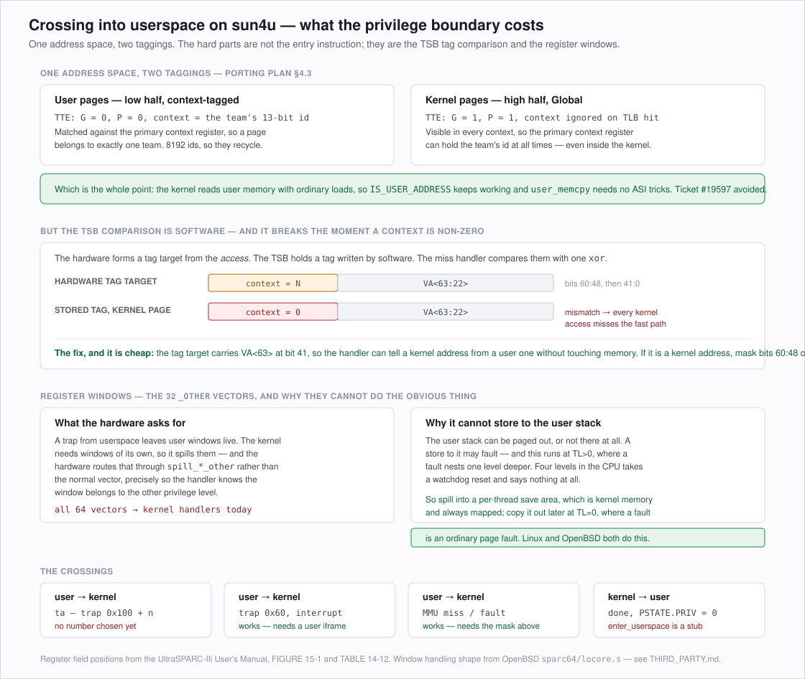

# Userspace on sun4u — the design before the code

Every phase before this one had a natural test: a banner over serial, a mounted volume, an interrupt
that arrives. This one does not, because nothing in the tree can run a user binary yet, and the pieces
that make one possible are entangled — a syscall needs a window state, a window state needs a context,
a context needs the TSB comparison to survive a non-zero value. Getting the order wrong means
debugging four things at once.

So this is written first. It is a design document, not a status one: `PROGRESS.md` records what
happened, `PORTING_PLAN.md` records the phases, and this records the decisions and the reasoning behind
them for the one subsystem where the reasoning is most of the work.




## 1. What is actually missing

Five things, in dependency order. The first two are the ones with design content; the last three are
work.

| # | Piece | State |
| --- | --- | --- |
| 1 | MMU contexts, and a TSB comparison that survives them | Nothing allocates a context; the fast path assumes zero |
| 2 | Register windows across the privilege boundary | All 64 spill/fill vectors point at the kernel handlers |
| 3 | The syscall path | No trap number chosen; `libroot`'s `syscalls.inc` emits no instructions at all |
| 4 | `arch_thread_enter_userspace`, signal frames, TLS | Three stubs and a `panic` |
| 5 | A userland to run | Phase 6's packaging gap, seen from the other side |

Items 1 and 2 are prerequisites for everything else and are independent of each other, so they can be
built and tested in either order. Item 1 is testable without any of the others, which makes it the
place to start.


## 2. Contexts, and the problem the plan did not reach

### The decision that already exists

`PORTING_PLAN.md` §4.3 settled the policy, against Haiku ticket
[#19597](https://dev.haiku-os.org/ticket/19597): **one address space, kernel mappings high and marked
Global, user mappings low and tagged with a per-team 13-bit context id.** The Global bit makes the
hardware ignore the context field during TLB hit detection, so kernel pages are visible in every
context, so the primary context register can hold the running team's id *at all times* — including
inside the kernel.

That is what keeps `IS_USER_ADDRESS` meaningful and `user_memcpy` ordinary. The idiomatic SPARC
alternative — kernel in its own context, user memory reached through `ASI_*_AS_IF_USER` — is a
cross-cutting change to Haiku's shared code, and §4.3 is right to refuse it.

The translation map already implements this half. `tte_flags_for_attributes()` sets `TTE_GLOBAL` and
`TTE_PRIVILEGED` for kernel mappings and neither for user ones, so a user page is already
context-tagged in the only sense the hardware cares about. What is missing is anything that *allocates*
a context id or writes it to the primary context register.

### The part §4.3 does not address

The Global bit governs **TLB** hit detection, which is hardware. The **TSB** comparison is software —
the hardware only forms the pointer and the tag target, and the miss handler does the compare itself
with a single `xor`. So the Global bit buys nothing there, and the two operands disagree the moment a
context is non-zero:

```
hardware tag target :  (current primary context << 48) | VA<63:22>
stored tag, kernel  :  (0                       << 48) | VA<63:22>
```

While a user context is loaded, every kernel address misses the fast path, falls into the slow path,
walks three levels of page table, and refills a TSB line that will mismatch again on the next access.
Correct, and catastrophically slow — the kernel would run permanently on the slow path.

`sparc_tsb_insert()` anticipated this. It stores `virtualAddress >> 22` with the Global bit
deliberately clear and a comment saying the comparison "will need to become G-aware" when user contexts
arrive. Worth being precise about what that should mean, because the obvious reading is the more
expensive one.

### The mechanism: mask by address, not by the G bit

Making the comparison G-aware in the literal sense — set the Global bit in the stored tag, have the
handler test it and compare fewer bits when it is set — costs a load-dependent branch on the hit path,
which is the single hottest path in the system.

There is a cheaper equivalence. The tag target contains `VA<63:22>` at bits 41:0, so **bit 41 of the
tag target is VA<63>** — and that bit alone separates a kernel address from a user one, because
`KERNEL_BASE` is `0xffffff0000000000` and user addresses live in the low half. The handler can
therefore decide which kind of address faulted from a register it has already loaded, without touching
memory and without consulting the stored tag at all:

```
    if tag_target has bit 41 set:        # kernel address
        tag_target &= ~(0x1fff << 48)    # mask the context off
    xor against the stored tag
```

Kernel tags stay stored with context zero, exactly as they are now. User tags get the mapping's
context. Two extra instructions on the fast path, no branch that depends on a load, and the Global bit
in the stored tag stays unused — which is fine, since its only purpose was to tell a handler to do what
this handler now decides more cheaply.

One consequence to state plainly: **user entries from different contexts alias in a shared TSB.** Their
tags differ, so the comparison correctly misses and the slow path fixes it up — this is a capacity
problem, not a correctness one, and it is the same aliasing the TSB already has between any two regions
64 MB apart. A per-address-space TSB is the answer if it ever measures badly, and the TSB base register
is per-CPU state that a context switch could write. Not first.

### Context ids

Thirteen bits, so 8192 ids, of which 0 is the nucleus context and belongs to the kernel. Recycling is
required and the recycling is where the bugs live: when an id is reassigned, every TLB entry and every
TSB line still carrying it becomes a mapping into the wrong address space.

The demap-by-context operation is what makes this tractable — one store to the DMMU and IMMU demap
registers removes every non-locked entry for a context. The TSB has no such operation, so a reassigned
context needs the TSB cleared of that context's lines, and since the TSB has no per-context index that
means walking it. A first implementation should:

- allocate ids sequentially and only recycle when the space is exhausted,
- on exhaustion, demap every context and clear the whole TSB rather than tracking which lines belong
  to whom.

Both are the slow, obviously-correct choice, and both are invisible until a system has run 8191 teams.

### What is testable, and it is a real test

None of this needs a user binary. A test can allocate two contexts, map the same virtual address to
two different physical pages in each, switch the primary context register between them, and check that
a load returns each page in turn — and that a kernel address keeps reading correctly throughout, which
is the assertion the masking above exists to satisfy. That last part is the one that would otherwise
be discovered as a mysterious slowdown.


## 3. Register windows across the boundary

### What the hardware does

A trap from userspace leaves the user's windows live. The kernel needs windows of its own, so it
executes `save`, and if `CANSAVE` is zero that traps to a spill handler. The hardware chooses between
two sets of spill vectors: `spill_*_normal` when the window being spilled belongs to the current
privilege level, and `spill_*_other` when `OTHERWIN` says it belongs to the other one. Thirty-two
vectors each way, spill and fill, because the trap type encodes the window number.

The trap table currently points all sixty-four at `SPILL_KERNEL_WINDOW` and `FILL_KERNEL_WINDOW`. For a
kernel-only system that is correct and the `_other` vectors never fire.

### Why the obvious handler is wrong

The obvious `spill_*_other` stores the sixteen window registers to the user stack frame the window
names. Two things break it.

**It can fault.** A user stack page can be paged out, or not mapped at all, or the stack pointer can be
garbage because userspace is allowed to put garbage there. The store faults, and this code runs at
TL>0, where a fault nests one trap level deeper. Section 2.6 of the porting plan already says where
that ends: four levels in, the CPU takes a watchdog reset and reports nothing.

**It must not use ordinary stores.** The window belongs to userspace, so the access has to carry user
privilege — a kernel store would succeed against a page the user cannot write. That is what
`ASI_AS_IF_USER_PRIMARY` is for, and it does not remove the faulting problem.

### The design: spill into kernel memory, copy out at TL=0

Both problems dissolve if the spill target is kernel memory. Give each thread a save area sized for the
maximum number of live windows, have `spill_*_other` store into it and bump a count, and copy the
saved windows out to the user stack later — at TL=0, from C, where a fault is an ordinary page fault
handled by the ordinary handler.

The cost is a copy. The benefit is that the only code running at high trap level touches memory that
is always mapped and always writable, which is the same rule the TLB miss handler already lives by.
Linux and OpenBSD both arrived here; it is the standard answer rather than a clever one.

The matching `fill_*_other` reads from the user stack, which can also fault. Same treatment: the fill
handler faults into a fixup path rather than trying to be clever, because a fill that cannot be
satisfied is a thread that must be killed, not a trap to be retried.

### Where the save area lives

`struct arch_thread` is the natural home and it is already the place `arch_context` lives. The save
area has to be reachable from a trap handler with no stack, which means through `%g7` — the thread
pointer, which the trap handlers already use and which `arch_thread_set_current_thread()` already
maintains. So the addressing is `%g7 + offsetof(Thread, arch_info.window_save_area)`, one constant the
assembler cannot see and which therefore needs the same offset-verification treatment
`sparc_verify_context_layout()` already gives `arch_context`.


## 4. The syscall path

### The trap number

SPARC V9 `Tcc` produces trap types `0x100 + n` for a software trap number `n` in 0..127, and the trap
table already reserves all 256 entries from `0x100` for them. Nothing constrains the choice; the
convention on this architecture is that every operating system picks its own, which is why SunOS,
Solaris, Linux and the BSDs all use different ones.

**Proposed: `ta 0x40`, trap type `0x140`.** Mid-range, so a stray `ta` with a small immediate — the
shape a compiler or a hand-written stub is most likely to emit by accident — lands on an unhandled
entry that reports rather than on the syscall path.

### Argument passing, and the reason it is not obvious

Haiku syscalls take up to twenty parameters. SPARC V9 passes six in `%o0`–`%o5` and the rest on the
stack, and the kernel's dispatcher wants a pointer to a contiguous argument list.

The SPARC V9 ABI makes this almost free. It reserves six argument slots at `%sp + BIAS + 128`,
immediately below where stack arguments start at `%sp + BIAS + 176` — the slots exist precisely so that
a varargs callee can spill its register arguments and read the whole list as one array. A syscall stub
can do the same thing: store `%o0`–`%o5` into those slots, and the argument list is contiguous from
`%sp + BIAS + 128` regardless of how many there are.

So the stub is: store six registers, put the call index somewhere the handler can find it, `ta 0x40`.
The kernel reads the index and a pointer to the list. Two facts make this safe to read from the kernel
— the list is in the *user's* stack, so reading it is a `user_memcpy` and can fault, which at TL=0 is
fine.

### The register the index travels in

`%g1` is the conventional choice on this architecture and it is convenient here for a reason beyond
convention: the trap handlers run with the alternate global bank selected, so the user's `%g1` is still
intact and readable when the handler wants it — but it must be saved before the handler uses `%g1` as
scratch, which the existing entry paths already do into the iframe.

### The return

`%o0` and `%o1`, as the ABI says. After the handler's `save`, the user's `%o` registers are the
handler's `%i` registers, so the return value is written to `%i0` and the closing `restore` puts it
where userspace will read it. No iframe field needed, which is why the iframe has no `%o` registers in
it — a fact worth stating, because their absence looks like an omission.


## 5. Order of work

1. **Contexts.** The allocator, the primary context register on address-space switch, and the tag
   target masking. Testable on its own, as §2 describes, and it is the piece that would otherwise be
   diagnosed as a performance mystery rather than a bug.
2. **`arch_thread_enter_userspace` plus the syscall trap.** Together, because neither is observable
   without the other. Test with a hand-built user thread — a page of user memory containing a couple
   of instructions and a `ta` — rather than waiting for a userland. A thread that never executes
   `save` needs none of item 3, which is what makes this a step and not a leap.
3. **The `_other` window handlers.** Then extend the test thread to `save` and `restore` and nest a
   few calls deep, which is what actually exercises them.
4. **Signals and TLS.** `arch_setup_signal_frame`, `arch_restore_signal_frame`,
   `arch_on_signal_stack`, `arch_thread_init_tls`.
5. **The userland.** `libroot`'s `syscalls.inc` — currently a stub that emits a label and no
   instructions, so every syscall in the system falls through into the next function — then
   `runtime_loader`, then something to run.

Steps 1 through 3 are kernel work with hand-built tests and no dependency on the image build. Step 5
depends on Phase 6's media gap, which is the reason this ordering puts it last rather than first.


## 6. Decisions recorded

| Decision | Alternative rejected | Why |
| --- | --- | --- |
| One address space, kernel Global | Separate kernel context, `ASI_*_AS_IF_USER` for user memory | §4.3: the alternative is a cross-cutting change to Haiku's shared code. Ticket #19597. |
| Mask the context off kernel tag targets | Set the Global bit in stored tags and branch on it | No load-dependent branch on the hottest path in the system |
| One TSB shared by all contexts | Per-address-space TSB, base register switched on context switch | Aliasing is a capacity problem, not correctness. Revisit with a measurement. |
| Sequential context ids, flush everything on exhaustion | Per-context TSB line tracking | Invisible until 8191 teams have run. Obviously correct beats clever. |
| Spill user windows into a per-thread kernel save area | Store straight to the user stack via `ASI_AS_IF_USER_PRIMARY` | A fault at TL>0 nests toward a watchdog reset. Same rule the miss handler lives by. |
| `ta 0x40` for syscalls | A low trap number | A stray `ta` with a small immediate hits an unhandled entry that reports |
| Arguments in the ABI's reserved slots at `%sp + BIAS + 128` | A separate argument buffer the stub builds | The slots exist for exactly this; stack arguments already continue from there |
